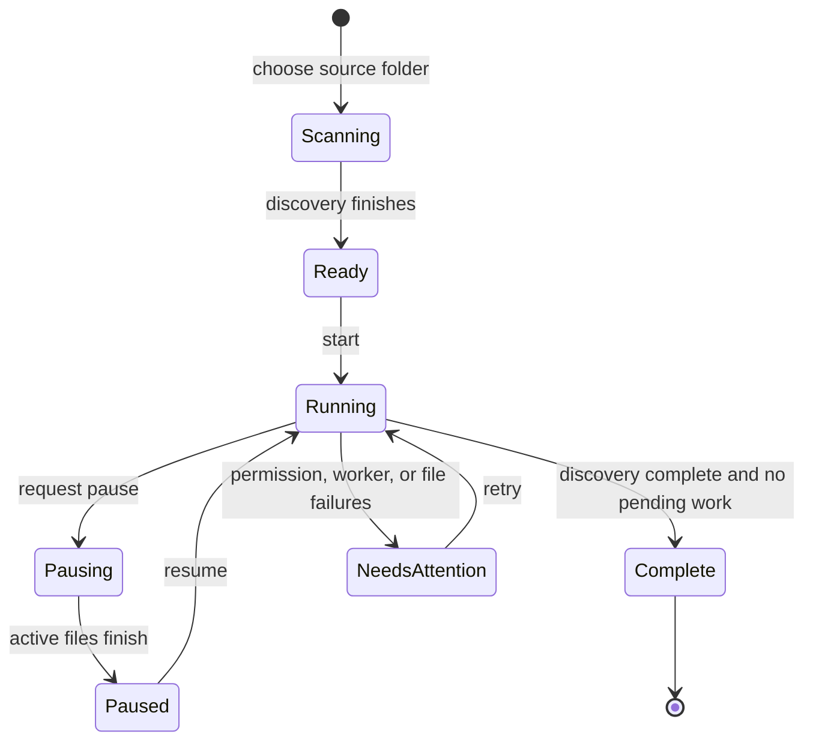

# Large-folder processing plan

Tiny Image Star supports large collections through the same recipe workflow as
one-image editing. A large folder is a durable local job, not an in-memory
batch and not an archive export.

## Product contract

- A person chooses a source folder, a destination folder, and one visual
  recipe. The output is written into one uniquely named subfolder.
- Files are discovered lazily. Only metadata is added to the durable manifest;
  source and result bytes are never retained for the complete collection.
- A bounded pool of image workers reads, transforms, writes, and releases one
  image at a time. The main thread receives result metadata, never output image
  bytes.
- Pause stops assigning new files and lets active writes finish. Resume resets
  interrupted entries and continues from the manifest. Resume is not exposed
  until those active writes have drained, so a file cannot be queued twice.
- A result is complete only after its destination file has been closed.
- The results list is virtualized and contains status, dimensions, byte change,
  and errors. It does not create image previews or DOM cards for every file.
- Multiple outputs are saved directly to a folder. ZIP is not part of the
  large-folder workflow and is not used by the normal multi-image save action.
- Browsers without direct folder access keep the smaller one-or-many workflow;
  they are not told that 100,000-file processing is available.

## Memory invariant

Collection memory is bounded by worker count, not file count:

```text
peak collection buffers <= active workers * (one source + one decoded image + one result)
manifest memory on main thread <= current job summary + visible result rows
```

Pillow-RS currently accepts and emits one complete image buffer. Therefore the
largest concurrently processed images still determine peak memory. The worker
pool defaults to a conservative balanced setting and never creates one worker
per file. Encoded results are sent to the browser's writable file stream in
4 MiB chunks and released after close, but this is file-output streaming—not
incremental codec encoding. The missing binding is tracked in
`PILLOW_RS_ISSUES.md`.

## Job lifecycle



Every status transition is persisted in IndexedDB. Source and destination root
handles are stored with the job; a resumed browser session asks for permission
again when the browser requires it.

The actions are deliberately distinct. **Resume remaining** continues pending
or interrupted files after a pause. Pause first enters a short draining state;
only after active file writes finish does Resume appear. When processing has
ended with failed files, Resume is hidden and **Retry N failed** moves only
those failed entries back into the pending queue before restarting. Permission
and worker startup checks are shared by both paths.

## Measured performance

Run the reusable local profiler with a folder and sample count:

```bash
npm run profile:folder -- tiny-image-star-20260802-050216-my-image-recipe 64
```

On 2026-08-02, the named fixture contained 8,192 PNG files (1.381 GB,
168.6 KB average). A 64-file evenly distributed sample measured 107.96 ms
average PNG encoding time versus 0.95 ms source reading, 0.02 ms initial open,
0.02 ms verification open, and 1.92 ms output writing. PNG encoding represented
97.4% of the measured direct pipeline. Folder listing plus sequential metadata
reads for all 8,192 files took about 180 ms on the local APFS cache and was not
the bottleneck.

The checked-in 2.25 MB artifact contains no `.debug*` WASM custom sections.
The dependency workspace's release profile uses optimization level 3, LTO, one
codegen unit, and aborting panics. This is evidence of a stripped release-style
artifact, although a reproducible build manifest should eventually record the
exact build command and source revision alongside the deployed files.

For the same fixed amount of encoding work, one process took 8.35 seconds, two
took 4.79 seconds, and four took 3.27 seconds. Four workers therefore improved
wall time by about 31.7% over two rather than delivering a perfect 2× gain.
**Balanced** remains the safer memory default; **Fast** is useful on machines
with sufficient CPU and memory. The primary optimization opportunity is a
faster PNG encoding/compression choice in the browser binding, tracked in
`PILLOW_RS_ISSUES.md`.

## Implementation modules

- `src/jobs/core.js`: deterministic naming, job records, progress, concurrency,
  and virtual-window calculations.
- `src/jobs/store.js`: IndexedDB job and entry manifest with atomic claims and
  completion checkpoints.
- `src/jobs/large-worker.js`: one-file Pillow-RS transform and direct output
  write.
- `src/jobs/controller.js`: lazy discovery, bounded scheduling, recovery, and
  the virtualized UI.

## Verification gates

- A 100,000-entry synthetic manifest does not allocate source or output bytes.
- Queue claims never exceed the available worker count.
- Output is marked complete only after the direct write closes.
- Reload converts interrupted processing entries back to pending without
  reprocessing completed entries. If discovery itself was interrupted, it
  restarts the metadata scan from the source; deterministic output paths mean
  an older partial file can be safely overwritten instead of duplicated.
- Result DOM remains bounded while representing 100,000 entries.
- Real browser smoke writes transformed PNG bytes to an output directory and
  reads those bytes back.
- Browser smoke pauses and resumes pending work, then creates a real failed
  image, verifies that no ineffective Resume action is shown, repairs it, and
  retries it to a completed output.
- Desktop and mobile layouts have no horizontal overflow, clipped text, or
  overlapping controls.
