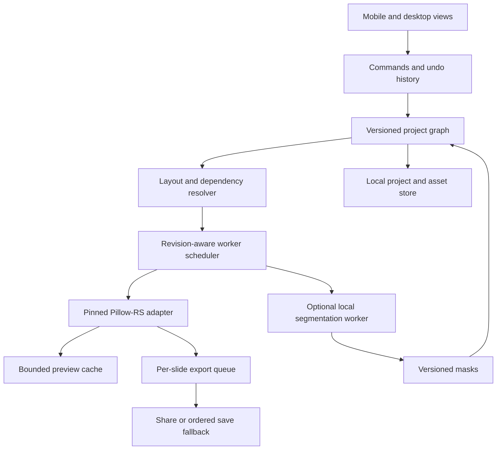

# Tiny Image Star: mobile story studio migration

Research date: **16 September 2026**. Application baseline: `89cc88c`.
Status: **proposal backed by a source audit, published-package experiments, and current market research**. This document does not certify production readiness or describe features already shipped.

## 1. Product decision

Build a **private, mobile-first photo story studio** using the deployed Pillow-RS package. The promise is:

> Choose your photos. Make a story worth swiping through. Keep every detail editable.

The initial audience is people making travel, weekend, event, outfit, and personal-brand photo stories on a phone. This is a starting hypothesis to validate, not an established customer segment. Bulk editing is also a first-class requirement: the same presets must work on independent images and, where appropriate, grouped stories, with desktop large-folder processing retained and mobile capacity verified separately.

The signature operation should be **“Make a story”**: turn 6–12 photos into a coordinated 4–8-slide composition, with optional subject cutouts, text behind people, connected elements across slide boundaries, a consistent visual treatment, and alternate aspect ratios. The user chooses a look and corrects only the exceptions. All these numbers are proposed product limits, not social-network limits.

The difficult capability is **editing relationships across images**. A shared treatment adapts to each photo; local crops and masks survive later global changes; layouts reflow when photos are replaced; one cutout can connect two slides. A conventional bulk transform operates on independent files and cannot provide this without a composition/document system.

Do not position a carousel, background remover, or text-behind-subject button as an invention. Existing products already cover those pieces. The opportunity is a faster combined workflow, transparent local processing, reliable output, and much less manipulation on a phone. This advantage must be demonstrated against competitors before launch.

Recommended initial release scope:

- One hero workflow: photo set → editable story → ordered exports.
- Three carefully finished looks: **Scrapbook**, **Depth cover**, and **Film diary**.
- PNG and JPEG as release output requirements; WebP after the same app-level gates.
- Portrait cutouts first if model quality passes; imported transparent cutouts and manual masks remain usable.
- Local projects, undo, reliable recovery, camera-roll import, accessible controls, and native sharing where supported.
- Apply supported presets to this image, selected images, or an entire collection; retain resumable large-folder processing and its explicit capability boundaries.
- High-throughput parallel processing: adapt worker concurrency to the device and workload, remove the universal four-worker ceiling after validation, and prove speed with complete import-to-output benchmarks.

Avoid launching a template marketplace, social network, cloud account system, generative avatar service, or video editor in the same release.

## 2. Research: what is timely, and what is already crowded

Sources were checked on 16 September 2026. Vendor documentation establishes advertised capability; vendor forecasts establish directional interest. Neither proves unmet demand or market-wide popularity. No credible day-by-day September ranking was established in this research, so “everyone is doing this right now” would be an unsupported claim.

| Direction | Evidence | Product implication |
| --- | --- | --- |
| Personal scrapbooks and imperfect photo stories | Canva's 2026 forecast reports 90% year-over-year growth in searches for DIY/scrapbook elements. Its evidence combines platform activity and a creator survey, not the whole market. [Canva forecast](https://www.canva.com/newsroom/news/design-trends-2026/) | Strongest initial visual direction; assemble users' own memories with controlled variation. |
| Seamless photo dumps and recaps | SCRL's current App Store listing advertises layered compositions, connected carousels, and a summer-recap event. [SCRL listing](https://apps.apple.com/us/app/scrl-photo-collage-maker/id1289057196) | Current product activity supports relevance, but a carousel splitter alone has little differentiation. |
| Text behind a subject | CapCut publishes a 2026 guide describing a three-layer depth effect. Its “viral” characterization is marketing, not independent usage measurement. [CapCut guide](https://www.capcut.com/resource/how-to-put-text-behind-a-person-in-capcut) | Good immediate visual payoff; make it one controllable operation inside a larger story. |
| Generative restyling | Google Photos documents photo remix templates, and Google announced general availability of Nano Banana 2 and Pro on Vertex AI in May 2026. [Photos help](https://support.google.com/photos/answer/16763021?hl=en), [Google Cloud announcement](https://cloud.google.com/blog/products/ai-machine-learning/nano-banana-2-and-nano-banana-pro-are-generally-available) | Relevant but crowded. Pillow-RS does not supply generative models. Treat this as a separate future service decision. |
| Advanced product-image batches | Photoroom's July 2026 help page covers batch/global and individual edits, layers, blur, lighting, graphics, and text. [Photoroom help](https://help.photoroom.com/en/articles/11784338-what-is-the-batch-feature) | Background replacement plus batch editing is not a defensible headline. |

### Competitive boundary

| Product | Verified public strength | What Tiny Image Star must demonstrate |
| --- | --- | --- |
| Photoroom | Mobile/web batch workflows; its product page advertises advanced ecommerce operations including staging, recolor, and virtual models. [Batch product](https://www.photoroom.com/batch) | A better personal-story workflow, rather than an attempt to outbuild its catalog studio. |
| SCRL | Freeform and structured layouts, panoramic carousels, stickers, photo adjustments, and publishing. [Developer listing](https://apps.apple.com/us/app/scrl-photo-collage-maker/id1289057196) | Faster initial assembly and aspect-ratio reflow, fewer corrective taps, preserved overrides, and proven local-only image processing. Do not assert that SCRL lacks these without a hands-on comparison. |
| Unfold | Mobile storytelling tools, templates, editing, and social-content workflows. [Official site](https://unfold.com/) | A concrete reason to choose adaptive composition over another template library. |
| Canva | Broad photo/design tooling and current template distribution. [Photo editor](https://www.canva.com/newsroom/news/remix-photos-canva-photo-editor/) | A focused flow that wins on a phone for this particular job; “more features” is unlikely to win. |
| Google Photos / Gemini | Prompt-based changes and template remixing. [Google Photos](https://blog.google/products-and-platforms/products/photos/nano-banana-ai-templates-ask-photos/) | Accurate, repeatable, editable compositions using the original photos. Avoid competing on general image generation. |

Research conclusion: **Scrapbook story + depth cover + adaptive reflow** is the best first hypothesis. A generic filter pack has weak differentiation. A generative-only fad has external model costs, uncertain repeat use, and little connection to Pillow's strengths.

**20 September recheck:** Photoroom still documents global and individual batch
edits, layers, text and both iOS/Android workflows; batching itself cannot be our
differentiator. [Current batch documentation](https://help.photoroom.com/en/articles/11784338-what-is-the-batch-feature).
Adobe's 2026 research describes tactile imagery, personal connections and locally
rooted storytelling. This provides additional directional support for editable
personal stories, but is a vendor forecast, not evidence of a September viral
ranking or demand for this app. [Adobe's research and examples](https://blog.adobe.com/en/publish/2026/01/08/how-creators-leveraging-adobe-2026-creative-trends).
The product hypothesis and comparative validation gates therefore remain unchanged.

### Validate the proposed advantage before expanding scope

Recruit 12–15 target creators for observed testing, including both iPhone and midrange Android users. Ask each to make the same six-photo story in their usual app, then the prototype. Counterbalance order; record familiarity and template choice. Measure time to a usable export, corrective actions, completion without help, and willingness to reuse. Do not infer a market statistic from this small sample.

Proposed continuation gates: at least 80% complete unaided; median time is at least 30% lower than their comparison workflow; at least 70% prefer the produced story in a blind output comparison. These are **decision targets**, not measured results. If assembly fails these gates, reduce to a single excellent depth-cover workflow and retest before building a large template catalog.

Keep trends as versioned recipe packs rather than hardcoded product logic. At each content review, require two recent signals, a reproducible edit, a rights-cleared example, and a clear expiry/review date. Do not equate a vendor's “viral” label with demand. Launch with three strong looks; add more only when observed use supports them.

## 3. What the repository actually has

The app is already a static, local-first Pillow-RS client. This is a **runtime upgrade and product/document migration**, not a switch from Python Pillow or an introduction of Rust from scratch.

| Finding | Evidence | Consequence |
| --- | --- | --- |
| Core foundations are worth retaining | Workers, revision handling, image-set scope, overrides, session recovery, output-byte checks, bounded folder jobs | Preserve these contracts while replacing the interaction model. |
| Vendored runtime has incomplete provenance | [Runtime notice](wasm/README.md) records hashes but no source revision/build | Replace it from an exact published package with recorded integrity and provenance. |
| Adapter misses the deployed generic encoder | `findEncoder()` in [adapter](src/engine/pillow.js) checks named methods, `encode`, and `save`, but not `saveWithInput` | Merely copying the new WASM pair will still leave output capability discovery incomplete. |
| Phone layout spends too much space on controls | Embedded-browser observation at 390 × 844: canvas starts at y=481.7; canvas height 362.3; page height 1339 | About 57% of the first viewport precedes the canvas. Redesign hierarchy, not just breakpoints. This is emulation, not physical-device evidence. |
| Theme is fixed dark navy/green | `color-scheme: dark` and many literal colors in [styles](styles.css) | Introduce semantic theme tokens and test light/dark independently. |
| Existing validation is strong but incomplete for mobile | Deterministic suite and Chromium smoke passed in this audit; the script launches Chromium only | Width checks do not certify Safari, touch, virtual keyboards, native sharing, or mobile memory behavior. |
| One result per input is baked into scope | [Scope](SCOPE.md), recipe config, session and batch structures | A multi-image/multi-slide project needs an explicit versioned model. |
| Large limits are not a mobile budget | 80M pixels/image, 160M pixels/set, 160 MiB compressed input, 64 MiB recovery budget | An 80M-pixel RGBA buffer alone is 320 MB before copies. Phone policy must account for decoded memory. |
| Camera and color readiness are incomplete | Current scope excludes HEIC/HEIF; no demonstrated HDR/wide-gamut pipeline | Camera-roll compatibility and color handling are launch work, not cosmetic improvements. |
| Trust copy conflicts with documented status | Footer calls the app open source; README says no application license selected. UI says offline; scope defers PWA support | Resolve license and cold-start offline claims as part of release readiness. |

Checks executed: `npm run verify` PASS; `npm run verify:browser` PASS after allowing its localhost server; `npm run check:docs` PASS. The initial combined command stopped at the sandbox's localhost restriction, after deterministic tests passed. These checks used the existing application runtime. New-package experiments below are separate.

## 4. Deployed Pillow-RS: verified migration target

The public [npm registry](https://registry.npmjs.org/pillow-rs) reported:

| Package | Publication (UTC) | Tag observed | Audit result |
| --- | --- | --- | --- |
| `pillow-rs@0.1.3` | 15 Sep 2026, 20:26:49 | `latest` | Downloaded tarball matches registry SHA-512; fixture probes executed. |
| `pillow-rs@12.2.0-alpha.1` | 16 Sep 2026, 13:33:31 | `next` | Downloaded tarball matches registry SHA-512; fixture probes executed. |

**Migration candidate: pin `12.2.0-alpha.1` exactly**, since it is the newly deployed line. Evaluate `0.1.3` as the comparison package and keep the existing application release available for rollback. Do not resolve `next` or `latest` at application runtime. A registry tag is not a stability certification.

The alpha's [public provenance attestation](https://registry.npmjs.org/-/npm/v1/attestations/pillow-rs@12.2.0-alpha.1) names tag `v12.2.0-alpha.1` and commit `310788f9fcadc85b02263b383c5a6ea094b000c6`. This audit inspected its payload and matched tarball integrity; it **did not cryptographically verify the signature/transparency chain**. Release CI must complete that verification. The packaged README still calls the candidate unreleased; registry evidence establishes publication and the documentation discrepancy should be recorded.

### Executed capability probes

Both releases passed small-fixture decode/load/raw-byte checks for PNG, JPEG, GIF, BMP, WebP, TIFF, ICO, and the repository's EXIF-bearing JPEG. The EXIF fixture probe verifies decode, not automatic orientation correction. `saveWithInput(format, null)` produced recognizable containers that reopened at the expected dimensions for PNG, JPEG, WebP, GIF, BMP, TIFF, and ICO. AVIF returned a codec-disabled error. Resize, crop, rotation, blur, color enhancement, and a simple masked composite executed successfully.

These are **Node-hosted executions of the published WASM** with tiny inputs. They do not establish complete format support, animation, mobile performance, lossy quality control, color fidelity, or parity across all operations. See [probe results](docs/research/2026-09-16/pillow-capability-probe.json) and [release evidence](docs/research/2026-09-16/release-evidence.json).

### Concrete adapter change

The tested output API is:

```js
// After initialization, transformations, and explicit mode/alpha handling:
const bytes = image.saveWithInput("JPEG", null);
// Second argument is an extension hint, NOT a quality setting.
```

Implement an explicit adapter for the pinned API. Remove guessing based on function arity for that release. Keep `save()` as the PNG-only legacy path; keep raw `toBytes()` / `toBytesEncoded()` separate from image containers. Flatten alpha onto a chosen background before RGB/JPEG conversion and test transparency edges. Verify signatures, dimensions, actual decoded pixels where meaningful, and an independent decoder for each promised export.

No quality argument is present in the inspected `saveWithInput(format, extension)` contract. Do not expose a fake 80/95/100 control. For v1, either ship verified fixed encoder settings with honest wording or obtain a separately published upstream encoder-options API and verify it. Model speed, quality control, AVIF, HEIC, streaming, and cancellation must not be inferred from the Rust core's capabilities.

Install the exact npm version into the lockfile, stage the browser JS/WASM pair from that package during the build, and self-host them. The package exports browser and Node entry points conditionally and exposes only the root and package metadata publicly. Avoid relying on an unexported deep import in application code. The build can locate the installed package directory through its exported metadata and copy the known pair into versioned application assets. Serve WASM with a correct MIME type and resolve paths under the deployment base path.

Do not patch upstream source from this repository. Record app-specific requests separately. Initially ship the published WASM unchanged; if the release pipeline runs `wasm-opt`, record both original and derived hashes, optimizer version, and all resulting regression results. Optimization produces a derived artifact, so registry integrity alone no longer identifies those served bytes.

## 5. Capabilities worth building

| Capability and user action | Substantial behavior | Pillow's role | Additional work | Release |
| --- | --- | --- | --- | --- |
| **Make a story** — select photos and a look | Compose a sequence with varied page roles, stable ordering, editable captions, and deliberate continuity | Resize, transform, crop, composite, render | Layout solver, project graph, design templates, quality review | Core v1 |
| **Depth cover** — place words behind a person | Reusable soft mask, foreground/background layer order, adjustable text, clean edges | Alpha/mask composition and final rendering | Segmentation model, edge refinement, restore/erase controls | v1 if model gates pass |
| **Connected cutouts** — carry a subject across slides | One object spans neighboring pages and survives reordering/cropping without visible seams | Affine transforms, masks, per-slide crops | Global coordinates, dependency invalidation, clipping and seam tests | Core v1, manual/imported masks supported |
| **Adapt the whole story** — change aspect | Reflow text, preserve chosen focal subjects, reposition decoration, flag unresolved crops | Accurate rendering of resolved geometry | Constraints, anchors, collision checks, override preservation | Core v1, two supported ratios first |
| **Match this look** — pick an anchor photo | Align exposure/color treatment with per-photo bounds and editable exceptions | Histograms, color enhancement, LUT operations | Matching algorithm, skin-tone/scene safeguards, comparison UI | Conservative preset v1; automatic matching later |
| **Selective focus** — keep subject sharp, soften surroundings | Masked blur, edge feather, controlled shadow/outline | Blur, composite, morphology candidates | Mask quality and halos tests; do not market 2D blur as depth estimation | After core story gates |
| **Perspective mockup set** — place art onto frames/screens | Reuse four-corner geometry and masks across outputs | Transform and compositing | Guided corner UI, region model, projective verification | v1.1 candidate |

Do not promise generative fill, clothing replacement, semantic object removal, relighting, upscaling hallucinated details, or avatar generation as Pillow features. Those require models/services with their own quality, licensing, privacy, and cost decisions. A later optional cloud mode must identify uploaded bytes and purpose, use a server-side credential boundary, support deletion, rate limits and spend caps, and make the local/privacy claim specific to the active mode. It is not necessary for this v1.

### Segmentation decision

Execution update, 2026-09-17: the [pinned browser model spike](docs/SEGMENTATION_RESEARCH.md)
now includes actual portrait/interactive masks, CPU/GPU/non-SIMD/no-WebGL
observations, working-set measurements, reproducible inputs and enforced network
policy probes. It is research evidence; automatic selection and its release
gates remain unfinished.

Run a short model bake-off before fixing the headline promise. MediaPipe Image Segmenter is a practical portrait starting point; its documentation requires a compatible trained model and notes synchronous calls should run in a worker. It does not promise arbitrary-object cutouts. [MediaPipe web guide](https://developers.google.com/edge/mediapipe/solutions/vision/image_segmenter/web_js)

Evaluate a general-object model through ONNX Runtime Web only if its weights, commercial redistribution terms, edge quality, download size and memory use fit the product. WebGPU is an acceleration option, with a separately tested WASM fallback; never require it for basic editing. Multithreading has additional cross-origin-isolation requirements. [ONNX deployment](https://onnxruntime.ai/docs/tutorials/web/deploy.html), [runtime flags](https://onnxruntime.ai/docs/tutorials/web/env-flags-and-session-options.html)

Test hair, dark and light backgrounds, varied skin tones, glasses, fingers, pets, product edges, low light, and multiple subjects. Portrait models must be labeled by supported task. Quality-confidence thresholds need calibration against human review; a model score alone cannot certify a clean cutout. Provide a zoomed edge preview, brush correction, and a normal layout when the model is unavailable. If automatic cutouts are advertised as part of v1, failing their gate blocks that claim and release scope.

## 5A. Presets, reusable recipes, and personal styles

**Presets are a primary interaction, not a secondary settings drawer.** A user should be able to achieve a polished result by choosing a visual example, then make only the changes they care about. The current destination presets and saved recipes provide a useful migration starting point; the new system adds composition and adaptation.

### What users can reuse

| Kind | Proposed examples | What it remembers |
| --- | --- | --- |
| **Looks** | Film diary, soft monochrome, warm editorial | Color treatment, supported grain/texture, contrast and related effect parameters, with an overall strength control. Each effect needs an implemented, tested renderer. |
| **Creative effects** | Depth title, outlined cutout, selective background blur | A bounded operation recipe, semantic target such as “selected subject”, and editable effect settings. New photos require new masks. |
| **Story recipes** | Weekend scrapbook, trip recap, outfit story | Slide roles, photo slots, layout rules, typography, decorations and connected elements, plus supported photo counts and aspect variants. |
| **Export presets** | Portrait set, tall story set, small website images | Dimensions, format, naming and metadata policy. Encode quality appears only when the engine verifies it. These are separate from the creative look. |
| **My styles** | A creator's preferred colors, title style and framing | User-selected reusable settings from an existing edit, named and saved locally. |
| **Identity kits** | Personal signature, shop colors, event styling | Chosen fonts, colors and logo assets. A basic local kit can follow the core presets; multi-brand/team management is later scope. |

The initial curated catalog remains **three fully finished story recipes: Scrapbook, Depth cover and Film diary**. Their underlying looks, text styles and effects can also be reused on a single image. Favor quality across varied photos over a large count of near-duplicate presets.

### Adapt to the content

For example, “Weekend scrapbook” can accept eight new photos, populate cover/detail/closing roles, place a title behind a qualified portrait subject, connect a cutout across two slides, and create portrait/tall variants. These are intended behaviors to implement and test, not current capabilities. The user can change the cover, replace a photo, adjust effect strength and fix a crop without rebuilding the story.

An adaptive recipe stores rules such as “keep this subject inside the frame” or “fit the title in the available area”, rather than copying one photo's pixel coordinates to every input. Start with deterministic slot assignment from photo order and aspect ratio plus an explicit user-selected cover. Semantic photo ranking is optional future assistance; do not assume Pillow recognizes what makes a good cover.

Keep appearance strength distinct from structure: reducing a look to 0% removes the treatment, while layout, captions and subject choices remain unchanged. Blending must be defined per operation; do not interpolate categorical settings such as font names, blend modes or slide counts. Changing a look must preserve local crops/mask repairs. A layout replacement should preview any conflicting manual placements and let the user keep them or reset them explicitly.

### Mobile preset experience

Open **Look** to a bottom sheet with **For this story · Saved · Recent**, using previews generated from the user's photos. “For this story” means compatible with the current content/capabilities; it does not imply an unbuilt recommendation model. Show three choices initially, with the rest discoverable in the sheet. Lazy-render previews and cancel outdated thumbnail work so browsing presets cannot starve the active canvas.

Tap to preview; adjust one strength slider where meaningful; choose **This slide** or **Whole story**; commit with one clear action. Previewing several presets produces one undo step when committed. Closing without applying restores the previous state. A favorite can be saved directly from its preview. Label unavailable effects with the missing requirement and a usable alternative, such as a layout that needs no automatic cutout.

After a custom edit, **Save my style** asks only for a name and offers simple inclusion choices: Look, Text style, Layout, and Output. Default to reusable visual settings. Exclude source photos, source-specific masks, personal caption text and exact crops unless the user deliberately saves a private project template containing them. Store reusable caption placeholders separately from the author's real words. Saving a style and backing up a complete project are different actions.

### A reliable preset format

Use versioned declarative data with a schema version, stable preset ID, immutable revision, compatible renderer/engine range, required capabilities, operation parameters, exposed controls, layout constraints, supported input counts/aspects, deterministic seed policy, and asset references with hashes/licenses. Validate numeric bounds and graph complexity before rendering. Presets cannot contain JavaScript, arbitrary executable expressions, or automatic remote asset URLs.

Copy the applied preset revision into the project. Updating a curated pack must not change an existing project on reopen. Replacing an image reruns source-dependent steps, including segmentation, while retaining the user's reusable choices. Missing fonts or models need a visible substitute/installation choice before committing; never silently alter an old export. A required unsupported operation blocks the preset; optional omissions are declared and shown in its preview.

Migrate existing destination presets into output presets and saved flat recipes into legacy-compatible styles, preserving IDs, names and operation order. Keep their original records until the migrated copy saves and reopens correctly. Unsupported old output settings remain identifiable and require a supported replacement.

Start with local favorites, recent use, custom styles and installed packs that work offline. Add **Export style / Import style** as a bounded, validated file workflow after the local system is dependable. Sharing defaults to parameters and redistributable assets, without private images or captions. Online links, community discovery and a marketplace can follow later; those need hosting, rights handling and content moderation.

### Preset release gates

- Every launch preset passes portrait/landscape inputs, supported photo-count extremes, missing/failed masks, long captions, missing fonts, and both offered aspect variants.
- Preview, commit, undo, save/reload and export retain the same resolved settings and preset revision.
- Applying a global look preserves per-photo crop and mask repairs; incompatible layout replacements are explicit and reversible.
- Strength endpoints, operation bounds, incompatible engines and malformed imported presets have deterministic outcomes.
- Existing saved presets migrate without losing names or changing legacy rendering order.
- Mobile preset browsing stays responsive under the same memory and interaction budgets as editing; optional asset downloads and offline availability are visible.

## 5B. Bulk editing and large collections

**Yes: applying a preset or supported edit to a large collection is part of the platform.** The small photo counts in the story workflow describe one composition; they are not intended to become the platform's overall bulk-editing limit. Treat collection size, individual image size, and operation complexity as separate limits.

### Current implementation versus migration target

| Workflow | Current implementation | Migration requirement |
| --- | --- | --- |
| Interactive image set | Up to 40 files, additionally limited by 160M total pixels and 160 MiB source bytes; All/Selected/This image scope and local overrides | Preserve familiar bulk application and override semantics; move large collections into the persistent queue instead of raising the in-memory cap. |
| Large-folder processing | A metadata manifest capped at 100,000 entries, bounded workers, direct-folder output, pause/resume and failed-item retry | Retain and extend through the pinned Pillow adapter and supported preset engine. The 100,000 figure is a modeled/tested manifest limit, not a completed production throughput claim. |
| Text/composition in large-folder jobs | A short text overlay with four built-in typography starters can be added to the folder recipe before choosing its output folder; interactive batches also support All/Selected/This-image overlay scope. The batch sheet can save the resulting full recipe for reuse. The folder recipe freezes before processing. | Qualify text output and font consistency. Add standalone overlay-only presets and multi-layer composition; complete cutout and size-variant recipes. Reject unsupported recipes during preflight. |
| Phone-scale collections | Standard picker workflow is available; the large-folder path depends on directory read/write capability | Certify import, storage, processing and export together on real phones. Do not advertise desktop-scale jobs on every mobile browser. |

Evidence: [input limits](src/input.js), [interactive coordinator](src/batch.js), [job model](src/jobs/core.js), [folder controller](src/jobs/controller.js), and [large-folder design](LARGE_FOLDER_PLAN.md).

### One preset, many images

The intended bulk flow is **Choose images/folder → choose a preset → preview a representative sample → apply to selected/all → review exceptions → export**. Interactive image batches now expose All/Selected/This-image scope for short signature overlays, while a large-folder job can freeze the overlay into its recipe before processing. For example, a user can apply the same warm look, aspect rule and short signature to a large collection, with each output processed separately. This feature slice has not been qualified; permitted collection size depends on the verified device, operation and storage path.

The preview sample should include different aspect ratios, large sources and representative supported formats. Show estimated output count, output destination and a measured time estimate once sample processing completes; label the estimate and update it as the job progresses. A low-confidence subject mask, an unsafe crop or an unsupported source becomes a visible exception rather than a silently poor export. Leave original files untouched and preserve the user's per-image corrections.

Keep two explicit preset execution modes:

- **Per-image presets** produce independent outputs: supported looks, resizing/framing, text/watermarks once composition is unified, and verified subject effects. One image can also produce several chosen size variants.
- **Story recipes** consume groups of photos. Ask for grouping by an existing folder, fixed group size or user selection; handle incomplete groups explicitly. Do not interpret an entire 10,000-image folder as one giant carousel or pretend semantic grouping is already implemented.

Display the complete output count before starting. Multiple variants and story slides can make output count much larger than input count; apply capacity limits to both.

### Processing and recovery contract

Store collection metadata persistently, virtualize the results list, and hold source/output buffers only for a bounded active window. Reuse loaded engine/model/font assets within a worker, schedule memory-heavy stages conservatively, and write each completed result promptly to the available output sink. This scales file count; it does not remove the memory needed to decode one large image.

Freeze the preset revision, engine/model versions, source identity and selected output variants into the job. Edits during a running job create a new job revision; they must not make the first half and second half of a folder use different recipes. Track completion per source/variant, retain completed files on pause, retry failures without repeating successful outputs, and detect changed sources on resume. Reconcile a crash between writing a file and recording completion; never silently overwrite an unrelated file or count the same output twice.

Provide progress, completed/failed/skipped counts, pause/resume, cancel, retry failed, and an exception-only review. A cancelled inference or encode may require worker termination; cancellation must preserve completed work. Never load every full-resolution preview into the review screen.

### Mobile boundary and release evidence

The product should aim for convenient batches of dozens and, where measured device capacity permits, hundreds of images on phones. That is a proposed validation range, not a guaranteed limit. Thousands of images remain a supported-desktop target until the full mobile path proves reliable. A fast WASM transform alone cannot solve photo-picker access, persistent-storage quota, phone suspension, and saving thousands of outputs.

When directory output is unavailable, preflight a bounded staging and export strategy; show storage requirements and offer manageable save/share groups. Do not accumulate all encoded results in RAM. When source bytes cannot be retained, explain that resume may require reselecting matching sources. Stop admitting work before exceeding the available storage budget. A phone browser must not promise uninterrupted processing after the screen locks; checkpoint and resume instead.

Release validation must include complete import-to-saved-output runs on real corpora: 100 and 1,000-image desktop jobs first, then 10,000 before claiming that scale. Retain the 100,000-entry manifest test separately. Test supported phone batch sizes on mixed camera photos, including thermal slowdown, low storage, background/foreground transitions, failed saves and resumed permissions. Publish measured device/format/operation limits and throughput; keep heavy segmentation recipes separately qualified from resize/color-only jobs.

This extends phases 1–5: preserve existing bulk regressions during the engine upgrade, add per-image preset jobs alongside the project composer, unify text/layer exports, and run the physical-device/corpus gates during hardening. If full large-collection composition misses its gates, retain the verified simpler bulk operations and label the narrower recipe availability explicitly.

## 6. Mobile experience and theme

### Four-step flow

1. **Choose photos.** Use the system picker. Keep existing order visible and easy to change. No account, preset jargon, or setup form before the first result.
2. **Choose a look.** Three real previews based on the user's photos. Show the first useful preview as soon as possible; load optional models only when needed.
3. **Make it yours.** Swipe slides; tap an object to edit it. One contextual bottom sheet at a time. Default scope is “This slide”; choosing “Whole story” shows the affected slides and preserves local exceptions.
4. **Export story.** Prepare current-revision files, then offer Share or Save with count, format, dimensions and size. Show ordered slide thumbnails and explicit completion/failure state.

Pinch/pan belongs to the canvas; swiping between slides belongs to the filmstrip or an explicit navigation mode, so gestures do not fight. Provide buttons for zoom, move/reorder, and crop adjustments; dragging must not be the only route. Put typing on a focused text-editing screen/sheet that survives the virtual keyboard. Back closes the sheet before leaving the project. One action commits one undo step; never make undo traverse every pointer event.

Proposed phone layout: 56px top bar, dominant canvas, compact horizontal filmstrip, and a 64px bottom action dock plus safe-area padding. The canvas should occupy at least 55% of usable portrait height with sheets closed on the defined reference screen. Small landscape or keyboard-open layouts are separate states. Use dynamic viewport units with a fallback, `env(safe-area-inset-*)`, and real-device keyboard testing. Avoid stacking the whole desktop inspector above or below the image.

Primary tools: **Look · Layout · Cutout · Text · Adjust**. Secondary actions live in context. Numeric dimensions and encoder details belong in export/advanced controls, not the everyday editing surface. The UI should display “Saving on this device”, “Preview ready”, and “Ready to share” only when each is true.

### Visual direction: quiet editorial controls, expressive artwork

| Token / behavior | Light | Dark |
| --- | --- | --- |
| App background | warm neutral `#F6F5F1` | neutral charcoal `#151619` |
| Panels | `#FFFFFF` | `#212226` |
| Main text | `#202124` | `#F4F4F0` |
| Secondary text | `#60616A` | `#B7B8C1` |
| Action accent | deep violet `#5946D2` with white text | pale violet `#C0B5FF` with dark text |
| Workspace | neutral gray, separate from artwork | neutral dark gray |

These are proposed tokens; contrast checks still gate implementation. Respect system appearance and offer a persistent Light/Dark/System choice. Use a locally available/system sans for controls, 16px form text, clear weights, restrained shadows, and 12–16px panel corners. Keep paper/grain/tape effects inside exported artwork rather than adding texture to every UI surface. Avoid tinted chrome that makes color judgment harder.

Use 48px primary touch targets and at least 44px for secondary editor controls as product targets. WCAG 2.2 AA's general minimum is 24 CSS pixels with exceptions; 44/48px is our more generous choice. Also verify focus visibility, no-drag alternatives, text contrast, 200% text scaling, reduced motion, VoiceOver, and TalkBack. [WCAG 2.2](https://www.w3.org/TR/WCAG22/)

## 7. Architecture and migration boundaries

Keep the app local-first and initially retain its vanilla modules and existing build tooling. Introduce typed contracts for new document/engine modules incrementally; a framework rewrite is not a prerequisite for better UX.



### Document model

Add a versioned `Project` containing original asset references, normalized orientation, optional masks, an ordered slide list, layer nodes, shared look/layout settings, per-slide overrides, output variants, recipe version, deterministic random seed, and engine/model versions. Assets and generated bytes live outside undo history. Preserve originals; edits store intent and parameters.

Use stable IDs for assets, slides and nodes. Store transforms in a documented coordinate system. A global composition can span slides, but export renders one viewport at a time. Avoid allocating one enormous stitched bitmap: eight 1080 × 1350 RGBA slides already need about 46.7 MB for a single buffer, before sources, masks and copies. Blur/shadow effects that cross boundaries require a bounded overlap region and consistent sampling to prevent seams.

The distinction from today's flat recipe is crucial: one asset may appear on multiple slides; a slide may contain multiple assets. Shared properties, node properties and local patches resolve in a deterministic order. Replacing one photo invalidates only affected nodes and output variants. User overrides are preserved unless explicitly reset.

Preview and export must use the same resolved project and revision, with explicit preview-scale rules. Preserve full-resolution geometry, transform order, font metrics, mask sampling, color conversion and seeded texture behavior. Never export a screenshot of the editor. Pixel-perfect equality across different preview sizes is not a valid general assertion; compare against a reference downsample of the same full-resolution render with documented tolerances.

### Adapter contract

Extend the app-owned engine boundary to `ready`, `capabilities`, `inspect`, `renderPreview`, `renderSlide`, and `dispose`. Return actual capabilities by operation, format, image mode, quality options and limits. Use typed structured errors: unsupported input, too large, decode failure, missing asset, quota exceeded, cancelled, and encoder failure.

Separate rendering from optional inference. An `AbortSignal` can cancel queued work; it does not interrupt synchronous WASM automatically. Terminate/recreate a busy worker when necessary and recover its committed state from the project. Limit restart attempts. Continue discarding stale results even after adding cancellation.

For text, the current browser compositor can remain temporarily, but route it through a single shared layout/rendering contract for both preview and export. Either rasterize text with the same font bytes into an RGBA layer then composite/encode through Pillow, or adopt Pillow's font renderer after script coverage tests. Do not assume browser and WASM font layout match. Test missing fonts, emoji fallback, ligatures, combining characters, Arabic and Indic shaping before advertising those scripts. Package licensed fonts and record fallbacks.

### Existing-code migration map

| Existing boundary | Change |
| --- | --- |
| `src/engine/pillow.js`, `wasm/`, packaging scripts | Published-package staging, explicit `saveWithInput`, provenance, capability tests. |
| `src/config.js`, `src/presets.js`, `src/scoped-edits.js` | Versioned project/recipe schema; stable patch semantics; legacy import migrator. |
| `src/editor/state.js`, `events.js`, `view.js`, `canvas.js` | Command-based editing, contextual mobile sheets, distinct object versus viewport gestures. |
| `src/editor/text.js`, `processing.js` | Shared compositing pipeline, font/mask dependency tracking, current-revision exports. |
| `src/batch.js` | Extract asset selection, story assembly, output review, and export orchestration from the large coordinator. |
| `src/worker.js`, `src/jobs/*` | Separate interactive priority from export jobs; retain desktop large-folder path. |
| `src/session.js`, `src/local-data.js` | Transactional project saves, quota handling, recovery versioning, cleanup including optional model caches. |
| `index.html`, `styles.css` | New mobile hierarchy, theme tokens, accessible sheet/dialog behavior. |
| `scripts/browser-smoke.mjs`, CI | Cross-engine suites, published-artifact tests, mobile task and failure cases. |

Do not force old sessions into a new schema in place. Read and validate them, create a new project copy, and retain the old record until a successful save and reload. Flattened one-image presets become one-slide projects with explicit legacy operation order. Back up custom fonts and recipe metadata; unknown versions remain exportable as backups. A rollback must not destructively downgrade newer projects.

## 8. Mobile performance, import, and export

Use the adaptive concurrency policy in section 8A. Start calibration conservatively on an unprofiled phone, then increase parallelism when observed throughput and the resource budget allow it. Rendering, preview, inference and export share one resource policy; their separate pools cannot each claim the full machine. A provisional admission estimate is `decoded pixels × channels × simultaneously live buffers + masks + model working set + encoded output`; refine it from device observations. `deviceMemory` is only a hint, not a reliable Safari or process-memory oracle.

Keep previews around a 1280px long edge initially; release bitmaps, object URLs, ArrayBuffers and WASM objects explicitly. Retain originals in bounded persistent storage where granted. LRU-evict generated previews first. A large source still requires a full decode with the current binding, even if its preview is small; preflight dimensions and reject or ask to import a reduced copy before risking an unsafe allocation. Tiling the composition alone does not solve source-image decode memory.

Camera-roll launch gate: test actual photo-picker output from supported iPhones and Android devices, including HEIC/HEIF originals, HEIC from Files, EXIF orientations 1–8, Android JPEG/WebP, wide-gamut photos and large panoramas. A browser sometimes returning JPEG does not establish HEIC support. If the user supplies undecodable HEIC, provide a clear conversion path; for a broadly marketed iPhone photo editor, resolve reliable HEIC import before general availability. A separately licensed local decoder or verified browser decode-to-RGBA adapter is a scoped dependency decision. Never silently upload to convert.

Define an explicit **8-bit sRGB still-image output** contract first. Establish source profile handling, EXIF normalization once, alpha behavior, and deliberate metadata stripping including GPS. Test Display-P3/HDR sources against a reference. Until conversion is verified, warn about or exclude those input variants; do not quietly claim fidelity. HDR, animation preservation and wide-gamut export are later scopes.

For phone exports, use `navigator.canShare({files})` with the actual ready files, then call share from a fresh user gesture. A resolved share promise means handoff, not proof of a completed Instagram post or camera-roll save. Share targets and ordering are browser/OS dependent. [Web Share specification](https://w3c.github.io/web-share/)

Fallbacks: ordered per-file saves first; a bounded archive option only after measuring real-device storage and extraction friction. Number files `01`, `02`, etc. Preserve partial progress and retries. Desktop direct-folder export remains capability-gated. `showDirectoryPicker` is not a universal baseline. [File System Access](https://developer.chrome.com/docs/capabilities/web-apis/file-system-access)

PWA support should cache the application shell, pinned engine and explicitly downloaded recipe/model packs. Define “available offline” per installed pack. Service workers handle asset availability, not long-running image jobs. Background tab suspension is expected: checkpoint and resume instead of promising processing while a phone is locked. Browser storage can be evicted; offer a user-controlled project backup and visible storage status.

## 8A. High concurrency and fast processing

**Throughput is a first-class release requirement.** Users should be able to apply a supported operation or preset to the entire collection and have the app automatically use the fastest verified execution path. Independent images run concurrently; ordered operations within one image retain their required dependencies. High worker count is a means to lower completion time, not the success metric itself.

### Current constraints to remove

`processingWorkerCount()` and its interactive caller cap the pool at four. `largeWorkerCount()` caps Balanced at two and Fast at four, with additional CPU/memory-hint restrictions. The interactive coordinator also copies source buffers for every queued item before dispatch. These are concrete migration targets in [input scheduling](src/input.js), [batch coordination](src/batch.js) and [folder scheduling](src/jobs/core.js).

The August [large-folder measurements](LARGE_FOLDER_PLAN.md) reported 8.35s with one process, 4.79s with two, and 3.27s with four for a fixed encoding workload using the old artifact. Those historical process measurements are not new-release browser benchmarks. Repeat the experiment with the pinned runtime and real browser output writes before choosing a new policy.

### One scheduler across all work

Introduce an app-owned resource scheduler used by the editor, interactive batches, folder jobs, preset thumbnail generation and optional inference. It owns CPU admission, reserved memory estimates, a bounded read-ahead queue, pending output-byte credits and worker lifecycle. Keep one authoritative owner of job claims and output commits so multiple tabs cannot process the same persistent job concurrently; use a supported lock/lease mechanism with recovery and fencing against stale owners.

The proposed policy is:

1. Initialize a small pool and collect useful-work timings by image size, operation family and output format. Do not run a costly full calibration for a two-image edit.
2. Increase runnable workers in measured steps. Benchmark 1, 2, 4, 8 and 16 workers where the reported CPU budget and memory allow; qualify higher counts on suitable workstations. There is no universal four-worker ceiling in the target design.
3. Admit each task only if its estimated incremental peak memory, CPU cost and output backlog fit. Count resident idle WASM heaps, font/model state, previews and pending writes too; a free worker slot does not imply spare memory.
4. Compare throughput over enough comparable work to reduce noise. Retain a larger pool only when it improves completion rate without violating interaction latency or memory budgets. Use hysteresis/cooldown to prevent constant resizing; thresholds are tunable benchmark parameters.
5. Reduce admissions when frame/input latency worsens, write backlog grows, sustained comparable-task throughput falls, or allocation failures occur. Do not wait for a tab crash as a memory signal. Browser APIs do not expose a dependable universal thermal/process-memory reading, so conservative admission remains necessary.
6. Give current-image edits and their exports priority over background batches and speculative preset previews. Fairness/aging prevents starvation; cancel superseded previews before admitting more. Logical-CPU headroom is a scheduling heuristic, not an OS-level core reservation.

Use `hardwareConcurrency` as a starting hint: browsers may report less than the physical/logical hardware actually contains. Do not infer a guaranteed number of useful parallel workers from it. [Browser CPU reporting](https://developer.mozilla.org/en-US/docs/Web/API/Navigator/hardwareConcurrency)

Account for nested parallelism. Eight image workers plus several independently multithreaded inference sessions can oversubscribe the same device. Start inference with an explicit thread budget and charge it to the shared scheduler. ONNX's WASM thread count is configured through `env.wasm.numThreads`; multithreading requires compatible runtime/browser support and cross-origin isolation. [ONNX runtime configuration](https://onnxruntime.ai/docs/tutorials/web/env-flags-and-session-options.html)

### Make each unit of work cheaper

| Optimization | Required behavior and boundary |
| --- | --- |
| Persistent workers | Initialize Pillow once per worker and reuse it across tasks. Grow lazily; retire oversized idle workers when measured heap retention warrants it. Bound model copies separately. |
| Bounded input acquisition | Queue references/metadata, then read or copy bytes just before a task is admitted. Remove the eager whole-queue buffer copy. Retain a recoverable original reference for retries. |
| Efficient transfer | Transfer owned `ArrayBuffer`s between threads when appropriate; the sender loses access. A transfer does not remove copies performed by the JS/WASM binding. [Transferable objects](https://developer.mozilla.org/en-US/docs/Web/API/Web_Workers_API/Transferable_objects) |
| One decode, one final encode | Keep a decoded image in its owning worker through the operation chain. Avoid PNG encode/decode between effects. Group size variants by source where doing so reuses decode without retaining too many full-resolution buffers. |
| Pipelined I/O | Read the next admitted source while another task runs; overlap output writes with other workers' compute. Bound every queue by bytes as well as task count and stop upstream admissions when writing falls behind. A first implementation may retain worker-local writing if a separate writer causes more copying than it saves. |
| Reuse unchanged work | Cache bounded previews and source-dependent masks with keys that include source identity, recipe/model/engine versions and relevant parameters. Invalidate only affected nodes. Reuse is never allowed to return stale exports. |
| Reduce scheduling overhead | Claim metadata in bounded chunks, throttle progress rendering, and virtualize results. Preserve per-output durable recovery even when UI updates are batched. |
| Accelerate proven hotspots | Investigate SIMD or intra-image threading only if the published engine exposes a compatible tested build. WebGPU inference is separately qualified. Pillow transformations do not become GPU accelerated merely because another dependency uses WebGPU. |

Keep a single-thread-compatible worker path available. Running several independent WASM instances in ordinary Web Workers is distinct from enabling shared-memory threads inside one WASM instance. The latter requires an appropriate engine artifact and deployment configuration; it cannot be enabled just by increasing an app setting. Budget each instance's linear memory and binding buffers. [WebAssembly memory](https://developer.mozilla.org/en-US/docs/WebAssembly/Reference/JavaScript_interface/Memory)

Encoding must be measured independently. The published API's fixed encoder settings are a constraint: additional concurrency cannot substitute for a missing fast/compression option. If encoding remains dominant, request a versioned upstream encoder-options contract, then compare speed, output size and decoded quality at explicitly comparable settings. Never obtain a speedup by silently lowering resolution or quality.

### Simple controls, detailed diagnostics

Default to **Auto**. Offer **Maximum speed** to use a more aggressive calibrated budget while preserving correctness, responsiveness and memory limits, and **Low resource use** for a smaller budget. Keep worker counts and per-stage timings in diagnostics. Show user-facing progress, images per second, an explicitly estimated remaining time, and a reason when performance is limited by saving or source size.

“Process all” means every eligible item enters the durable queue. It does not allocate an image worker or decoded bitmap for every file at once. The chosen concurrency can differ for 1MP resize jobs, 12MP camera photos, and segmentation/compositing jobs on the same device.

### Performance proof and acceptance

Create a reproducible benchmark manifest with corpus hashes, operation parameters, exact engine/assets, browser/OS/device, output destination, cold/warm state and run count. Use at least three workload families: small resize/convert images, mixed camera photos, and the heaviest shipped mask/text/story recipe. Include multiple source/output formats and difficult large-image tails. Measure full jobs with normal output validation and durable writes enabled.

Record images/second, total wall time, per-stage and per-image p50/p95 latency, worker startup, responsiveness, reserved/observed memory where available, output bytes and failures. Compare fixed concurrency levels with Auto; randomize run order, repeat at least five times, and include sustained phone runs to expose slowdown. Report ranges rather than one best run. Node experiments supplement browser evidence; they cannot replace it.

Proposed release targets:

- On each qualified device/workload, Auto completes within 10% of the fastest fixed configuration that also meets memory and UI latency gates. This is an empirical target, not a current result.
- A CPU-bound representative desktop job should achieve at least 2× throughput over one worker on the selected machine with at least four available logical processors, at equivalent output settings. Investigate exceptions before reducing this target or marketing a speed claim.
- Concurrency changes do not alter decoded output, preset interpretation, filenames, item coverage or recovery results; randomized effects use stored deterministic seeds. Test for dropped/duplicate outputs, worker deaths, stalled writes and simultaneous tabs.
- A larger pool that adds memory/latency without useful speedup is not the default. Benchmark the retained high-concurrency configurations explicitly before advertising their benefit.

Deliver the scheduler and benchmarks as an explicit workstream: baseline during phase 1, integrate shared admission while building the project/batch model, and qualify high worker counts plus sustained mobile performance in phase 5. If a device is fundamentally limited by storage, decoding or thermals, report that limit rather than inventing a worker-count speed promise.

## 9. Production readiness is a release gate, not a percentage

“100% ready” should mean **100% of the declared release gates pass for a specified product scope and device matrix**, not a claim of zero future bugs. Current state is pre-release. Assign each gate a named owner, a reproducible test, dated evidence, and a blocking/pass result in a release checklist.

The following thresholds are proposed acceptance targets, not achieved benchmarks. Benchmark on physical baseline devices: iPhone 12/SE-class small screens and a newer iPhone; a 4 GB Android phone and a recent midrange Android; record exact device, OS, browser version, thermal state, image corpus and network conditions. Test current and previous supported iOS major versions plus the declared Android/browser range.

| Gate | Required evidence before general availability |
| --- | --- |
| User value | Observed comparative task gates from section 2; output preference and reuse interviews. |
| Rendering | Independent decoder validation for every offered format; golden cases for orientation, transparency, masks, seams, resize and text; explicit lossy tolerances. No mislabeled containers or stale exports. |
| Touch usability | Import → assemble → correct → export on physical iOS Safari, installed iOS PWA, Android Chrome/PWA, and agreed desktop browsers. Test keyboard-open, interrupted gestures, orientation change, small screens and share cancellation. |
| Accessibility | WCAG 2.2 AA audit for shipped flows, keyboard equivalents, VoiceOver/TalkBack tasks, contrast and focus, 200% text scaling, no hover-only or drag-only essential action. |
| Responsiveness | p75 INP ≤200ms; warmed lightweight preview updates p95 ≤250ms on the reference device/corpus. Export/inference is asynchronous with immediate feedback. |
| Loading | Shell LCP p75 ≤2.5s on the agreed mobile network; measure engine/model loading separately. Proposed non-ML shell budget ≤200 KiB compressed JS; model download is optional and visible. |
| End-to-end performance | Initial six-JPEG story preview p95 ≤5s with cached engine, excluding cold model download; six 1080 × 1350 exports p95 ≤15s on reference devices. If unmet, reduce scope/resolution before launch and disclose it. |
| Memory | Thirty-minute edit/export stress sessions on baseline phones without tab termination; bounded caches; admission guards; correct cleanup after 100 repeated edit/export cycles. Record native/process observations when available, not just JS heap. |
| Bulk scale | Complete real-corpus runs at each advertised collection size; bounded source/output memory; all/selected scope; per-item overrides; frozen job recipe; interrupted write reconciliation; retry only failed outputs; mobile storage and export capacity verified separately. |
| Parallel throughput | Fixed-worker versus Auto benchmark matrix, section 8A targets, shared resource admission across pools, slow-write backpressure, sustained device runs, identical results across worker counts and no concurrent-tab duplicate commits. |
| Resilience | Kill/reload workers, deny storage, exhaust quota, interrupt exports, disconnect network, hide/restore tab, and inject corrupt assets. Recover the latest committed revision or explain exactly which assets need reimport. |
| Import and color | Camera-roll/Files matrix including HEIC decision; EXIF 1–8; sRGB policy, transparent edges, profile/HDR handling. Unsupported cases fail before destructive work. |
| Privacy and security | No image uploads in local mode, network tests with cold caches, safe parser limits, dependency/license review, CSP, no inline secrets, no executable template payloads, no sensitive diagnostics. Model/font/template assets have documented provenance and redistribution rights. |
| Packaging | Exact lockfile, paired JS/WASM integrity, verified provenance, reproducible build, artifact-level browser tests, correct WASM URL/MIME and cache rules, base-path routing. |
| Operations | Version visible in diagnostics; synthetic load/render/export probe using non-user fixture; documented incident owner, release health criteria, and rehearsed rollback to an immutable artifact. |
| Product truth | All promised functionality passes; license and privacy wording matches reality; unsupported feature controls cannot appear enabled. No unresolved P0/P1 issues. |

Keep diagnostics local by default. A user may explicitly export a redacted report containing app/engine version, device capability summary, operation timing and error codes—no image bytes, filenames, EXIF, text contents, or asset URLs. Aggregate product telemetry would be a separate transparent product decision, not a silent addition to a private editor.

The static architecture needs no image-processing service for v1. Keep GitHub Pages during the pilot if all required behavior passes. Before launch, verify whether the chosen host provides the needed CSP/security headers, caching, correct WASM MIME and rollback controls. Move the static artifact to a host with explicit header/release configuration if required. Do not require cross-origin isolation merely for a single-threaded engine; add it only for a measured threaded dependency, with compatibility tests.

## 10. Delivery sequence

Planning estimate: **12–16 calendar weeks** with two experienced engineers, a product designer engaged throughout the mobile work, and QA with physical devices. This is a conditional estimate, not a commitment. A solo engineer should expect a materially longer schedule, approximately 4–6 months. HEIC, model performance, font shaping, and upstream encoder work can extend the critical path.

| Phase | Indicative window | Concrete deliverable | Exit gate |
| --- | --- | --- | --- |
| 0. Prove the product and dependencies | Week 1 | Comparative prototype, model/HEIC spikes, reference devices, pinned-engine decision | Hero task justified; no unknown dependency hidden behind the launch promise. |
| 1. Upgrade the engine safely | Weeks 1–2 | Exact npm artifact, explicit adapter, JPEG/PNG export, provenance, regression evidence and stage/concurrency benchmark baseline | Current flows still work; browser/independent-decoder format checks pass; performance bottlenecks measured. |
| 2. Replace mobile navigation/theme | Weeks 3–4 | Canvas-first shell, bottom sheets, Light/Dark/System, import and export flow | Real phone task tests and accessibility checks pass for basic editing. |
| 3. Add the project graph and composer | Weeks 5–7 | One-to-many layout, three authored recipes, visual preset picker, saved styles/favorites, linked layers, undo/recovery migrations | Stable layout/reflow, preset round-trips, preserved overrides, seam and recovery tests. |
| 4. Finish signature editing | Weeks 8–10 | Qualified portrait cutouts, depth text, mask repair, connected cutouts, two output ratios | Mask quality/performance and multi-slide correctness gates. |
| 5. Harden and pilot | Weeks 11–13 | Camera formats/color, PWA cache/update policy, sharing fallbacks, adaptive/high-concurrency qualification, device stress and incident drill | All declared technical release gates, throughput evidence and representative user pilot. |
| 6. Contingency and launch | Weeks 14–16 | Fix pilot blockers, measured competitor comparison, release evidence and rollback rehearsal | Named owners approve evidence; no open P0/P1. |

Keep desktop utility mode usable throughout. Stage engine and UI changes separately so failures can be localized. Use an opt-in preview build with a distinct cache namespace. Deploy immutable, versioned assets; keep HTML short-lived; prompt for an update only at a safe checkpoint. Never let a new service worker mix incompatible engine JS/WASM or migrate a project while a previous tab is editing it.

Pilot first with 20–30 invited users for two weeks; this is a proposed operational step, not a claim of statistical certainty. Collect consented task observations and redacted reports. Roll back on confirmed data loss, wrong/stale outputs, corrupt exports, repeated baseline-device crashes, or broken import/export. Broader percentage rollouts need actual routing/infrastructure; GitHub Pages alone should not be described as providing cohort control.

### First implementation slice

The next implementation should be small and reviewable:

1. Pin `pillow-rs@12.2.0-alpha.1`; stage and identify its artifact.
2. Add `saveWithInput` support with fixed-setting JPEG/PNG and correct alpha handling.
3. Retain legacy behavior behind a testable adapter boundary; port current regression fixtures and add independent decode checks.
4. Add browser tests for the published/served package and document actual capabilities.
5. Correct obsolete upstream-blocker notes only after application integration passes.

Then deliver one vertical mobile path: import six photos → choose Scrapbook → edit title/crop → export four ordered JPEGs → reload and recover. This establishes the whole product path before widening the operation catalog.

## 11. Decisions to settle during implementation

Working defaults allow planning to proceed: personal/social creators first, local-only processing, static web/PWA delivery, three looks, two aspect variants, exact newly published Pillow package, and no cloud generation.

Owner/product decisions still needed before their corresponding release gates: choose the application's license; accept the narrowed v1 format contract instead of the existing AVIF hard gate; settle supported phones/browser versions; fund device QA and design; decide whether HEIC needs a redistributed decoder; choose licensed model/font/template assets; and decide how paid features, if any, should work. No pricing or legal readiness is asserted by this plan.

Changing the old scope's one-output-per-input, no-PWA/no-layers rules is intentional. Update [SCOPE.md](SCOPE.md), [VERIFICATION_MATRIX.md](VERIFICATION_MATRIX.md), [ENGINE_EVALUATION.md](ENGINE_EVALUATION.md), [PILLOW_RS_ISSUES.md](PILLOW_RS_ISSUES.md), and [RELEASING.md](RELEASING.md) as each migration lands. Their current implementation claims remain authoritative until then.

## 12. Evidence and reproducibility

- [Research experiment instructions](docs/research/2026-09-16/README.md)
- [Published package and baseline evidence](docs/research/2026-09-16/release-evidence.json)
- [Executed capability results](docs/research/2026-09-16/pillow-capability-probe.json)
- [Rerunnable published-WASM probe](docs/research/2026-09-16/probe-published-pillow.mjs)

Boundaries: competitor research used official public documentation/listings, not paid-account hands-on testing. The app was inspected locally at phone width, not on physical phones. The npm artifacts were executed in Node, not certified in mobile browsers. No inference model, HEIC path, new UI, project schema, or hosting migration has been implemented by this research deliverable. The recommended workflow and performance thresholds are proposals to test.
