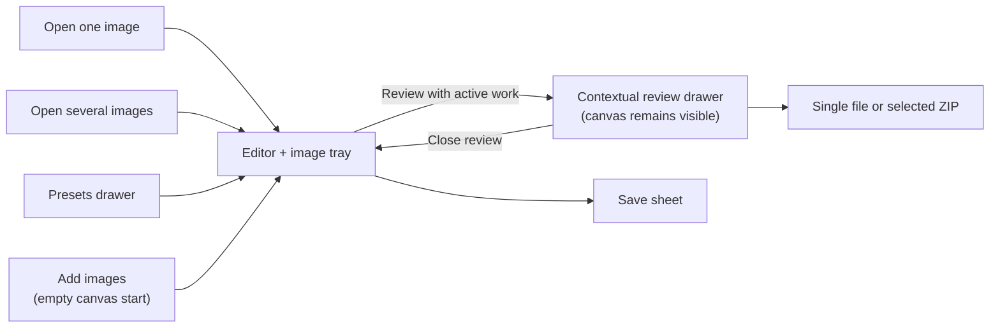
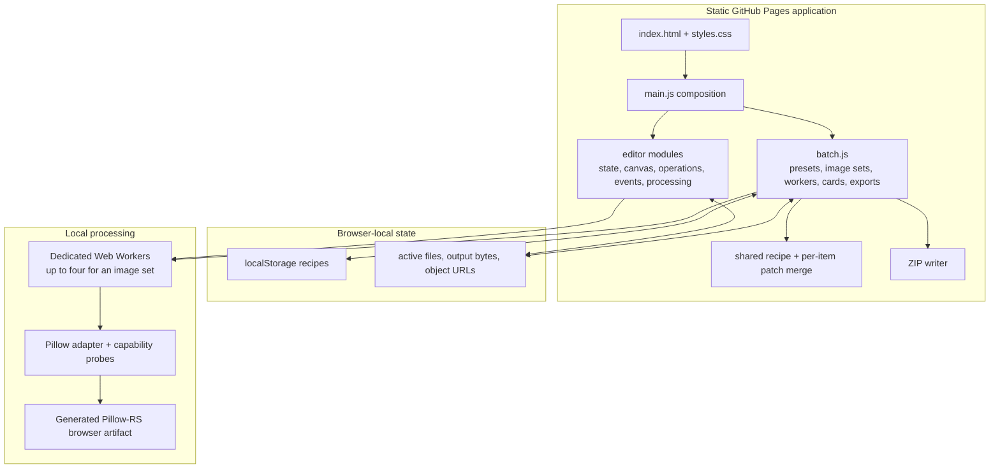
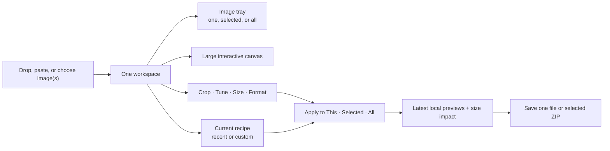
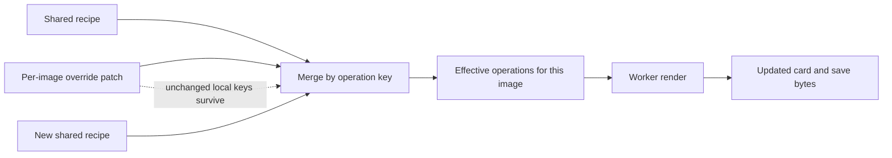
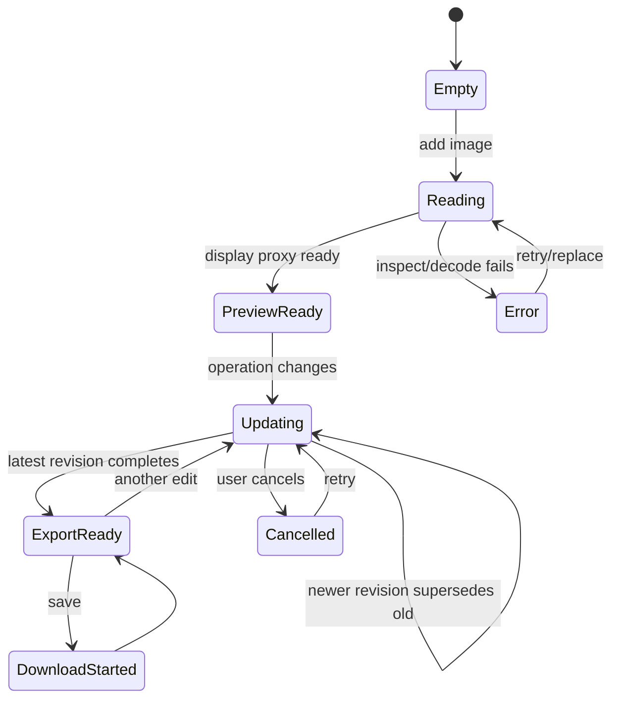

# Tiny Image Star product and UX audit

> Historical design review: the interaction research in this document remains
> useful, but its ZIP export descriptions are superseded by
> [`LARGE_FOLDER_PLAN.md`](LARGE_FOLDER_PLAN.md). Current multi-image behavior
> writes files directly into a uniquely named folder; the large-folder path
> uses a durable metadata manifest, bounded workers, and a virtual status list.
> `README.md`, `IMPLEMENTATION_PLAN.md`, and `VERIFICATION_MATRIX.md` are the
> current implementation contract.

> Review date: 2026-08-02  
> Scope: the complete current browser application, source structure, documented
> product contract, automated checks, live desktop and 390 px browser behavior,
> and relevant interaction patterns from established photo and design tools.

## 2026-08-02 unified-workspace implementation update

This update supersedes older recommendations below that mention separate
**Canvas**, **Review**, or **Return to set** navigation and generic **Save**
wording. The implemented interface now has one editing workspace:

- one image or many use the same canvas and image tray;
- **Results (N)** opens a contextual output drawer and **Back to editor** closes
  it—there is no competing Canvas toggle or Return-to-set action;
- direct canvas changes stay local until the user chooses **Apply changes to:
  All images / Selected images / This image** and activates the clearly named
  apply action;
- applying to all merges only the changed properties into the shared layer;
  normalized crop coordinates scale per source, while unrelated per-image
  corrections remain intact;
- format is always visible after import. Friendly compression choices are
  **Low (80)**, **Medium (95, default)**, and **High (100)**, but appear only for
  an output encoder whose quality path has been verified;
- **Apply** changes previews; **Download** creates files. The download sheet is
  metadata-only and never duplicates the image preview;
- individual downloads include source name, UTC date/time, destination, and
  verified extension. Multi-image downloads use one timestamped ZIP containing
  one identically named top folder;
- the bounded, pixel-aware Web Worker pool remains the compute mechanism. A
  Service Worker is not used for image computation because its lifecycle is
  designed for network/offline interception, not a reliable parallel job pool.

### Results and mobile quality audit

A second full responsive pass found several issues that ordinary overflow
checks had missed. They are now fixed and covered by the browser regression:

- an open **More destinations** list and a capability-gated format selector
  could extend beyond a 320 px viewport;
- the active recipe summary was clipped instead of wrapping at phone and
  tablet widths;
- long filenames could expand a result card's implicit grid track even though
  the visible filename itself used an ellipsis, pushing comparison and menu
  controls off-screen;
- result actions and comparison controls were too short for dependable touch
  use, and several labels inherited a desktop-only no-wrap rule;
- a phone-specific grid rule could override a control's `hidden` state and
  reveal disabled compression/quality settings for an unsupported format;
- the editor's fixed phone controls had a higher stacking layer than Results,
  so an apparently visible card menu could have its tap intercepted;
- result cards and their open action menus did not have an explicit one-column,
  bounded phone layout.

The regression now imports a deliberately long filename, opens both destination
and card action menus, injects a verified multi-format capability state, and
checks 320/375/390/768/1024/1440 px layouts. It fails on horizontal escape,
clipped result text, open menus outside the drawer, page overflow, or mobile
targets below 44 px, and on any hidden Results control becoming visible. A 390
px run at 200% text size covers the Results surface. The mobile smoke also uses
hit-testing and a real click to prove card actions are above the underlying
editor controls and can actually open.
The long filename also remains available through a native title tooltip when
the compact card heading is ellipsized.

The remaining responsive boundaries need device or assistive-technology
evidence rather than more geometry assertions: iOS/Android touch behavior,
screen-reader order and announcements, right-to-left layouts, virtual-keyboard
interactions, and end-to-end output fixtures for every newly enabled encoder.

### Research translated into product rules

The interaction model follows recurring, independently documented patterns:

- Apple Photos lets people copy modified edits and paste them onto multiple
  selected photos. Tiny Image Star makes the same scope explicit at the moment
  the user applies a canvas change: [Apple Photos edit/copy edits](https://support.apple.com/en-euro/guide/iphone/iphb08064d57/26/ios/26).
- Lightroom offers Copy Settings plus paste to multiple selected photos, and
  Lightroom Classic distinguishes Sync from Auto Sync. The useful lesson is to
  preserve a deliberate per-image versus shared scope instead of silently
  broadcasting every adjustment: [Lightroom copy/paste](https://helpx.adobe.com/uk/lightroom/mobile/share-save-and-export/copy-and-paste-edits-to-photos.html),
  [Lightroom Classic sync behavior](https://helpx.adobe.com/lightroom-classic/desktop/process-and-develop-photos/develop-module-options.html).
- Apple Photos exposes format, filename, quality, and subfolder choices at
  export time. Tiny Image Star keeps format and friendly quality visible, while
  exact values remain optional: [Apple Photos export options](https://support.apple.com/en-mide/guide/photos/pht6e157c5f/mac).
- Squoosh validates the value of private local processing and immediate size
  feedback, but its compression-first model is not used as the editor’s
  navigation model: [Squoosh](https://github.com/GoogleChromeLabs/squoosh).
- Recurring user reports reinforce the same gaps: demand for batch application
  of edits, confusion over save/export semantics, and frustration when batch
  format/quality defaults are hidden. These reports are directional rather
  than authoritative specifications: [Google Photos batch-edit request](https://www.reddit.com/r/googlephotos/comments/1t0d0e9/can_google_photos_batch_enhance_or_batch_edit/),
  [Snapseed export confusion](https://www.reddit.com/r/snapseed/comments/1td1mk6/why_exporting_got_so_maddening/),
  [Affinity batch defaults complaint](https://www.reddit.com/r/Affinity/comments/1vbaco8/batch_job_module_could_use_a_redesign/).

The highest-value follow-ons are now fewer and clearer: real-device touch and
screen-reader testing, focal-point assistance for mixed-aspect crops, total ZIP
size prediction, and end-to-end acceptance fixtures for each new Pillow-RS
encoder before its format appears.

## Executive conclusion

Tiny Image Star already has a credible processing core. It keeps image data in
the browser, generates the downloadable file independently from the display
canvas, validates output signatures, runs image-set work in a bounded worker
pool, rejects stale revisions, supports real PNG and ZIP bytes, stores recipes
locally, and preserves a per-image correction as a patch over a shared recipe.

The main product problem is not missing engine sophistication. It is that the
interface still exposes more surfaces than the user's goal requires. A user can
encounter **Canvas**, **Presets**, **Review**, a tool rail, an inspector, a top-bar
Save button, a Result summary, and a conditional save sheet. The active
one-and-many path is now one canvas workspace with a tray and contextual review
drawer; an empty workspace keeps the same canvas surface and turns **Add images**
into the one-or-many collection chooser, while collection saving remains scoped
to the selected images. On a phone, important
controls are also split across fixed quick actions, a bottom bar, and a
Controls sheet rather than forming one familiar photo-editing surface.

The proposed north star is:

> **Open any number of images into one workspace. See the result immediately.
> Make one visual decision at a time. Apply it to this image, selected images,
> or all images. Save without learning image-processing terminology.**

“100× better” should not be treated as an objective marketing claim. It can be made a
useful product constraint: reduce decision load, navigation, and recovery cost
by orders of magnitude. A first-time user should be able to obtain a correct
result without a tutorial; a returning user should be able to apply a saved
recipe to a new set in two or three deliberate actions.

The highest-priority changes are:

1. Finish the one-workspace migration: keep one canvas plus an image tray, and
   use the contextual review drawer for an active set instead of a second mode.
2. Reduce the primary editing vocabulary to **Crop**, **Tune**, **Size**,
   **Format**, and **Save**. Rotation and flip belong contextually inside Crop.
3. Keep the explicit **This image / Selected / All** scope that now appears
   only when more than one image is present in both the image-set bar and the
   editor tray.
4. Keep the mobile layout around a compact header, a full-height canvas, a
   fixed primary action bar, and a contextual controls sheet; remove the
   undiscoverable scrolling tool strip.
5. Make the preview a tested contract. Keep extending the pixel-parity fixtures
   from the now-verified resized PNG path to crop, orientation, alpha, color,
   adjustments, and every enabled output type—not just DOM-state and
   output-dimension checks.
6. Make import support end-to-end and truthful. A format is supported only when
   it can be decoded, previewed, transformed, encoded when applicable, and
   saved with verified bytes.
7. Make the browser regression command a normal installed project dependency,
   expand its mobile assertions, and run it with the byte-level suite before a
   release.

## What was reviewed

### Evidence levels

This document uses four evidence labels:

- **Verified** — exercised by the current deterministic test or directly in the
  live browser during this review.
- **Implemented** — present in source, but not fully proven across the intended
  browser/input matrix.
- **Gap** — absent, misleading, inconsistent, or observably difficult.
- **Proposal** — recommended behavior; not a current claim.

### Review evidence

- The complete current executable and test surface was inventoried: 8,849 lines
  across HTML, CSS, application modules, worker/engine code, scripts, and the
  deterministic fixture harness, plus eight design/verification documents.
- The app was exercised from its local HTTP server with a deterministic PNG in
  the empty editor, image-set grid, canvas, Crop, Adjust, Save, Presets, and a
  per-item canvas return path.
- Desktop and 390 × 844 layouts were inspected. Element bounds were measured,
  not inferred from CSS alone.
- The registered fast command passed against the current saved source in 266 ms
  (`f486c8dd-2195-4915-b8c7-2f344d7f7c1d`). It exercised real image
  transformations, decoded PNG dimensions and exact crop/rotate/flip pixels
  including varied alpha, all eight EXIF orientations, indexed PNG, a compound
  crop/rotate/flip/resize/adjustment path, output-size rejection, structure-
  aware animation safety, corrupt/truncated input rejection, exact
  batch-byte-limit boundaries, ZIP entry bytes,
  capability rejection, a runtime probe of every output format actually
  exposed by the checked-in binding, plus a synthetic verified JPEG signature
  and quality path,
  configuration merging, input safety, pixel-aware worker scheduling, and the
  unified tray selection and shared-recipe/editor-context contracts.
- The Playwright development dependency is now declared and installed. The
  registered browser command passed in 17.558 seconds
  (`34ac535d-574b-4763-9a06-373764e79dc2`) with an observed download event,
  responsive geometry checks, actual ICO import, hold-to-compare state, direct
  crop-handle dragging, JPEG/EXIF-JPEG generated-output/canvas parity,
  single-image Size/aspect-lock and capability-gated Format actions plus shared tray
  format/lossy controls,
  saved format/compression recipe round-trip, explicit All/Selected/This
  recipe scope with per-item destination markers, honest unsupported format
  recovery back to PNG, keyboard crop and history shortcuts, cancellation,
  selection, per-item override plus separate destination/manual reset actions,
  saved override-as-recipe persistence and local-data counts,
  direct top-bar single-format Save plus the choice-required metadata-only save sheet,
  reduced-motion and forced-colors/high-contrast media emulation,
  worker-backed ZIP assembly with stale-archive cancellation, editor-tray
  cancellation followed by per-card retry,
  refresh/restore recovery, restored-set Editor navigation that reopens the
  active item with its tray, synthetic pinch
  and double-tap Fit gestures, keyboard zoom/crop shortcuts, exact
  generated-PNG-to-canvas pixel parity for TIFF/ICO input, fit/crop, and a
  compound rotate/flip/adjust path, no console errors, and no image upload or
  external network request.
- The same browser run verifies the contextual workspace labels: an active set
  exposes **Review** with its image count, review exposes **Canvas**, the
  legacy per-item return action says **Return to set**, and an empty workspace
  keeps **Add images** for importing through the same one-or-many collection
  input.
- The documented combined `npm run verify:all` gate also passed in 17.558
  seconds (`34ac535d-574b-4763-9a06-373764e79dc2`), with both subcommands
  reporting PASS and the download event observed. This confirms the release
  command invokes the real-byte and browser gates together rather than merely
  documenting separate commands.
- No line/branch coverage artifact is produced by the current test commands.

### Open-source documentation readiness

The product review is documented, but the repository is not yet ready to make
every open-source trust claim without one maintainer decision:

| Surface | Current state | Required before public release |
| --- | --- | --- |
| License | No root `LICENSE` file; the intended license is unknown. | Choose and add a license covering the frontend, checked-in generated artifact, fixtures, and any third-party assets. Until then, avoid implying unrestricted reuse. |
| Contributions | No root contribution guide. | Add the supported local commands, browser-smoke prerequisites, fixture rules, and the boundary that contributors must not edit the Pillow-RS checkout from this project. |
| Security/privacy reports | No private reporting route. | Add a repository-specific private contact or security-advisory route. Public issue reports should not be the only path for a browser/privacy defect. |
| Deployment | `.github/workflows/pages.yml` exists and assembles the static app, but this checkout has no Git history or executed CI/deployed-path evidence. | Run the workflow in the hosting repository and document the release artifact, dependency installation, deployed-path smoke test, and rollback path. |

These are release-trust gaps, not reasons to add product UI. They are called out
so documentation does not silently turn an intended property into a proven one.

## Current product model

### Current user-facing surfaces



The transitions work, but the nouns encode product architecture. A normal user
does not think “I am in batch mode”; they think “I have three photos.” They do
not think “open the preset manager”; they think “make these fit a profile
photo.”

### Screen-by-screen UI review

| Surface | What is good now | What makes the user work | Recommended end state |
| --- | --- | --- | --- |
| Empty start | One calm canvas, one primary Choose images action, a secondary Choose a folder action, and a short private/offline explanation. Both entry points feed the same editor/tray workspace. | The header still contains navigation and several secondary actions before there is an image. Browser smoke now imports a directory through the empty canvas, opens an active image, and keeps the tray in the editor. | Keep the canvas invitation dominant; reduce the header to brand, Add images, and nothing that cannot help the first import. |
| One-image editor | Direct canvas, Crop handles, Original/Edited comparison, visible dirty state, history, and a truthful Save readiness boundary. The primary tools now separate Move, Crop, Size, Adjust, and capability-gated Format; Size reveals destination, Fit/Fill, and Advanced dimensions only when chosen. | The remaining top-level tool count is still higher than the ideal Crop/Tune/Size/Save vocabulary, and rotation/flip remain in a secondary desktop group. | Keep the deliberate Size/Format separation, then group Tune and rotation/flip contextually once real-device verification shows no loss of discoverability. |
| Several-image workspace | The tray keeps the image set, shared destination, output options, selection, explicit All/Selected/This recipe scope, and per-item override context alive while an item opens on the canvas. The contextual **Review** action opens the result drawer while the canvas remains visible; **Canvas** returns to editing, and the legacy route says **Return to set**. Empty **Add images** uses the same collection input without exposing a separate empty collection mode. | Review still has a distinct drawer surface, and the primary Save action is below a toolbar with many equally weighted controls. | Keep the tray as the collection model and the drawer as a contextual view. Put the active destination, selected count, and one Save action in a sticky, compact footer. |
| Review surface | Result-first cards, press-to-compare original, dimensions, bytes, delta, selection, retry, remove, and ZIP behavior are visible. | The result grid can still feel like a second product surface if its relationship to the canvas is not obvious. | Keep the grid as a view of the same collection and label the entry action **Review**. |
| Presets | Human-readable destinations, local custom recipes, duplicate/edit/delete, and Advanced details are available. | The drawer asks users to manage recipes before they have made a visual result; platform names can look like official current requirements. | Let users save the current canvas as a recipe first. Present recent destinations, shape choices, and My recipes in one contextual sheet; describe platform labels as familiar layouts. |
| Save sheet | When choices are ambiguous, it shows dimensions, file size, and format without duplicating the image preview; the latest bytes are the ones saved. A single verified format saves directly from the top bar. | Browser verifies the choice-required metadata-only sheet and direct PNG bytes; the legacy rail trigger is hidden and retained only as a compatibility bridge. | Save immediately when there is one valid choice. Open the sheet only for format, transparency, naming, multi-file, or warning decisions. |
| Recovery and local data | Refresh recovery is explicit, bounded, local, and clearable; the current open image survives clearing stored records. | Recovery, recipes, and active in-memory work are separate concepts that are not yet explained in one compact place. | Use one “Your work on this device” surface with a clear distinction between saved recipes, recovery copy, and current unsaved work. |
| Phone layout | Fixed primary bar, quick actions, bottom sheet, pinch/double-tap wiring, and 320–390 px geometry checks exist. | Fixed bars consume several stacked rows and real touch/screen-reader/text-zoom behavior is still unverified. | Keep the canvas dominant, use one contextual sheet, preserve button alternatives for every gesture, and validate on real devices before calling it effortless. |

The recurring issue is not that a control is missing. It is that the same choice
is presented in more than one place, or that a control is visible before the
user has a reason to use it. The redesign should remove choices from the first
screen and reveal them at the moment their result can be seen.

### Current implementation architecture



### Source ownership

| Area | Current owner | Review |
| --- | --- | --- |
| Application bootstrap | `src/main.js` (87 lines) | Good: small composition entry point; session persistence and the public editor bridge are explicit. |
| Canvas behavior | `src/editor/canvas.js` | Good separation; direct crop/pan/zoom logic is readable. |
| Editing state/history | `src/editor/state.js`, `core.js`, `operations.js` | Good serializable operation model; latest operations can recover locally, while undo/redo history remains session-memory only. |
| Worker lifecycle/result state | `src/editor/processing.js`, `src/worker.js` | Strong revision boundary; cancellation cannot interrupt a running synchronous engine call. |
| Engine contract | `src/engine/pillow.js` | Strong app-owned adapter and byte-signature checks; input support and visual parity need broader proof. |
| Framing review | `src/framing.js` | Small pure shape-comparison helper; flags likely shared-crop mismatches without changing the shared recipe. |
| Presets and image sets | `src/batch.js` (2,010 lines) | Still too many responsibilities; the dominant developer-accessibility and change-risk hotspot even after the earlier `main.js` composition refactor. |
| Destination data | `src/presets.js`, imported by `batch.js` | Resolved in the current pass: one destination vocabulary now drives the built-in recipe picker and preset dialog. |
| Recipe/override merge | `src/config.js` | Strong: small, explicit, and byte-testable. |
| ZIP creation | `src/zip.js`, `src/zip-worker.js` | Useful minimal store-mode ZIP with safe basenames and deterministic duplicate suffixes; selected archives now assemble in a dedicated worker with a revision check before download. |
| Regression | `scripts/verify.mjs`, `browser-smoke.mjs` | Strong real-byte foundation; browser dependency and visual/parity coverage are incomplete. |

## Complete current feature audit

| Feature | Current behavior and implementation | Evidence | UX judgment |
| --- | --- | --- | --- |
| Private local processing | Static site, no application backend, local object URLs, workers, and local recipe storage. | Verified in source and browser run `34ac535d-574b-4763-9a06-373764e79dc2`: no request body and no request outside the local test origin; local `blob:` preview URLs are in-memory. | Core differentiator. Say it once near import and once near save; do not repeat it as chrome. |
| Engine readiness | Internal Starting/Ready/Error phases. Healthy Ready badge hides; processing status is separate. | Verified by fast test and live browser. | Correct. Users only need activity or actionable failure, not engine terminology. |
| Empty editor | Hides disabled tools and shows one central Choose action. | Verified live. | Strongest current screen; preserve its calmness. |
| Single import | One file routes to canvas; drop, paste, and chooser are supported; browser-unfriendly still sources can use the local display proxy. | Verified for PNG and TIFF in browser; the compound smoke also verifies clipboard import through the shared tray and keyboard drop-zone activation; engine fixture coverage is broader. | Good first action, but one and many diverge immediately after import. |
| Multiple/folder import | Several files from the main chooser stay in the editor with an image tray. The tray exposes a human-readable destination picker, explicit All/Selected/This recipe scope, capability-gated output format and smaller-file controls, Select all/Clear selection, Add, Cancel updates while processing, and Save selected. With an active canvas image, **Review** opens the result-first drawer; without one, **Add images** stays on the calm canvas start and opens the same collection input. The 40-file/160 MiB limits, preflight byte check, input reset, New set, Retry, Clear completed, and per-card Remove are available. | Browser path is covered for PNG and TIFF; source/fast contracts cover the bounded workflow, scoped destination merge, shared output-setting recovery, editor-tray cancellation followed by per-card retry, review drawer close/reopen, and automatic return to the canvas after the last reviewed item is cleared. | The shared workspace direction is working. Keep the status line explicit about skipped, failed, cancelled, and completed items, and continue reducing the review drawer's visual weight. |
| Input formats | Capability metadata lists JPEG, PNG, GIF, BMP, WebP, TIFF, and ICO. Native browser previews are used when available; a local Pillow-RS-generated PNG proxy handles browser-unfriendly sources while the original bytes remain the processing input. Animated GIF/WebP inputs are rejected before preview. | Fast fixtures prove JPEG, BMP, WebP, GIF, TIFF, ICO, all eight EXIF-JPEG orientations, varied-alpha PNG, indexed PNG, and corrupt/truncated rejection; browser smoke proves chooser, drag/drop, clipboard, TIFF proxy, ICO, normal JPEG, and EXIF-oriented JPEG import, visibly rejects an unsupported AVIF input without replacing the current image, and checks generated-output/canvas parity. Color-profile behavior remains unproven. | The UI can truthfully accept the proven still-image paths. Keep animation unavailable until preservation or intentional flattening is implemented. |
| Canvas preview | Browser Canvas gives an immediate editing preview; once the worker result is ready, the edited view displays the decoded generated output bytes. Crop manipulation intentionally returns to the source image so handles remain direct. | Implemented; browser asserts stale-save blocking, a changed original/generated canvas snapshot, and exact rendered-channel parity against decoded generated PNGs for fit, two crop paths, and a compound rotate/flip/adjust path. | Stronger truth boundary. Extend parity across every input, orientation, alpha, enabled format, and color profile before claiming universal renderer parity. |
| Pan | Pointer drag; Space modifies crop-mode behavior. | Implemented; browser smoke performs a real Space-drag and asserts the canvas image moves, while the source contract and browser gesture journey cover the interaction family. | Desktop-familiar. Mobile needs one-finger pan rules and two-finger pinch; no gesture tutorial should be required. |
| Zoom and fit | Wheel, +/− buttons, keyboard shortcuts, and Fit. | Browser automation verifies unmodified shortcuts and proves Cmd/Ctrl+F remains the browser Find command instead of triggering Fit. | Keep Fit. Move zoom to canvas chrome; hide +/- labels on mobile and add pinch. |
| Original comparison | Original/Edited segmented buttons in the canvas plus press-and-hold original on image-set cards. | Browser run `34ac535d-574b-4763-9a06-373764e79dc2` verifies both the editor hold state and result-first card comparison. | Keep the accessible persistent toggle. Add a wipe slider only if real-device testing proves it is clearer than hold-to-compare. |
| Crop | Eight edge/corner handles, movable crop frame, direct draw, thirds grid, Original/Square/4:3/3:4/16:9/9:16 presets, and keyboard arrow nudging with Enter/Escape alternatives. Handle visuals are 14 px with a 20 px hit radius. | Real crop bytes tested; browser selects and shape-checks all six presets, applies a real 16:9 preset and compares its generated bytes to the canvas, drags a handle, uses keyboard Enter/Escape and arrow nudging, and asserts the changed output dimensions. | Valuable. Keep the edge handles and grid; still add drag-image-under-frame mobile behavior and real-device target-size checks. |
| Resize | The primary **Size** action opens Keep whole image versus Fill frame; exact width/height and aspect lock remain under Advanced. Fit does not enlarge. Move is reserved for canvas navigation. | Real dimensions tested; browser deliberately switches Size before destination and Advanced sizing, verifies locked/unlocked width/height behavior, checks Fit/Fill, and verifies generated bytes. | Semantics are good. Separate **Frame shape** from **Output size** visually; illustrate what is lost; expose “Do not enlarge” in plain language. |
| Rotate/flip | Four always-present rail buttons for 90° left/right and horizontal/vertical flip. | Real bytes tested. | Operations work, but four top-level actions are too expensive. Put them inside Crop, where phone users expect them. |
| Adjustments | Brightness, contrast, grayscale; live browser-canvas feedback and worker output. | Real output bytes tested. | Too technical and sparse. Use human-centered zero values, tap-to-reset, and visual feedback. Add Auto, color, warmth, highlights/shadows only after engine parity is verified. |
| Undo/redo/reset/dirty | Operation snapshots in memory; sliders coalesce into one history step on change; dirty state compares against last saved operations. The badge occupies a stable header slot, so save-state transitions no longer move the canvas. | Browser automation compares header/workspace geometry across clean, dirty, updating, and ready states; text-field undo is isolated from canvas history. | Strong foundation. Add visible current-step labels and persistent crash recovery. Reset should offer “this image” versus “all selected” only when scope demands it. |
| Output format | Runtime probes known encoders and checks byte signatures plus a decode-and-dimension round trip; current checked-in artifact exposes PNG only. Both batch surfaces and the single-image **Format** action render choices only after capability data says they exist. Selecting a complete destination recipe clears an older explicit batch format/compression override so the saved recipe’s final format is honored. | Verified for PNG and unsupported rejection; the fast suite exercises the adapter's capability-gated JPEG dispatch with a synthetic verified encoder, and the browser run injects a verified PNG/JPEG capability, checks the Format action at 390 px, saves and reapplies a JPEG/lossy recipe, observes an honest JPEG failure with disabled Save, verifies exact PNG preview/download byte identity, then resets and successfully retries PNG. | Excellent truth principle. A signature alone is not enough for new formats: decode the emitted bytes and check dimensions/content too. |
| Compression | “Smaller file” and quality are capability-gated by the selected output format; currently hidden for the real PNG-only artifact. | Implemented gating; the latest combined gate `34ac535d-574b-4763-9a06-373764e79dc2` probes the real runtime output list and proves quality reaches a verified synthetic encoder path, but there is no operational lossy encoder in the checked-in artifact. | Keep **Smaller file** as the primary wording. Put “lossy compression” only in Advanced/help. Always show predicted/actual size impact. |
| Save sheet | The save sheet intentionally contains metadata only, not a second image preview. | Verified live and asserted in browser script. | Correct. The canvas/grid is the preview. Keep the save route free of duplicate imagery. |
| Single save | With one verified format and no quality choice, top-bar/keyboard Save downloads the latest generated bytes immediately. With multiple formats or a lossy choice, it opens a metadata-only sheet. The Result inspector reports output state but does not offer a second Save action. | Fast PNG bytes and browser direct-save path pass; browser also checks the choice-required sheet has no second image preview and asserts the legacy rail control is not visible. | The single-image click budget is now correct for the real PNG-only artifact. Keep batch Save visibly scoped to the selected collection, and keep the sheet conditional as capabilities grow. |
| Built-in recipes | Outcome-named destinations plus Keep original. The editor and image-set pickers show three quick choices (Keep original, Instagram Post, Profile Photo) and place the remaining destinations behind a human-readable More destinations disclosure; exact dimensions remain in Advanced. | Fast data tested; browser run `34ac535d-574b-4763-9a06-373764e79dc2` verifies quick choices, More destinations, Website Banner, scoped tray application, and review reuse. | The first-use choice set is calmer. A later pass can make quick choices recent/frequent rather than fixed while preserving the More fallback. |
| Custom recipes | Save current visual crop and operations; localStorage; name, destination, Advanced dimensions/format; edit, duplicate, delete. A saved recipe carries its final format/compression choice into the active tray and refreshes the tray picker immediately. | Implemented; the latest browser run saves, verifies, reapplies, and deletes a JPEG/lossy recipe while preserving the shared recovery destination. | Powerful. Make creation feel like “save what I see,” not form completion. Per-image correction is now explicit and always marked as an override; there is no hidden adjustment permission. |
| Relative crop recipe | Crop is normalized to source dimensions and reapplied to each image. Different source shapes are now reviewed before save. | Fast configuration contract plus browser run `34ac535d-574b-4763-9a06-373764e79dc2`: Square applied to square and portrait sources shows a plain-language Review framing notice and marks the affected tray/card; removing the affected item clears the notice, and Keep whole image avoids it. | Correct basic rule with an explicit safety cue. A later pass can add candidate-frame previews or focal-point guidance; the shared recipe still remains unchanged until a user makes a per-image correction. |
| Image-set parallelism | A queue runs through up to four dedicated workers, limited by reported hardware concurrency and the largest item’s decoded pixel budget. Worker failures retire cleanly. | Fast contract proves small sets use parallel workers and large images reduce concurrency; browser smoke observes several results without blocking the canvas. | Correct primitive. Prioritize visible/selected items next; keep service workers for offline app assets—not image compute. |
| Cancellation | Cancels/terminates current image-set workers; completed results remain. Editor stale revisions are discarded. Cancelled and retryable processing/encoder failures expose Retry; permanent animated/corrupt/oversized-input errors stay non-retryable; completed cards can be cleared without removing unresolved items. | Source and browser-script coverage, including an unsupported shared output format followed by a successful reset/retry. | Honest recovery path. Keep “stop waiting,” “retry,” “clear completed,” and “remove image” visually distinct. |
| Preview grid | Result-first thumbnail, destination, dimensions, bytes, delta, status, and a hold-to-compare action that temporarily reveals the original. Scoped destination cards visibly mark items that differ from the shared recipe, and likely mixed-shape crop items show Review framing. | Browser run `34ac535d-574b-4763-9a06-373764e79dc2` verifies the result-first state, scoped tray application, contextual review drawer, press/release comparison, and mixed-shape warning/markers at desktop and mobile widths. | The visual decision is now clearer. Add a larger optional wipe view only if real-device testing shows it is needed. |
| Selection | Completed items select by default; per-card checkboxes; Select all/Clear selection. | Implemented and scripted. | Sensible default. Let clicking a card select it; enter explicit selection mode on mobile; never hide the checkbox's accessible semantics. |
| ZIP export | One selected result downloads directly; several selected results are renamed and placed in one uncompressed ZIP. Entry paths are reduced to safe basenames and duplicate names get deterministic suffixes. ZIP assembly runs in a dedicated worker and is discarded if the image-set revision changes before download. | Real ZIP headers/entries, duplicate/path-safety cases, and readable name rules are fast-tested; browser smoke verifies the worker URL, selected-only ZIP bytes and filename, individual output filename, keyboard save, and no stale download when a recipe changes during assembly. | Correct default. Show predicted total size before save when the collection is large; keep the worker boundary. |
| Per-image override | Shared recipe is normalized per source; item stores only changed keys. A scoped destination is stored separately as `presetOverride`; returning from canvas merges manual changes—including format, lossy, and quality choices—over that item's effective recipe. Shared destination/format changes capture the current canvas patch, keep the merged format visible on errored cards, and reload the active editor with the merged effective configuration. Resetting an active override refreshes both the canvas and result. | Fast session/merge contracts and browser scenario, including tray scope → edit → choose JPEG/lossy/quality 55 → return → shared PNG change → reopen and compare the preserved override against an untouched item → active reset. The browser also fetches the overridden result preview and proves that individual PNG and selected ZIP exports contain those exact bytes. | One of the product's best capabilities. Surface it as **Adjusted** with a clear “uses recipe + this correction” explanation. |
| Keyboard | Cmd/Ctrl+S, Cmd/Ctrl+Z/Shift+Z, Space, F, C, Enter, Escape, +/−. | Implemented and partially scripted. | Good for returning users. Do not make shortcuts the only route; expose a concise shortcut sheet under Help. |
| Mobile editor | Header wraps; the four primary tools use a fixed bottom bar; rotate/flip/zoom/Fit use a contextual quick-action row; Controls opens a bounded bottom sheet; batch cards expose a press-and-hold original comparison. The active image tray keeps Cancel updates and Save selected available at the right processing states, with Save selected in-bounds at 320px and 390px. | Browser smoke covers geometry at 320/375/390 px plus desktop widths, synthetic two-pointer pinch, synthetic double-tap Fit, keyboard alternatives, reduced-motion, forced-colors/high-contrast emulation, and no console/page errors. Real-device touch, screen-reader, and 200% text-zoom checks remain open. | The old hidden rail problem is fixed and collection actions no longer disappear on small screens. Keep the mobile interaction model, then validate it on real touch hardware and complete accessible gesture alternatives. |
| Recovery | Recipes persist. An active image set stores source bytes plus shared recipe, explicit recipe scope, per-item destination choices, selection, and manual override metadata; a standalone edit stores source bytes plus its latest operations in separate versioned, bounded IndexedDB snapshots. Refresh offers Restore/Clear/Not now; restore reprocesses outputs instead of trusting cached bytes. | Fast session-schema contract and browser refresh/restore journey pass for both active sets and a rotated single image. The browser also verifies the Local data summary/clear flow. Generated results and undo/redo history remain session-memory only. | The core recovery promise is now present. Consider restoring named history only if the privacy/storage tradeoff stays clear. |
| Accessibility | Semantic buttons, labels, native dialogs, focus-visible styles, status live regions. Canvas has an accessible label. Reduced-motion, contrast, and forced-colors styles are explicit. | Fast source contract and browser media emulation cover reduced-motion, forced-colors, and high contrast; the latest browser run also reports no console/page errors. Real-device screen-reader, touch, and 200% text-zoom checks remain open. | Good foundation. Add non-drag crop controls and validate target sizes, focus order, text zoom, and assistive technology on real devices. |

## Observed interface findings

### P0 — fix before presenting the product as effortless

#### 1. Mobile hides core operations

At 390 × 844 in the baseline review, the measured tool rail was 372 px wide
with 852 px of scrollable content. Only Move, Crop, Adjust, Save, and part of
Rotate left were visible. Rotate right, both flips, and zoom controls existed
beyond the edge with no strong indication that the strip scrolls.

The loaded editor header was 155 px high. The stage footer began at 749 px, the
Controls button began at 760 px, and the sticky tool rail began at 755 px. The
controls occupy the same visual band and compete for the bottom of the canvas.
The page itself has no horizontal overflow, so a generic page-overflow test does
not detect this failure.

**Current remediation:** the old horizontal strip has been replaced by a fixed
four-action primary bar, a contextual quick-action row for rotate/flip/zoom/Fit,
and a bounded bottom Controls sheet. The layout removes hidden horizontal
overflow, gives all eight crop handles a large hit region, and exposes
press-and-hold original comparison in image-set cards. The browser smoke
contract checks rail/footer overlap, viewport escape, direct crop dragging,
hold comparison, synthetic pinch, and double-tap Fit.
**Remaining validation:** verify the same interaction model with real touch
hardware, screen readers, reduced motion, high contrast, and 200% text zoom.
Rotation and flip can still be grouped more tightly under Crop in a later
information-architecture pass, but they are reachable now.

#### 2. Preview and saved output are not yet one fully proven truth

The architecture correctly exports worker-generated bytes rather than a canvas
screenshot. That avoids low-resolution saves. The edited canvas now switches to
the decoded worker output when it is ready, while direct crop manipulation keeps
using the source image for responsive handles. There are still two renderers
during active manipulation:

- browser Canvas for interaction; and
- Pillow-RS for the saved output.

The tests prove that an edit invalidates stale Save bytes and that original and
generated canvas snapshots differ after a resize. The browser gate now also
captures the actual generated PNG blob and compares every rendered channel for
deterministic 4×4 fit, direct 8×6 crop, advanced 4×4 crop, and compound
rotate/flip/adjust states. The browser path and engine path still apply filters
through different implementations while an edit is in flight. All eight EXIF
orientations are normalized by the app adapter, varied alpha and indexed PNG
are covered by real fixtures, and animated inputs are rejected. ICC/color
conversion remains outside the current fixture corpus.

**Remaining contract:** extend the canvas/output comparison across the
remaining operations, input orientations, alpha cases, color profiles, and
enabled formats before claiming full renderer parity. The fast fixture already
covers alpha, indexed PNG, all eight EXIF orientations, animated GIF/WebP
rejection, corrupt/truncated files, and each currently exercised input path.

#### 3. Input-format proof now covers the main still-image paths, with color profiles open

The adapter metadata lists seven input types. The fast fixture contract now
proves JPEG, BMP, WebP, GIF, TIFF, ICO, indexed PNG, and EXIF-JPEG decoding
(including all eight orientation normalizations), and import generates
a local PNG display proxy when `window.Image` cannot preview the original. The
original bytes still go to the worker for the actual edit/export, so the proxy
does not silently change the saved source. Browser smoke proves the TIFF path in
both the canvas and image-set workflows.

**Remaining redesign:** add color-profile behavior to the fixture corpus and
decide whether profile conversion should be explicit or always normalized.
Animation is now detected and rejected explicitly; do not turn it into
first-frame output until that data-loss decision has a verified, visible path.
Build the picker `accept` list from the passed end-to-end matrix, not declared
decoder metadata.

#### 4. The browser gate is now available; broaden its viewport matrix

`npm run verify` and `npm run verify:browser` now pass. The browser script
checks tool-rail overflow/overlap, stage-footer, mobile comparison,
re-import, remove/new-set, capability-gated format assertions, downloads,
cancellation, per-item override behavior, TIFF proxy and ICO import, direct
crop-handle dragging, hold-to-compare, and the full
320/375/390/768/1024/1440 px geometry matrix for editor and image-set controls.

**Remaining redesign:** keep the supported browser driver declared, keep the
fast save watcher dependency-light, require `npm run verify:all` for release,
and add screenshot/pointer/touch assertions for the actual editor.

#### 5. Image-set cleanup and recovery are now available

The current pass adds per-card **Remove image**, a confirmed **New set** action,
resets file inputs after capture so the same chooser selection can be used
again, exposes **Retry** on failed/cancelled cards, and adds **Clear completed**
without discarding unresolved cards. Completed previews remain in memory while
the active set is being edited.

**Remaining redesign:** make the recovery copy explain the difference between
latest-operation recovery and session-memory undo/redo, and add screenshot and
real-device checks for the local-data dialog. Both active image sets and
standalone edits now have explicit, bounded Restore/Clear paths.

### P1 — largest improvements to first-use clarity

#### 6. One product still looks like three

The app now has a meaningful unified path: selecting one or many files from the
main chooser keeps the canvas workspace, an image tray appears for a set, and
the tray can change the human-readable destination for all, selected, or the
active image without leaving the canvas. Selecting a tray item opens it in the
same editor while preserving the active recipe and per-image override layer.
The contextual **Review** action opens the result-first drawer when an editor
image is active, so comparison, selection, and Save do not require leaving the
canvas. **Canvas** returns to editing, and a legacy per-item route says
**Return to set**. If an active set has no canvas item yet—for example after
refresh recovery—Review first opens the active item and then re-enters the
drawer, keeping the tray and canvas together. An empty workspace stays on the
same calm editor surface: **Add images** opens the collection chooser, and the
first selected file becomes the canvas item while the tray keeps the set.

**Remaining redesign:** reduce the visual weight of the Review drawer and move
recipe selection into a contextual recipe sheet. The one-workspace collection
model and the no-active-image import entry are now aligned; retain the scoped
recipe contract while simplifying the remaining chrome.

#### 7. Single-image Save now has one visible home

The loaded editor now exposes only the top-bar **Save** action to users. When
the current PNG output is unambiguous it downloads immediately; when runtime
capabilities introduce choices, the same action opens one metadata-only sheet.
The Result inspector reports dimensions, format, and readiness but does not
repeat Save, and the former rail trigger is hidden while its programmatic bridge
remains for compatibility. Batch Save remains intentionally separate because it
means “save the selected collection,” not “save this canvas image.”

**Remaining refinement:** keep the single-image route stable as more encoders
arrive, and make the batch footer label its collection scope just as clearly.
The save sheet must continue to contain only necessary choices and warnings—
never another image preview.

#### 8. Destination choice is now calmer, with a follow-on refinement

The current first-use picker shows three quick choices—Keep original, Instagram
Post (Square), and Profile Photo—and places the remaining destinations behind a
More destinations disclosure in both the editor and shared image-set picker.
Platform names are useful recognition aids but can become stale and do not cover
users who only know “square,” “portrait,” or “small for email.”

**Remaining redesign:** make the quick choices recent/frequent when usage data is
available, and group the More sheet by Shape, Share, Web, and My recipes.
Platform-labeled layouts remain clearly described as familiar presets, not
official current requirements. Advanced reveals exact pixels.

#### 9. The image-set cards spent space on duplicate previews — resolved

The cards now show the result at full width and keep the original hidden until
the user holds **Compare original**. The same press/release behavior is available
at desktop and mobile widths, while dimensions, format, file size, and size
change remain visible below the result.

**Remaining refinement:** add a larger optional wipe view only if real-device
testing shows that a press comparison is insufficient. Do not bring back two
permanent thumbnails.

#### 10. Settings now use human values, with format wording still gated

Brightness and Contrast now display a neutral `0` with signed percentages and
each label is a one-click reset. “Smaller file” is the primary wording; exact
dimensions and verified format/quality choices remain Advanced or capability-
gated.

**Remaining redesign:** add named endpoints or a small visual histogram only if
they make the adjustment decision faster, and continue keeping format,
quality, and metadata policy behind Advanced until the binding proves them. The
canvas always shows the selected destination frame.

### P2 — trust, resilience, and maintainability

#### 11. Recovery covers active sets and standalone edits; history remains local

The current image-set snapshot stores source bytes, shared recipe, selection,
and per-image override metadata in bounded IndexedDB. A standalone edit stores
its source bytes and latest operations in a separate bounded snapshot. Refresh
offers Restore, Clear saved session, or Not now, and restore reprocesses outputs
instead of trusting stale generated bytes. The footer's **Local data** dialog
reports saved recipes, recovery-copy count, and storage bytes, then clears both
stores after confirmation while leaving the currently open image available.
Undo/redo history is intentionally memory-only.

**Remaining proposal:** add screenshot and real-device checks for the dialog;
never make recovery depend on an account or silently persist undo history.

#### 12. Filenames are now consistent and bounded

Single output names and ZIP entries share one app-owned naming module. They use
the source basename plus a readable recipe slug and the extension matching the
verified output bytes. Folder segments, control characters, trailing dots, and
very long stems are bounded before download; ZIP entry collision handling still
adds deterministic suffixes.

**Remaining refinement:** show three example names before a very large save and
offer an explicit folder-preservation policy only if browsers provide a reliable
path-safe mechanism.

#### 13. Per-image correction and destination overrides are explicit

The misleading “Allow a quick per-image crop adjustment” flag has been removed.
An image opened from a set always receives a separate manual override patch, the
card shows **Edited for this image**, and a scoped destination is a separate
**Different destination** layer. The card now offers **Reset to preset** for
manual edits and **Use shared destination** for a scoped destination, so one
reset cannot silently erase the other kind of user intent. The shared recipe
can change without silently replacing either layer.

The first review cue is now implemented: when a shared crop destination is
applied to source images with materially different shapes, the tray and result
card mark the affected item as **Review framing**, and the active-set review
surface explains that the image can be adjusted on the canvas. This is a cue,
not a blocking wizard; the user can still save the set or remove the item.

**Next proposal:** show candidate frames or a focal-point adjustment for the
marked item, without turning framing review into a required wizard.

#### 14. Developer structure raises product-change risk

`batch.js` owns storage, preset rendering, dialogs, view routing, imports,
worker scheduling, grid rendering, selection, downloads, and overrides.
Destination definitions are duplicated in `batch.js` and `presets.js`.

**Proposal:** extract behavior incrementally behind the current interfaces:

```text
src/
  app/              workspace shell, routing, keyboard scope
  session/          image collection, selection, recovery
  editor/           canvas, tools, inspector, history
  recipes/          definitions, storage, visual builder, migration
  processing/       scheduler, worker pool, capability registry
  export/           names, download, ZIP worker
  engine/           app-owned Pillow adapter
  ui/               reusable buttons, sheets, cards, status
```

One `recipes/definitions.js` file must be the source of destination names,
dimensions, aspect ratios, and descriptions.

## Lessons from tools people already know

This comparison uses official product/help material current at the review date.
It identifies interaction patterns, not a claim that every competitor behaves
identically on every device or plan.

| Tool | Familiar behavior worth borrowing | What Tiny Image Star should avoid |
| --- | --- | --- |
| Apple Photos | A small bottom mode rail; direct crop/straighten; one-tap Enhance; tap the image to compare; reversible edits; copy selected edits to one photo or a batch. [Apple Photos guide](https://support.apple.com/en-ae/guide/iphone/iphb08064d57/ios) | Device/cloud coupling and advanced features that conflict with the project's portable offline scope. |
| Google Photos | One-click suggested edits, direct crop handles, press-and-hold original comparison, Save/Revert language. [Google Photos help](https://support.google.com/photos/answer/6128850?hl=en-uk) | Account/backup assumptions and feature differences between web and native apps. |
| Microsoft Photos | Crop/rotate/flip/straighten grouped together; light/color adjustments; click-and-hold or Space to compare with original. [Microsoft Photos help](https://support.microsoft.com/en-gb/windows/using-generative-erase-in-microsoft-photos-e0b4df42-3372-4dfd-9d28-c4ef408454a7) | A broad desktop feature ribbon for a focused utility. |
| Squoosh | Immediate local processing, visual comparison, and file-size outcome. [Squoosh source and privacy note](https://github.com/GoogleChromeLabs/squoosh) | Compression-first panels and codec vocabulary as the whole editor model. |
| TinyPNG | Drop many files and let a strong default do the work; make the size win obvious. [TinyPNG web compressor](https://tinypng.com/?locale=en_us) | Upload/service limits, paid tiers, and automatic choices without a local visual correction path. |
| Adobe Express Quick Actions | One job per entry point; destination/social resize presets; a short select → resize → save story. [Adobe Express image resizer](https://www.adobe.com/express/feature/image/resize) | Sending a simple crop into a large design suite or account funnel. |
| Canva | Direct crop, drag/reframe, familiar aspect choices, clear final download. [Canva crop tool](https://www.canva.com/features/crop-image/) | Canvas/page/image-size ambiguity and full design-suite complexity. |
| Figma UI3 | Canvas dominance, contextual properties, selection actions, and collapsible chrome. [Figma UI3 guide](https://help.figma.com/hc/en-us/articles/23954856027159-Navigating-UI3) | Professional design-system density, modes, and panels that require prior learning. |
| Photopea | Powerful local browser editing and broad professional capabilities. Its own guide recommends a large screen, precise pointer, and keyboard for best comfort. [Photopea introduction](https://www.photopea.com/learn/) | Photoshop-style menus, layers, and terminology for users who only need a correct image result. |

### Synthesis

Phone photo apps are the stronger inspiration for first-use simplicity. Figma is
the stronger inspiration for spatial layout and contextual properties. Squoosh
is the stronger inspiration for outcome feedback. TinyPNG is the stronger
inspiration for minimal-decision image sets. Tiny Image Star can combine
those strengths without inheriting accounts, uploads, cloud AI, or a
professional-design learning curve.

## Target experience: one workspace

### Information architecture



There is no batch mode. The collection has one item or many. There is no
separate preset page. The current recipe opens a recipe sheet. There is no
separate save tool. Save is the destination of editing, not an editing mode.

### Desktop layout

```text
┌──────────────────────────────────────────────────────────────────────────────┐
│ Tiny Image Star   photo.jpg • Edited        Undo  Redo       [ Save ]       │
├──────────────┬───────────────────────────────────────┬───────────────────────┤
│ Review (4)   │                                       │ Crop                  │
│              │               CANVAS                  │ [Original] [Square]   │
│ ▣ photo 1    │                                       │ [4:3] [16:9] [Free]  │
│ ▢ photo 2    │       hold to see original            │                       │
│ ▢ photo 3    │                                       │ Rotate  ↶  ↷  Flip   │
│ + Add        │                                       │                       │
│              │                                       │ Applies to: This ▾    │
├──────────────┴───────────────────────────────────────┴───────────────────────┤
│  Crop      Tune      Size      Format                 Recipe: Profile photo  │
└──────────────────────────────────────────────────────────────────────────────┘
```

Rules:

- The tray collapses automatically for one image and remains one click away.
- The right inspector shows only the selected tool. No output summary is
  repeated in every tool.
- The scope control appears only when more than one item exists.
- Original comparison is a hold gesture on canvas; a persistent accessible
  Compare control remains available.
- Save is the only primary-colored action in the shell.

### Mobile layout

```text
┌──────────────────────────────┐
│ ‹  1 of 4   Edited    Save   │
├──────────────────────────────┤
│                              │
│                              │
│            CANVAS            │
│      pinch • drag • hold      │
│                              │
├──────────────────────────────┤
│ This image ▾   100%   Compare│
├──────────────────────────────┤
│ Crop   Tune   Size   Format  │
└──────────────────────────────┘
          ┌ bottom sheet ┐
          │ tool controls│
          │ Done         │
          └──────────────┘
```

Rules:

- Brand text does not consume editing height after import.
- Four primary tools fit without horizontal scrolling. Save stays in the compact
  header. Add/recipe/history are in a small overflow sheet.
- Selecting a tool opens a bottom sheet immediately; no separate Controls
  button is required.
- Pinch zoom, one-finger drag, double-tap Fit, and press-and-hold Original match
  existing phone habits. Buttons provide equivalent accessible actions.
- Crop shows the image moving under a stable frame, a familiar phone pattern.

## The intentional-click contract

Every interactive control must do exactly one of five jobs:

1. add or select source images;
2. change the visible result;
3. change which images receive that change;
4. choose/save the output;
5. recover, undo, or remove work.

A control should be removed or demoted if it only repeats status, opens a view
whose purpose can be contextual, or duplicates another route to the same action.

### Target click budgets

File selection itself is counted as one user action; direct drags/sliders are
interactions rather than extra navigation clicks.

| Goal | Target deliberate actions after arriving |
| --- | --- |
| Keep original and convert/save | Choose image → choose Format if needed → Save (2–3) |
| Make one photo smaller | Choose image → Smaller file → Save (3) |
| Crop and save | Choose image → Crop → Done → Save (4 plus framing gesture) |
| Apply a recent recipe to a new set | Choose recipe → choose images/folder → Save selected (3) |
| Correct one result in a set | Select result → edit directly → Done (3; shared recipe remains intact) |
| Reuse this correction later | Recipe menu → Save current recipe → name/save (3) |

### Current controls to consolidate

| Current | Target |
| --- | --- |
| Editor / Presets / Images navigation | Keep the canvas/tray as the main workspace; keep Presets contextual, use **Add images** as the empty-workspace entry, and use **Review** only for an active set. |
| Open images, Choose image(s), Choose images, Choose folder, drop zones | One **Add images** action with Images/Folder choices where supported; retain drop/paste. |
| Top-bar Save, hidden legacy rail bridge, Result inspector, save sheet | One visible single-image **Save** action; conditional metadata-only save sheet. Batch Save remains a clearly scoped collection action. |
| Original / Edited segmented toggle | Press-and-hold Original + optional wipe; accessible toggle retained. |
| Rotate left/right and Flip horizontal/vertical in global rail | Contextual row inside Crop. |
| Controls / Hide controls on mobile | Remove; selecting a tool opens its bottom sheet. |
| Ten destination chips | Current + two recent + More. |
| Return to set | Keep as a compatibility label for the per-item editor path; the active-set drawer already provides Close review and the empty workspace now uses Add images. |
| Edit on canvas from a card | Selecting a card puts it on canvas. |

## Feature-by-feature target specification

### 1. Add images

Primary behavior:

- Drop, paste from clipboard, choose files, or choose a folder where reliable.
- One or many files populate the same image tray.
- A visible **Add** action remains after import.
- Duplicate files are identified by a lightweight hash plus size/name and ask
  whether to add another copy.
- Invalid items become cards with a concise reason and Remove/Retry; one bad
  file never blocks good files.
- Each card can be removed, replaced, or reordered. New set clears only after a
  clear confirmation or recoverable session snapshot.

Technical behavior:

- Read bytes once; use transferable buffers where ownership allows.
- Inspect in a worker before claiming support.
- Normalize orientation for both preview and output.
- Produce a display proxy through the engine when browser-native decoding is
  unreliable.
- Detect animation/multiple frames and reject or explicitly offer **Use first
  frame** only after that flattening path has tests and clear data-loss copy.
- Guard decoded megapixels, not only compressed bytes, to resist memory bombs.

### 2. Canvas and comparison

Primary behavior:

- The image appears as soon as a safe preview is available. Controls may update
  optimistically, but Save only enables for the latest completed output.
- Desktop: wheel zoom, Space-drag, Fit, and an optional before/after wipe.
- Touch: pinch zoom, one-finger pan outside Crop, double-tap Fit, and hold to see
  Original.
- A short status line uses only actionable states: Preparing preview, Updating,
  Ready to save, Could not update, Cancelled.
- When the display preview is newer than the savable output, Save says
  **Finishing…** rather than using stale bytes.

### 3. Crop and framing

Primary behavior:

- Eight handles on desktop/touch, at least 44 × 44 CSS px touch hit regions,
  and non-drag alternatives for every action.
- Show thirds grid while manipulating, then fade it.
- Shapes: Original, Free, Square, 4:3, 3:4, 16:9, 9:16; recent destination
  shapes appear first.
- Rotation left/right, flip, and a Straighten slider live in this tool.
- **Done** commits one history step; Cancel restores the draft.
- The outside region remains visible enough to explain what will be removed.

Recipe behavior:

- Store a normalized crop rectangle plus an anchor/focal point.
- When applied to images with different aspect or subject placement, render all
  candidate frames first and mark **Review framing** rather than assuming the
  normalized rectangle is semantically correct.
- Manual item correction creates a patch and never edits the shared recipe.

### 4. Size

Primary behavior:

- First choice is visual: **Keep whole image** versus **Fill frame** with two
  thumbnail illustrations.
- Second choice is outcome: Keep original, Square, Portrait, Story, Thumbnail,
  Banner, Email, or Custom. Platform names are optional recognition labels.
- Result dimensions update directly on canvas and in a quiet status line.
- Advanced contains width, height, aspect lock, unit (pixels only initially),
  and **Do not enlarge**.

Rules:

- Keep whole never removes content.
- Fill frame always previews removed edges before it can be saved.
- Upscaling is never silently performed. If supported later, it is a separate
  explicit feature, not a side effect of typing a larger size.

### 5. Tune

Current verified controls remain Brightness, Contrast, and Black & white.

Recommended interaction:

- Neutral displays as 0; dragging left/right shows a signed human value.
- Tap the adjustment name to reset it.
- Hold the image to compare all tuning with Original.
- A local deterministic **Auto** may be added only after a documented algorithm
  and parity fixtures exist. It must remain one reversible history step.
- Add Saturation, Warmth, Highlights, Shadows, Blur, and Sharpen only when both
  adapter methods and preview/export pixel tests pass.
- Do not add paid/cloud background removal. It conflicts with the product's
  private, offline, no-monetization boundary.

### 6. Format and smaller files

Primary behavior when more encoders pass:

- Use choice cards that explain outcomes, for example:
  - **PNG — clear graphics and transparency**
  - **JPEG — smaller photos**
  - **WebP — compact web images**
  - **AVIF — efficient modern images**
- Show only operational choices. Never show disabled promises merely because
  the upstream Rust crate contains a codec.
- **Smaller file** is a simple toggle for a format where lossy output is valid.
- Show the actual latest size and percentage change beside the toggle.
- Quality, chroma/detail options, metadata handling, and target file size live
  under Advanced.

Capability acceptance for every output format:

1. encoder method exists;
2. emitted signature matches;
3. emitted file decodes again;
4. decoded dimensions and color/alpha expectations match;
5. at least one non-trivial transform is preserved;
6. quality changes have a measurable byte/pixel effect where promised;
7. filename extension and MIME match bytes;
8. canvas/result parity fixture passes;
9. single and ZIP downloads contain those same verified bytes.

Transparency conflicts must be explicit. Choosing JPEG for an image with alpha
requires a visible background-color decision, with a sensible white default
only after confirmation.

### 7. Recipes

The recipe sheet has three levels:

1. **Recent** — at most three large, recognizable choices.
2. **Choose a result** — Shape, Share, Web, and My recipes.
3. **Advanced** — operation list, exact dimensions, format, compression,
   filename rule, and step details.

Creating a recipe:

1. Make the result visually on the representative canvas.
2. Open the current recipe chip and select **Save current recipe**.
3. Name it; optionally choose where it appears.

The saved recipe includes a schema version, destination label, fixed operation
order, normalized frame/anchor, resize behavior, verified format/compression,
and filename rule. It does not include pan/zoom view state.

Recipe management supports rename, duplicate, delete with undo, import/export
as a small local JSON file, and migration between schema versions. Built-ins
and custom recipes use the same single definition type.

### 8. One or many images

The image tray is the collection model:

- one item: tray collapses; scope is implicitly This image;
- several items: tray/grid is available; scope becomes This, Selected, or All;
- changing scope does not itself change any image;
- applying an operation creates a shared recipe change or selected-item patches
  according to the explicit scope;
- every card shows Processing, Ready, Adjusted, Error, or Cancelled without
  relying on color alone;
- visible and selected cards process before off-screen cards;
- a card can Retry, Remove, Reset to recipe, or Save its correction as a recipe.

### 9. Shared recipe and per-image correction

The current patch model should be retained and made visible:



Interaction rules:

- **Adjusted** opens a short explanation: “Uses Profile photo plus your crop and
  rotation.”
- Reset to preset removes only the manual correction and shows the immediate
  preview; Use shared destination separately removes a scoped destination.
- Save as new recipe merges shared + patch into a new named recipe and does not
  mutate the original recipe.
- Applying a new shared recipe preserves explicit local keys, but warns if the
  combination becomes invalid (for example, transparent output overridden to
  JPEG without a background rule).
- Advanced shows the exact effective operation diff for debugging and power
  users; ordinary users never see merge vocabulary.

### 10. Save

Primary rules:

- No duplicate preview appears at save. The canvas/grid is the preview.
- One selected result saves directly in its configured format.
- Several results save as one ZIP by default.
- Save is disabled only when current bytes do not match current edits; its label
  explains why instead of silently doing nothing.
- A compact save sheet appears only for unresolved choices: output location
  where supported, naming collision, transparency background, multiple formats,
  or a very large ZIP.
- Browser wording is precise: **Download started**, not **Saved**, unless a file
  handle confirms a completed write.

The cross-browser baseline remains Blob + download anchor. `showSaveFilePicker`
can be an enhancement because it requires a user gesture, HTTPS, and is not
available in all major browsers. [MDN save picker notes](https://developer.mozilla.org/en-US/docs/Web/API/Window/showSaveFilePicker)

### 11. Progress, cancellation, and performance

Processing state machine:



Implementation direction:

- Dedicated Web Workers remain the compute mechanism. They are designed for
  background scripts and keep UI work responsive. [MDN Web Workers](https://developer.mozilla.org/docs/Web/API/Web_Workers_API/Using_web_workers)
- A service worker should cache the static application for offline startup, not
  own long-running image transforms. Service workers are event-driven network/
  offline intermediaries and may be stopped between events. [MDN Service Worker
  API](https://developer.mozilla.org/en-US/docs/Web/API/Service_Worker_API)
- Choose concurrency from both hardware and memory cost. Estimate decoded bytes
  as width × height × channels plus transform copies; four workers is a ceiling,
  not always the target.
- Coalesce slider updates, prioritize current/visible images, and transfer
  buffers. The current 90 ms editor debounce is a reasonable starting point.
- ZIP construction now runs in a dedicated worker; add a predicted total size
  and cancellation affordance for very large selected sets.
- Add progress callbacks when the upstream binding exposes them. Until then,
  show indeterminate activity for a running synchronous transform and make
  cancellation semantics honest.

### 12. Recovery and privacy controls

- Autosave versioned operation state immediately.
- Retain source blobs in IndexedDB only under a documented local size budget.
- On startup show **Restore 6 images from your last session?** with Restore and
  Clear—not an automatic surprise.
- **Implemented:** the footer's **Local data** dialog summarizes recipes,
  recovery copies, and recovery bytes, then clears the recipe and IndexedDB
  recovery stores after confirmation. Generated results and undo history remain
  memory-only by design.
- No analytics by default. Product timing can be measured in a local diagnostics
  panel and through explicit usability studies.
- If optional telemetry is ever proposed, it must be opt-in and exclude image
  bytes, names, dimensions that may identify a user, and recipe content.

### 13. Accessibility and inclusive input

Target WCAG 2.2 AA and exceed minimum target sizes for a touch editor. WCAG 2.2
adds requirements around target size, dragging alternatives, and focus not being
obscured. [W3C WCAG 2.2](https://www.w3.org/TR/WCAG22/)

Required checks:

- 44 × 44 CSS px preferred touch targets, including crop handles and card menus;
- every drag action has buttons/fields or keyboard-arrow alternatives;
- visible focus is never covered by the bottom sheet or sticky toolbar;
- tool state uses icon + label + pressed state, not color alone;
- canvas has a textual summary of effective crop, rotation, size, and output;
- screen-reader announcements are concise and do not fire on every slider tick;
- dialogs/sheets restore focus to their trigger;
- 200% text zoom and 320 px reflow do not hide Save or Done;
- reduced-motion disables non-essential transitions/spinners;
- high-contrast and light/dark canvas surroundings are tested because perceived
  image brightness changes with the editor background;
- RTL and long translated labels are included in geometry tests.

## What not to build now

These would increase learning cost or violate the product boundary before the
core is trustworthy:

- layers, text, drawing, masks, and Photoshop-style selections;
- cloud or paid AI background removal;
- accounts, sync, collaboration, comments, or monetization;
- a plugin marketplace;
- arbitrary workflow graph editing in the primary UI;
- unsupported format buttons shown as “coming soon” in the save flow;
- animation editing or metadata preservation without end-to-end tests;
- drag-out saving presented as reliable before browser-matrix verification;
- service workers used as a substitute for dedicated compute workers.

## Verification plan for the redesigned product

### One release gate

Keep the existing fast command for save-triggered feedback and make the full
release command deterministic:

```bash
npm run verify       # fast real-byte and state contracts
npm run verify:watch # reruns fast checks on source/test save
npm run verify:all   # fast checks + installed headless browser suite
```

`verify:all` should be the required release/CI command. Playwright should be a
declared development dependency rather than an optional local assumption.

### Required test layers

| Layer | Must prove |
| --- | --- |
| Engine fixtures | Decode, inspect, orientation, transform order, encode, signature, re-decode, dimensions, alpha/color expectations, quality effect. |
| Preview parity | Canvas snapshot and decoded export match within tolerance for every visible operation and supported input/output combination. |
| State contracts | Undo/redo coalescing, dirty state, stale revision rejection, This/Selected/All scope, recipe migration, patch merge, reset, recovery. |
| Worker scheduling | Memory-aware concurrency, priority, cancellation, failure retirement, no stale save, transferred buffers. |
| Export bytes | Single file and ZIP bytes, unique safe names, MIME/extensions, selected-only membership, output unchanged between preview-ready and save. |
| Browser journeys | Empty import, one image, many images, visual crop, compare, recipe reuse, per-item correction, save, retry, clear, restore. |
| Responsive geometry | 320/375/390/768/1024/1440 widths; no hidden primary action, collision, clipped label, inaccessible horizontal rail, or obscured focus. |
| Accessibility | Keyboard-only, screen-reader semantics, dragging alternatives, target sizes, contrast, zoom/reflow, reduced motion. |
| Privacy | No image-byte network request; local-data clear works; static/offline shell remains operational after first load. |
| Performance | Time to first preview, current-preview latency, peak memory, cancellation latency, ZIP assembly responsiveness. |

### Fixture corpus to add

- PNG: RGB, RGBA, indexed, 1-bit, grayscale, large transparent areas.
- JPEG: EXIF orientations 1/6/8, ICC profile, progressive, corrupt/truncated.
- WebP: lossy, lossless, alpha, animated rejection.
- GIF: still and animated rejection.
- BMP/TIFF/ICO: browser-unfriendly inputs use an engine display proxy; TIFF and
  ICO are covered in the browser smoke, while other browser decoder edge cases
  still need fixtures.
- AVIF: still decode/encode only after upstream support is present.
- Very large dimensions with small compressed bytes; a safe megapixel guard.
- Unicode, duplicate, no-extension, multiple-dot, and very long filenames.
- Mixed image set containing successes, unsupported files, corruption, cancel,
  and retry.

### UX success measures

These are targets, not current claims:

- 90% of first-time participants save a correctly cropped single image without
  help.
- Median first useful preview under 2 seconds for an ordinary phone photo on a
  mid-range reference device.
- Median simple conversion uses no more than three deliberate actions after the
  page opens.
- Median recent-recipe image set uses no more than three deliberate actions.
- Zero saves from stale revisions.
- Zero silent format fallbacks, silent animation loss, or unannounced crop loss.
- All primary actions remain visible at 320 px width and 200% text zoom.
- A user can explain the difference between Keep whole and Fill frame after
  seeing the two visual choices once, without reading documentation.

## Prioritized implementation roadmap

Effort is a rough estimate for one experienced frontend engineer working with a
stable generated Pillow artifact. Upstream codec/binding work is separate.

### Phase 0 — truth and release safety (3–5 engineering days; core gate mostly implemented)

- Install and run the browser gate as a normal project dependency. **Implemented
  locally; deployment/CI execution remains unproven.**
- Expand geometry assertions to the mobile tool rail, footer, bottom sheet,
  crop handles, and long labels. **The current browser gate covers the main
  geometry and synthetic gestures; real-device checks remain.**
- Add pixel-parity, alpha, color-profile, additional EXIF-orientation, and
  corrupt input fixtures; ICO, animation-rejection, EXIF-JPEG, and the main
  still-image decoder fixtures now exist. **Fit, two crop paths, and a
  compound rotate/flip/adjust PNG canvas/output parity path are verified; broad
  input/format parity and color profiles remain open.**
- Centralize destination definitions. **Implemented.**
- Add an undoable current-session recovery action and make the active-set status more explicit. **Implemented for active sets and standalone edits:** versioned IndexedDB source snapshots, explicit Restore/Clear/Not now offers, reprocessing on restore, and a 64 MiB budget; undo/redo history remains memory-only.
- Replace adapter-listed input claims with passed end-to-end capability results.
  **Still open for additional output formats and color-profile behavior.**

Exit criteria: `npm run verify:all` passes; no enabled format lacks a complete
fixture; the current mobile collision cannot recur unnoticed.

### Phase 1 — unified workspace (5–8 days; interaction slice in progress)

- Finish the image collection/tray around the existing editor; the initial tray
  and multi-file canvas entry path now exist.
- Keep no-active-image import in the same workspace: **Add images** remains on
  the calm canvas start and opens the collection chooser, while an active set
  auto-opens its current item before entering the contextual **Review** drawer.
  **The old empty Images route is no longer exposed by the visible navigation.**
- Keep selecting a tray item swapping the editor source/context without losing
  the set.
- Keep the This/Selected/All scope and reuse the existing shared-recipe/patch
  model. **Implemented in the tray and Review bar; scoped destination choices
  are persisted separately from manual per-item corrections.**
- Consolidate to one visible single-image Save action and one current-recipe chip. **Implemented:** the top bar is the only visible single-image Save route; Result is informational and the legacy rail trigger is hidden.
- Add an optional larger comparison/wipe view if real-device testing justifies it;
  keep result-first cards as the default.

Exit criteria: one and many images follow the same journey and share one
visible source of truth. The initial active-set Review slice, unified Add images
entry, and single-image Save consolidation meet this direction; reducing the
remaining navigation chrome and the Review drawer's visual weight remains.

### Phase 2 — phone-quality interaction (4–6 days)

- Compact imported-state header, fixed four-item bottom bar, contextual
  quick-action row, and bounded Controls bottom sheet. **Implemented.**
- Browser checks for pinch, double-tap Fit, pan wiring, hold Original, direct
  crop handles, overlap, and viewport escape. **Implemented.**
- Validate the same interactions with real touch hardware, screen readers,
  RTL, and 200% text zoom; reduced-motion, forced-colors, and high-contrast
  emulation now run in the browser gate.
- Add accessible non-gesture alternatives for any action that remains
  gesture-dependent.

Exit criteria: every core operation is discoverable without horizontal toolbar
scrolling or an instructional tour, and the real-device accessibility matrix
passes.

### Phase 3 — recipe and set mastery (5–8 days)

- The current picker’s three quick destinations plus a More disclosure; later
  group More by Shape, Share, Web, and My recipes and make quick choices recent.
- Visual Save current recipe flow and schema migration.
- Multi-image framing review for likely crop mismatches. **Implemented as a
  non-blocking notice and per-item marker; candidate-frame guidance remains.**
- Visible Adjusted explanation, reset preview, and save-as-new-recipe flow.
- File naming, collision handling, selection mode, retry, remove, reorder.
- Move large ZIP assembly off the main thread. **Implemented with a dedicated
  worker and revision-aware stale-download protection.**

Exit criteria: a returning user applies a recipe before import and obtains a
reviewable image set in two or three actions.

### Phase 4 — recovery and accessibility (5–8 days; recovery core implemented)

- IndexedDB recovery with explicit restore/clear. **Implemented for active sets
  and standalone edits; generated outputs and undo history remain intentionally
  memory-only.**
- Keyboard crop/numeric alternative, focus management, status throttling.
- 200% zoom, RTL, long labels, and real-device assistive-technology checks;
  reduced-motion, forced-colors, and high-contrast emulation now run in the
  browser gate.
- Local diagnostics for preview latency, peak memory estimate, and worker state.

Exit criteria: refresh, tab loss, motor constraints, or narrow screens do not
turn a routine edit into lost work.

### Phase 5 — formats and compression (per codec, dependency-driven)

- Rebuild the generated Pillow package outside this app.
- Probe each encoder and quality control through the complete acceptance list.
- Add outcome-based format cards and live size comparison.
- Add transparency/background behavior and metadata policy only when proven.
- Keep AVIF hidden until still decode and encode pass in target browsers.

Exit criteria: every format visible in the UI is truthful from import through
preview, transform, single save, ZIP save, and re-decode.

## Open-source release readiness

The project already has useful scope, architecture, engine, issue, and
verification documents. The repository root is still missing several trust
artifacts expected for a public open-source release:

- a LICENSE file;
- CONTRIBUTING guidance;
- SECURITY reporting guidance;
- a code of conduct or a deliberate statement that one is not yet adopted;
- a reproducible Pillow artifact provenance/build description;
- a browser-support matrix;
- an installed full-test dependency and release gate.

The GitHub Pages workflow deploys static files, but release documentation should
also confirm that legal files and the exact generated artifact are present and
that smoke tests run against the deployed subpath.

## Decision principles for future features

Use this filter before adding any control:

1. **User goal:** can the feature be named as an outcome a non-technical user
   recognizes?
2. **Directness:** can the image itself be the control before a field or form?
3. **Truth:** are preview and output verified across enabled browsers/formats?
4. **Scope:** is it obvious whether the change affects this, selected, or all?
5. **Recovery:** can the user undo, reset, or recover it without fear?
6. **Privacy:** does it stay useful with no account, upload, or paid service?
7. **Cost:** does the click remove more uncertainty than it creates?
8. **Progressive disclosure:** can ordinary users ignore its advanced details?
9. **Accessibility:** is there a non-drag, non-color, keyboard/screen-reader path?
10. **Maintenance:** is there one source of truth and an automated contract?

If a proposed click does not satisfy one of these principles, the burden of
proof is on adding it. Implementation may become more sophisticated—display
proxies, recovery, capability matrices, memory-aware scheduling—to make the
user's experience simpler. That is the correct tradeoff for this product.

## Recommended product promise

> **Edit one image or a whole set, privately on your device. Crop, resize,
> convert, and make files smaller with an immediate visual result. Save a recipe
> once and reuse it without an account.**

Do not promise “every format,” “instant” for arbitrary huge images, metadata or
animation preservation, or pixel-identical preview until the corresponding
fixture matrix passes. The strongest experience is not the one with the most
buttons; it is the one in which every visible choice is understandable,
reversible, and true.
