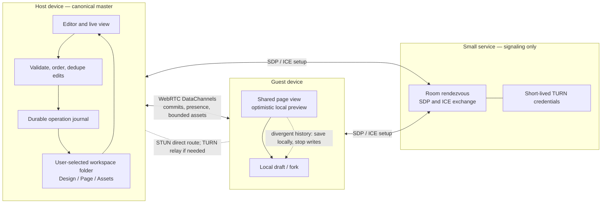
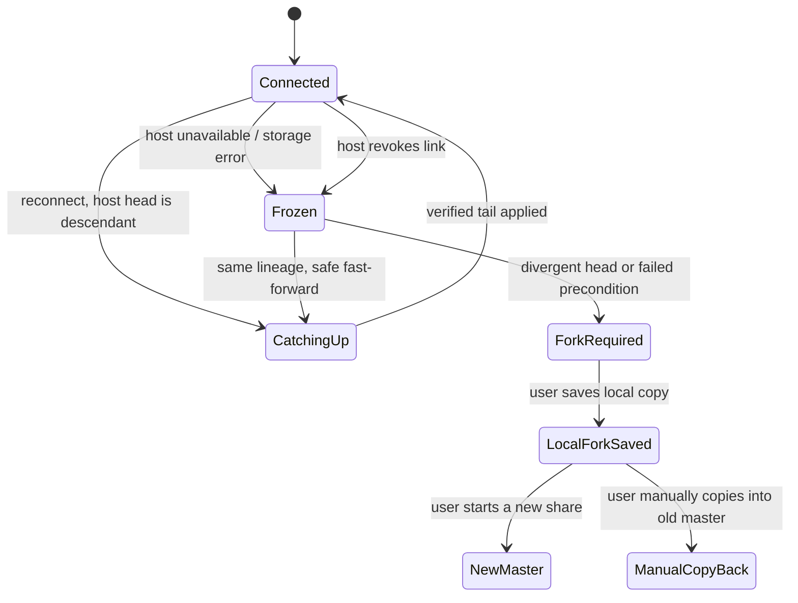

# Local workspace and live design sharing

**Status:** design proposal for review; this document does not implement folder persistence or WebRTC sharing.

**Current state:** Tiny Image Star presently saves designs and image assets in browser storage and supports portable `.flocal` export/import. It does not yet use a user-selected workspace folder, a per-page folder tree, or live WebRTC collaboration. The architecture below is a proposed migration from that local-first base.

## Goal

Tiny Image Star should open into a user-selected workspace folder, keep each design and its pages in that folder, and let its owner share one design through a link. People with the link can see the host's current page and propose edits. The host's device and folder remain the only authority for that shared design. A guest who edits a stale or disconnected copy must save it as a local fork before continuing; Tiny Image Star must not silently merge divergent histories or write them over the host's work.

The sharing model is deliberately one-master. It gives collaborators a clear answer to “which edit won?” and fits the requested detached-head behavior better than a multi-master CRDT. Collaboration is a sequence of validated edits committed by the host, rather than independent documents that later merge.

## End-to-end architecture



The signaling service helps peers discover and connect; it does not store the design or decide edit order. WebRTC does not define the signaling service itself, so Tiny Image Star must operate or contract for one. STUN can help establish a direct route, but it cannot relay traffic; networks that block direct peer connectivity require an authorized TURN service. A production deployment therefore needs both signaling and TURN capacity, with short-lived TURN credentials and quotas. [WebRTC peer connections and signaling](https://webrtc.org/getting-started/peer-connections), [TURN server guidance](https://webrtc.org/getting-started/turn-server)

WebRTC DataChannels are a fit for ordered edit messages and presence. They are carried over SCTP/DTLS and secured by DTLS, but that does not replace application authorization: each message still needs design scope, capability checks, validation, and host-side persistence. Large asset transfer should use bounded chunks with backpressure so it cannot block edit traffic. [RFC 8831: WebRTC Data Channels](https://www.rfc-editor.org/rfc/rfc8831.html), [RFC 8827: WebRTC Security Architecture](https://www.rfc-editor.org/rfc/rfc8827.html)

## User flow

1. **Choose a workspace.** On first use, ask the user to select a folder and grant read/write permission. Create the Tiny Image Star workspace metadata there. On later launches, reopen the saved directory handle and re-check permission; ask again if access was revoked. Show visible states such as “Saving,” “Saved to folder,” “Folder access needed,” and “Disk full.” A failed or pending write must never be presented as saved.
2. **Create a design and pages.** Designs are folders inside the workspace. Pages are folders inside their design. New pages and assets are written through the same journaled save path as edits.
3. **Start sharing.** The owner selects **Share design**, sees what will be shared, and creates a revocable design-scoped link. The host remains online while collaborators use the live session. The shared view follows the host's selected page and viewport; collaborator cursors, selection, and presence are ephemeral and do not change the document.
4. **Join and synchronize.** The guest opens the link, proves possession of its capability, receives the current committed snapshot plus the operation-log tail, and joins as a guest. The host displays a participant and connection indicator and can revoke access or stop sharing at any time.
5. **Edit collaboratively.** The guest preview updates immediately, but the UI marks it pending. A semantic edit proposal goes to the host. The host checks capability, session, base head, operation ID, entity/field preconditions, document invariants, and resource limits. The host writes the operation and the resulting new head to its selected folder before broadcasting the committed sequence number and acknowledging the guest. Only then is the guest edit shown as saved.
6. **Recover a detached guest.** If the guest reconnects and its base is still an ancestor of the host head, it fetches the missing committed operations and continues. If it has pending changes and the host head is still exactly the guest's base, the host may validate and commit those operations one by one. If the host advanced on a conflicting branch, identity or preconditions do not match, or the history cannot be fast-forwarded, freeze guest writes. Offer **Save local copy and continue as host**. After the fork is saved, the guest can host that copy and manually copy/paste work into the original design if desired. There is no automatic merge and no leader election.

## Folder layout and persistence

The chosen directory is the workspace root. The exact serialization format should be versioned and migration-friendly; IDs are generated locally and remote paths are never accepted.

```text
Tiny Image Star Workspace/
  .tiny-image-star/
    workspace.json
    transactions/<transaction-id>/
  designs/<design-id>/
    design.json
    HEAD
    commits/<sequence>-<hash>.json
    operations/<sequence>-<operation-id>.json
    assets/<content-hash>.<extension>
    pages/<page-id>/
      page.json
```

`design.json` holds stable design identity and format version. Each `page.json` holds that page's editable scene graph and page settings. Assets are content-addressed and shared by pages in the design. A commit records the sequence number, previous commit hash, new hash, operation ID, and resulting document revision. Checkpoints limit replay time; the immutable operation history remains the audit and recovery trail.

Saving uses a journaled transaction: validate and serialize first; stage new content under a transaction ID; close/write staged files; publish an immutable commit record; then update `HEAD` as a recoverable index and mark cleanup complete. The closed, hash-linked commit record is the durable commit point; `HEAD` can be rebuilt from valid commits after a crash. Startup recovery checks the commit chain and pending journal entries, ignores uncommitted staged data, and repairs or reports incomplete work without discarding the last valid commit. A successful local write is required before the host sends an ACK. Folder permission errors, quota/disk errors, and corrupt documents pause canonical writes and remain visible to all connected guests.

The browser File System Access API requires a secure context and a user gesture for the directory picker, and support is not universal. OPFS is private browser storage rather than a visible user-selected folder, and it remains subject to browser storage quotas. Therefore the strict “choose a visible folder” experience is supported where the picker API exists; unsupported browsers need a clearly labeled local workspace fallback with export/import, or a native document-provider implementation if visible-folder access is mandatory on that platform. Do not claim the fallback is a synced user folder. [MDN: `showDirectoryPicker()`](https://developer.mozilla.org/en-US/docs/Web/API/Window/showDirectoryPicker), [MDN: File System API](https://developer.mozilla.org/en-US/docs/Web/API/File_System_API), [MDN: Origin Private File System](https://developer.mozilla.org/en-US/docs/Web/API/File_System_API/Origin_private_file_system), [Storage quota and eviction](https://developer.mozilla.org/en-US/docs/Web/API/Storage_API/Storage_quotas_and_eviction_criteria)

## Edit protocol and authority rules

Every shared design has a random `designId`, a `lineageId`, a monotonically increasing `sequence`, and a hash-linked committed head. The host owns the only writer lease for a live share. A reconnecting guest supplies its last accepted `(lineageId, sequence, headHash)` and any pending operation IDs.

The reliable, ordered control channel carries versioned, size-limited messages such as:

| Message | Direction | Meaning |
| --- | --- | --- |
| `HELLO` / `WELCOME` | guest ↔ host | Capability proof, identity, head, role, and protocol version |
| `SNAPSHOT` / `TAIL` | host → guest | Current committed state or missing accepted operations |
| `PROPOSE` | guest → host | One semantic edit with `opId`, base head, and preconditions |
| `COMMIT` / `ACK` | host → guests | Persisted sequence and resulting hash; duplicate IDs return the original result |
| `REJECT` / `DETACHED` | host → guest | Stale precondition, permission, lineage, or storage reason; freeze writes as required |
| `PRESENCE` | either direction | Ephemeral cursor, selection, viewport, and participant status |
| `ASSET_BEGIN/CHUNK/END` | either direction | Consent-gated, hashed, bounded asset transfer on a separate backpressured channel |

The host rejects replayed IDs with a different payload, unknown operations, stale entity versions, edits to deleted/locked entities, oversized payloads, invalid references, and unauthorized design/page IDs. It validates resulting document invariants before commit. Guests never send file paths, arbitrary file names, or direct filesystem commands. Assets are written only under generated IDs after size, type, and hash checks. The operation protocol needs deterministic normalization so every participant renders the same committed state.

**Detached state machine:**



No guest may become master by timeout or by being the last connected peer. A guest starts a new master only from a saved local fork with a new lineage and share capability. This avoids split-brain; offline availability is provided by local save/fork, not by pretending a stale guest copy is still canonical.

## Share URL and security model

The design URL is a **bearer capability**: possession grants edit access to one design until revoked. Generate a per-share P-256 signing key; put the private capability in the URL fragment and keep only its public verifier with the signaling room. A joiner proves possession by signing a one-time challenge; signaling can check that proof for rendezvous admission, and the host verifies it again before sending the design snapshot or accepting edits. This keeps the raw capability out of HTTP requests, signaling logs, and the rendezvous service. Rate-limit failed proofs and let the host revoke or rotate the public verifier. Fragments are still visible in browser history, copied links, screenshots, and local scripts, so the UI must explain that anyone with the link can edit. [RFC 6750: bearer token threats](https://www.rfc-editor.org/rfc/rfc6750.html), [RFC 3986: URI fragment](https://www.rfc-editor.org/rfc/rfc3986.html)

The signaling service sees connection metadata and the SDP/ICE needed for rendezvous, but should not receive design contents or persistent access tokens. Enforce HTTPS/WSS, origin checks, strict CSP, no untrusted scripts, payload limits, per-link revocation, TURN quotas, abuse controls, and short-lived credentials. WebRTC encrypts the data channel in transit, but the host browser and any authorized guest can read the design. Do not imply that P2P means the guest cannot copy or export shared content. Minimize candidate/IP exposure in the UI and document that network-address privacy depends on browser policy and ICE configuration. [RFC 8828: WebRTC IP address privacy](https://www.rfc-editor.org/rfc/rfc8828.html)

Folder access is separate from link access. The host's directory handle stays in the host browser; guests receive validated design operations and approved assets, never the host's directory handle or paths. Only the host writes the canonical design folder. A user must confirm incoming asset transfers and should see size/progress before accepting large batches.

## Batch processing and GPU use

Pillow-RS currently runs in the local WebAssembly worker path; a host GPU is not automatically available to that code. The development Mac has an Apple M3 Pro GPU, but this change adds no GPU renderer. If batch export needs more throughput, evaluate a separately capability-detected WebGPU path for operations that map cleanly to GPU kernels, retain Pillow-RS WASM as the CPU fallback, and preserve the existing bounded worker scheduler and memory admission limits. Compare output against Pillow-RS golden images and benchmark total decode, upload, kernel, readback, and encode time on supported phones and desktops. Use the GPU path only where end-to-end measurements show a real gain; sharing and folder persistence should not depend on it.

## Mobile and browser support

The editor and collaboration controls need phone-sized participant, connection, and save-status UI; touch-friendly edit/accept/reject controls; and a clear read-only or fork screen when disconnected. Live editing must never depend on right-click/context menus. Users need a persistent way to open **Share**, inspect pending edits, save a local fork, and stop sharing.

Folder selection is the main browser compatibility constraint. `showDirectoryPicker()` has limited availability; OPFS can provide private local persistence on more browsers, but it is not the user's visible directory. Before promising identical behavior on iOS Safari, decide whether an OPFS/export fallback is acceptable or whether a native wrapper/document provider is required. Keep peer-to-peer sharing behind a capability check and show a supported fallback message when DataChannels or the needed storage path is unavailable.

## Delivery plan

1. **Approve product/security choices.** Decide visible-folder fallback on iOS, max room size and asset sizes, link expiry/revocation policy, signaling/TURN operator and budget, and whether presence includes following page/viewport only or also selections.
2. **Workspace foundation.** Implement folder selection, permission persistence/re-check, versioned folder format, save journal/recovery, quota handling, and explicit export/import fallback. Test crash recovery and external folder removal before network sharing.
3. **Local operation log.** Convert editor mutations into deterministic semantic operations; add sequence/hash, idempotency, checkpoints, recovery and stale-revision tests. Preserve current document recovery behavior during migration.
4. **Rendezvous and transport.** Add signaling with short-lived scoped session credentials, STUN plus production TURN, connection state UX, reliable edit/presence channels, and a separately backpressured asset channel. Define retention and service telemetry so signaling does not persist documents or bearer secrets.
5. **Host-authoritative collaboration.** Add host validation, write-before-ACK sequencing, snapshot/tail sync, revocation, guest pending preview, and the explicit detached/fork workflow. Add two-browser fault-injection tests for duplicate/reordered messages, tab crash, host disk failure, stale base, network partition, reconnect, and revoke.
6. **Security and scale gate.** Threat-model capability leakage, malicious peers, XSS, path traversal, oversized assets, TURN abuse, and compromised signaling. Pen-test before general availability. Load-test signaling and TURN separately from host CPU, and measure large designs and many concurrent guests on realistic phone hardware.
7. **Limited rollout.** Ship behind an opt-in flag to a small cohort, collect only operational metrics (latency, failed joins, write/recovery failures, TURN usage), then widen only after recovery and revocation targets are met.

## Acceptance criteria

- The first-run workspace is selected by the user; a design and each page have their own folder beneath it; every acknowledged host edit survives reload and a forced tab termination.
- A guest sees the host's committed page and follows the host's page/viewport changes; presence is visibly separate from saved content.
- A guest proposal is never marked saved before the host has durably recorded it. Duplicate proposals commit once. Invalid/stale operations are rejected without partial writes.
- Reconnecting same-lineage guests fast-forward only when the operation chain proves ancestry. Divergence freezes shared writes and offers a local fork; no automatic merge, hidden leader election, or canonical write from a guest occurs.
- A revoked or rotated link can no longer join; a leaked link is visibly described as edit access; large asset messages are bounded and cannot starve edit messages.
- Direct WebRTC and TURN-relayed sessions both pass; no TURN credential is permanent; service outages are explicit, and users can still save/export locally.
- Unsupported folder-picker browsers receive truthful fallback behavior, with platform coverage documented before release.

## Decisions for review

1. Is a non-visible OPFS plus `.flocal` export/import an acceptable fallback on iOS, or is a visible selected folder a launch requirement everywhere?
2. Should guests be allowed to pause following the host and inspect other pages while still receiving and proposing edits?
3. What maximum number of concurrent guests and maximum design/asset sizes should launch support?
4. Who will operate signaling and TURN, and what availability and bandwidth budget is acceptable?
5. Should GPU acceleration for batch image processing be a separate opt-in path after parity and mobile benchmarks, with Pillow-RS WASM remaining the default CPU path?
