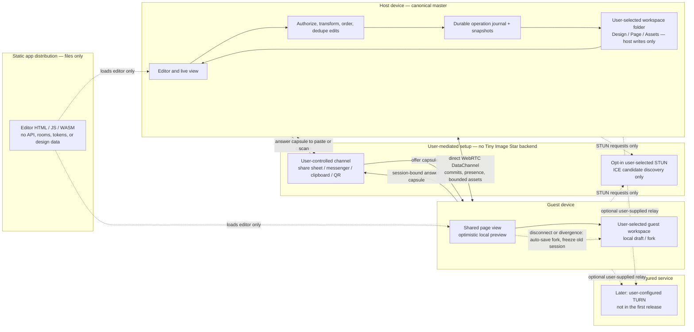

# Local workspace and live design sharing

**Status:** core serverless collaboration is wired into the editor. The full unit suite (1,251 tests), local Pillow-RS/WASM static validation, and broad browser workflow smoke passed on 2026-10-01. The WebRTC/folder collaboration path still needs two-profile and real-device network checks, security review, and production load limits; this is not a production-readiness claim.

**Current state:** the editor can use a user-selected folder workspace, migrate existing IndexedDB designs, keep design/page snapshots and verified image/font assets in that folder, and start or join an out-of-band WebRTC session. The owner remains the canonical writer. Guests checkpoint an independent local copy before proposing changes and preserve it as a local fork on disconnect or divergence. Existing IndexedDB data remains available as a library/recovery copy. The app provides direct ICE by default and an explicit opt-in to Google STUN; it has no rendezvous service or TURN relay.

**Implementation checkpoint:** workspace storage now has validated manifests, per-design immutable hash-linked commits, per-page revision materializations, verified binary image/font stores, IndexedDB migration, folder discovery, autosave fencing, and preflight limits that prevent accepted writes from making a design unrecoverable. `src/collaboration/session-capsules.js`, `share-store.js`, `webrtc-session-transport.js`, `protocol.js`, `asset-transfer.js`, `host-operation-engine.js`, `guest-fork-recovery.js`, and `session-controller.js` implement signed short-lived offers/answers, one-time answer use, direct DataChannels, owner-side validation and durable ACKs, bounded image/font transfers, disconnect forks, exact host commit hashes, bounded queues/replay state, and retryable fork saves. The File menu opens mobile-sized Share/Join panels with clipboard/native share-sheet signaling and explicit asset approval. The browser workflow smoke covers local editing, Pillow previews, bulk recipes, mobile controls, sharing/export, and the broader editor; focused unit tests cover the collaboration protocol and controller. The editor currently proposes complete snapshots rather than emitting typed operations at every model gesture; simultaneous collaborators and live cursor/presence are not supported. Two-profile and real-device WebRTC/folder behavior remain unverified.

## Goal

Tiny Image Star should open into a user-selected workspace folder, keep each design and its pages in that folder, and let its owner share one design through a stable capability link plus fresh session capsules. People with the link can see the host's current page and propose edits. The host's device and folder remain the only authority for that shared design. If the host disconnects or the guest detects divergent history, the guest automatically saves its last committed replica and local pending work as a separate fork in its chosen workspace before continuing. Tiny Image Star must not silently merge divergent histories or write them over the host's work.

The sharing model is deliberately one-master. It gives collaborators a clear answer to “which edit won?” and fits the requested detached-head behavior better than a multi-master CRDT. Collaboration is a sequence of validated edits committed by the host, rather than independent documents that later merge.

## End-to-end architecture



**No Tiny Image Star collaboration backend is part of this design.** The deployed app can remain static. A stable design URL identifies the design and carries its revocable capability; it is an invitation, never a live-session locator. For each live session the host creates a fresh WebRTC offer, waits for ICE gathering, signs the session capsule with the design's persistent identity key, and sends it through a user-controlled channel. The guest verifies the identity, creates an answer, and returns a session-bound answer capsule through that same channel. The host opens the answer capsule to finish negotiation. This out-of-band exchange is required without rendezvous infrastructure: a stable design URL alone cannot discover an open host or start a live session. The app does not run a room directory, signaling endpoint, document server, or TURN service.

**Confirmed constraint: no central Tiny Image Star server.** Static hosting serves only the editor files; the canonical design, folder handle, operation journal, and live edit authority stay on the owner's device. No app backend receives designs, stores room state, issues share tokens, or forwards collaboration messages. The offer and answer move directly between users through a channel they choose. This deliberately gives up one-click joining from a permanent URL: a live join requires the owner to be online and a fresh offer/answer exchange. A persistent URL can identify and authorize a design, but without a rendezvous service it cannot locate the owner's browser.

**No-server product contract:** the stable per-design URL is a local capability/deep link of the form `https://<static-origin>/d/<design-id>#<versioned-invite-payload>`. Its fragment carries the revocable edit secret and pinned design identity; it cannot create a session, wake the owner, queue edits, or promise reachability. **Share Live** wraps that stable invitation with a fresh, expiring signed offer capsule, so the guest can open one artifact. The answer returns in a session-bound capsule through a user-chosen channel. The static site is only software distribution and must not gain a collaboration API as a hidden dependency. The host stores capability grants and revocation state in its own workspace. If the owner is offline, the guest cannot change the canonical design; disconnection automatically checkpoints the guest replica and pending edits as a local fork.

The product exposes three distinct connectivity levels:

| Product level | Tiny Image Star service | External network service | Expected behavior |
| --- | --- | --- | --- |
| **LAN / direct** (first-release default) | None | None | Use directly reachable candidates only. No outside network service is contacted; this works on suitable local/public routes, but not every internet connection. |
| **Internet P2P** (user opt-in) | None | STUN server selected by the user | STUN discovers possible direct routes; signaling remains out of band. The selected provider sees connection metadata, and some NAT/firewall pairs still fail. No STUN endpoint is preselected or silently contacted. |
| **Reliable Internet** (later, optional) | None | TURN relay configured and operated by the user | A relay can connect more network pairs, but carries encrypted packets and connection metadata. Tiny Image Star neither supplies nor operates TURN. |

The first-release default has no Tiny Image Star backend and contacts no external STUN or TURN service. Users may explicitly select a STUN provider for internet-direct attempts after seeing the metadata disclosure. If STUN remains disabled, connections are limited to routes the devices can already reach, so many internet connections will fail. TURN is deferred; if later added, it must be a user-configured external relay. WebRTC does not define a signaling transport; the W3C API expects the application to exchange session descriptions, while ICE uses STUN/TURN to find or relay routes. These are separate responsibilities. The [W3C WebRTC Recommendation](https://www.w3.org/TR/webrtc/) defines the peer-connection API, and the [WebRTC peer-connection guide](https://webrtc.org/getting-started/peer-connections) explicitly separates signaling from ICE-server configuration. Google's `stun.l.google.com:19302` example may be offered as a user-selected option, but it is not a Tiny Image Star service. [TURN guidance](https://webrtc.org/getting-started/turn-server) describes TURN as a traffic relay, which is why support is deferred and must remain optional.

Google's documented `stun.l.google.com:19302` endpoint is only one user-selectable third-party STUN option. It does not carry SDP signaling or relay design traffic, and its provider can observe connection metadata such as the request's source address. With no selected STUN and no TURN relay, some carrier, office, and symmetric-NAT networks will fail to connect. The app must report that clearly and let users retry on another network. TURN is not part of the first release; a later user-configured relay must disclose that it sees connection metadata and encrypted packets. [WebRTC peer connections and signaling](https://webrtc.org/getting-started/peer-connections), [TURN server guidance](https://webrtc.org/getting-started/turn-server)

WebRTC DataChannels fit ordered edit messages and presence. They use SCTP over DTLS, but transport encryption does not replace application authorization or authenticate the intended host through an untrusted out-of-band channel. Each message still needs design scope, capability checks, validation, and host-side persistence. Large asset transfer should use bounded chunks with backpressure so it cannot block edit traffic. [RFC 8831: WebRTC Data Channels](https://www.rfc-editor.org/rfc/rfc8831.html), [RFC 8827: WebRTC Security Architecture](https://www.rfc-editor.org/rfc/rfc8827.html)

**One edit from phone to durable folder commit, with no app signaling service:**

```mermaid
sequenceDiagram
  autonumber
  actor Owner
  actor Guest
  participant App as Host Tiny Image Star
  participant Folder as Host workspace folder
  participant Channel as User's existing share channel
  participant GuestApp as Guest Tiny Image Star
  participant GuestFolder as Guest workspace folder

  Owner->>App: Choose workspace folder
  App->>Folder: Create workspace or verify existing workspace
  App->>Folder: Migrate existing IndexedDB design and verify assets
  Owner->>App: Create design and page
  App->>Folder: Journal page and design changes
  Owner->>App: Share Live
  App->>App: Create fresh offer; gather ICE; sign short-lived session capsule
  App-->>Owner: Copy/share capsule as link, code, or QR
  Owner->>Channel: Send capsule through a channel they choose
  Guest->>GuestApp: Choose or open guest workspace folder
  GuestApp->>GuestFolder: Create workspace or verify existing workspace
  Guest->>Channel: Receive invite
  Guest->>GuestApp: Open capsule; verify design identity, scope, and expiry
  GuestApp->>GuestApp: Create SDP answer; gather ICE; bind proof to session nonce
  GuestApp-->>Guest: Copy/share signed answer capsule
  Guest->>Channel: Return answer capsule to host
  Owner->>App: Paste or scan guest answer capsule
  App->>App: Verify session, capability proof, and answer; complete ICE handshake
  Guest->>App: HELLO with last accepted lineage, sequence, and hash
  App->>Folder: Read and verify canonical head
  App-->>GuestApp: Signed snapshot or verified missing commit tail
  Guest->>GuestApp: Make local edit; show pending preview
  GuestApp->>App: PROPOSE with op ID, base head, operation, field preconditions
  App->>App: Authenticate, deduplicate, transform if supported, validate

  alt Proposal valid and folder commit succeeds
    App->>Folder: Append operation and hash-linked commit; publish new head
    Folder-->>App: Durable commit confirmed
    App-->>GuestApp: COMMIT/ACK with sequence and hash
    GuestApp->>GuestFolder: Persist accepted replica state
  else Folder write fails
    Folder-->>App: Write or permission error
    App-->>GuestApp: No ACK; shared writes paused
    GuestApp->>GuestFolder: Automatically persist replica and pending edits as a new-lineage fork
  else Base is detached or operation conflicts
    App-->>GuestApp: DETACHED; freeze proposals to the old master
    GuestApp->>GuestFolder: Automatically persist a fork; freeze writes to the old master
    Guest->>GuestApp: Explicitly start a new live master when ready
  end
```

The ACK is the save boundary: local previews may appear optimistically, but the UI must label them pending until the host has durably appended the commit. A disconnected host never hands authority to the last guest. On connection loss or a detached/conflicting revision, the guest automatically writes its last acknowledged replica plus pending local work into a guest-owned fork with a fresh lineage ID; the old session is frozen and no fork operation is sent to the original host. The guest can continue editing the local fork and may explicitly start a new live master after the fork is safely stored. A stable design URL cannot locate an active host or reconnect a peer by itself; each session needs fresh signed offer/answer capsules. Sharing capsules through a third-party messenger exposes them to that provider, so the UI must warn users to use a channel they trust. For QR pairing, both devices must be physically available to scan in both directions.

## Revision ordering and conflict rules

The first collaboration version uses one host sequencer and one append-only log per design. It is master-authoritative, not a multi-master CRDT. This gives each accepted edit one stable order and lets the folder remain the source of truth. The host processes one proposal at a time under a per-design writer lock; only that host can write the canonical folder. A local-tab coordinator and fencing token must prevent a second app tab from acting as writer for the same workspace. If the host detects an external folder change or a commit chain it cannot verify, it pauses writes and enters recovery instead of overwriting the unexpected state.

Every proposal includes a protocol version, design/session/page IDs, lineage ID, `opId`, base revision and head hash, typed operation, stable target IDs, and expected versions for the fields it changes. The initial operation allowlist is `SetProperty`, `InsertNode`, `DeleteNode`, `MoveNode`, `ReplaceText`, and `AddAsset`; unrecognized operation types fail closed. Every message is size-bounded and authenticated to its session. The host applies these rules in order:

1. Check the share capability, room, design/page scope, protocol version, message size, operation allowlist, and document invariants. Guest messages contain document operations only—never local paths, directory handles, filenames, or filesystem instructions.
2. Deduplicate by `(actorId, opId)`. The same ID and payload returns its original result; reusing an ID with a different payload is rejected and recorded as a protocol violation.
3. Verify that the proposal's base commit belongs to the current hash-linked lineage. If it is an ancestor of the current head, run only a registered deterministic transform for the operation type against intervening commits. Disjoint edits to stable IDs/field paths may rebase; overlapping edits to the same field or an operation without a tested transform are rejected with the current head and a conflict reason. The host never guesses.
4. Validate the resulting document, append the operation and hash-linked commit, update the recoverable head, then ACK and broadcast the signed commit. If the folder write fails, do not ACK and pause canonical writes until recovery succeeds.

This is the minimum safe base for concurrent editing. In the first release, overlapping edits to the same text range are rejected or held behind a short text-edit lease. Google Docs-like concurrent typing requires a separately designed and tested OT or stable-position transform before it is enabled. Other edit families need explicit transforms too; unsupported overlap is a visible conflict. A truly detached guest history—different lineage, base not in host ancestry, or failed transform—cannot be fast-forwarded. Preserve it automatically as a local fork, stop sending writes to the old master, and let the guest start a new master only after the fork save succeeds. Copying work back is an explicit manual action in the original design.

**Required editor refactor:** the current editor mutates document fields across UI handlers, gestures, and model helpers; snapshot undo/redo does not describe operations that can be validated or rebased. The existing IndexedDB revision compare-and-swap ([`storage.js`](../src/storage.js)) is useful for local recovery, but it is not a shared operation log; [`history.js`](../src/history.js) stores whole-document snapshots, and editor changes are spread through [`main.js`](../src/main.js) and [`model.js`](../src/model.js). Collaboration cannot safely be added as a WebRTC wrapper around the current save queue. Add a shared action/reducer boundary so local and remote edits apply the same typed operation at the existing gesture/input commit points. Derived layout/component changes must be deterministic and included in the accepted operation. Undo becomes a new validated inverse operation; guests may not submit replacement document snapshots. The current image/font assets also live outside the document JSON, so asset references and verified transfer must be part of that boundary.

## User flow

1. **Choose a workspace.** On first use, ask the user to select a folder and grant read/write permission. Create the Tiny Image Star workspace metadata there. On later launches, reopen the saved directory handle and re-check permission; ask again if access was revoked. Show visible states such as “Saving,” “Saved to folder,” “Folder access needed,” and “Disk full.” A failed or pending write must never be presented as saved.
2. **Create a design and pages.** Designs are folders inside the workspace. Pages are folders inside their design. New pages and assets are written through the same journaled save path as edits.
3. **Start sharing.** The owner chooses **Share Live**, creates a signed, expiring SDP offer, and sends both the stable design invitation and one-time offer using the native share sheet or copy/paste. The owner stays online. The invitation identifies authority but never locates a live host by itself.
4. **Join and synchronize.** The guest needs a writable folder, pastes the invitation and offer, reviews image/font transfer prompts, and returns a signed answer. The guest verifies the signed host offer and pins the exact hash-linked workspace head. Required image/font data travels over bounded encrypted DataChannel chunks; the folder handle never leaves the host browser.
5. **Edit collaboratively.** The guest editor writes its local copy before sending a full-snapshot proposal. The owner validates and commits it to the selected folder, then returns an ACK with the exact new sequence and commit hash. The guest marks a change canonical only after that ACK. The editor blocks further interaction while that single proposal is pending.
6. **Recover a disconnected or detached guest.** On transport loss, stale-head rejection, or divergence, freeze the old session and save the guest's folder-backed copy as a separate local fork. Retry remains available if storage fails. Copying work back to the original design remains a manual owner action; there is no automatic merge or leader election.

## Folder layout and persistence

The chosen directory is the workspace root. The exact serialization format should be versioned and migration-friendly; IDs are generated locally and remote paths are never accepted.

```text
Tiny Image Star Workspace/
  .tiny-image-star/
    workspace.json
    transactions/<transaction-id>/
  designs/<design-id>/
    design.json
    HEAD
    commits/<sequence>-<hash>.json
    operations/<sequence>-<operation-id>.json
    assets/<content-hash>.<extension>
    pages/<page-id>/
      page.json
```

An automatic guest fork is a separate design under the guest's selected workspace, with a new design ID and lineage. Its first checkpoint records the source design ID, source lineage, last acknowledged revision/head hash, and the pending local operation IDs it preserved; it never contains the host's folder handle or path. Create or advance the fork through the same atomic journal path as ordinary local edits. The invite/join flow requires an available guest workspace before enabling edit proposals, so disconnect recovery does not depend on a later permission prompt.

`design.json` holds stable design identity and format version. Each `page.json` holds that page's editable scene graph and page settings. Assets are content-addressed and shared by pages in the design. A commit records the sequence number, previous commit hash, new hash, operation ID, and resulting document revision. The host durably appends every acknowledged operation; full page/design snapshots are written at bounded intervals to limit replay time, while the immutable operation history remains the recovery trail. The folder hierarchy is the canonical project layout, not a mirror that guests may write directly.

Saving uses a journaled transaction: validate and serialize first; stage new content under a transaction ID; close/write staged files; publish an immutable commit record; then update `HEAD` as a recoverable index and mark cleanup complete. The closed, hash-linked commit record is the durable commit point; `HEAD` can be rebuilt from valid commits after a crash. Startup recovery checks the commit chain and pending journal entries, ignores uncommitted staged data, and repairs or reports incomplete work without discarding the last valid commit. A successful local write is required before the host sends an ACK. Folder permission errors, quota/disk errors, and corrupt documents pause canonical writes and remain visible to all connected guests. The browser stores the directory handle locally and rechecks permission on each launch; the handle never crosses to a guest. Existing IndexedDB documents and their assets are copied into a staging workspace, verified by IDs and hashes, and left intact until the new folder's manifest and first commit have been reopened successfully. Tiny Image Star writes each acknowledged edit into the selected local folder; if that folder is also watched by a cloud-sync utility, remote sync timing and conflict-copy behavior belong to that utility. On a changed or conflicting folder state, Tiny Image Star verifies the commit chain and pauses on uncertainty rather than replacing files it cannot prove are current.

The browser File System Access API requires a secure context and a user gesture for the directory picker, and support is not universal. OPFS is private browser storage rather than a visible user-selected folder, and it remains subject to browser storage quotas. Because selecting a visible folder is a product requirement, do not silently substitute OPFS and call it the selected folder. Use the directory picker where supported; for platforms without a writable folder picker, a native document-provider adapter is required for full workspace support. Until that adapter exists, clearly label the platform as unable to host a canonical folder workspace and retain `.flocal` import/export for portability. [MDN: `showDirectoryPicker()`](https://developer.mozilla.org/en-US/docs/Web/API/Window/showDirectoryPicker), [MDN: File System API](https://developer.mozilla.org/en-US/docs/Web/API/File_System_API), [MDN: Origin Private File System](https://developer.mozilla.org/en-US/docs/Web/API/File_System_API/Origin_private_file_system), [Storage quota and eviction](https://developer.mozilla.org/en-US/docs/Web/API/Storage_API/Storage_quotas_and_eviction_criteria)

## Edit protocol and authority rules

Every shared design has a random `designId`, a `lineageId`, a monotonically increasing `sequence`, and a hash-linked committed head. The host owns the only writer lease for a live share. A reconnecting guest supplies its last accepted `(lineageId, sequence, headHash)` and any pending operation IDs.

The host and guest authenticate before exchanging design data. The ordered reliable control channel carries versioned, size-limited messages such as:

| Message | Direction | Meaning |
| --- | --- | --- |
| `HELLO` / `WELCOME` | guest ↔ host | Capability proof, identity, head, role, and protocol version |
| `SNAPSHOT` / `TAIL` | host → guest | Current committed state or missing accepted operations |
| `PROPOSE` | guest → host | One semantic edit with `opId`, base head, and preconditions |
| `COMMIT` / `ACK(newRevision)` | host → guests | Persisted revision and resulting hash; duplicate IDs return the original result |
| `REJECT(reason,currentRevision)` / `DETACHED` | host → guest | Stale precondition, permission, lineage, or storage reason; freeze writes as required |
| `PRESENCE` | either direction | Ephemeral cursor, selection, viewport, and participant status |
| `ASSET_BEGIN/CHUNK/END` | either direction | Consent-gated, hashed, bounded asset transfer on a separate backpressured channel |

The host rejects replayed IDs with a different payload, unknown operations, stale entity versions, edits to deleted/locked entities, oversized payloads, invalid references, and unauthorized design/page IDs. It validates resulting document invariants before commit. Guests never send file paths, arbitrary file names, or direct filesystem commands. Assets are written only under generated IDs after size, type, and hash checks. The operation protocol needs deterministic normalization so every participant renders the same committed state.

**Detached state machine:**

```mermaid
stateDiagram-v2
  [*] --> Connected
  Connected --> CatchingUp: reconnect, host head is descendant
  CatchingUp --> Connected: verified tail applied
  Connected --> ForkPersisting: host disconnected / detached / conflicting edit
  ForkPersisting --> LocalForkSaved: atomic local save succeeds
  ForkPersisting --> SaveBlocked: guest workspace write fails
  SaveBlocked --> ForkPersisting: storage access restored
  LocalForkSaved --> LocalEditing: continue on the fork
  LocalForkSaved --> CatchingUp: fresh capsule; fork has no local-only edits
  Connected --> Frozen: host storage error / revocation
  Frozen --> CatchingUp: same lineage, safe fast-forward
  Frozen --> ForkPersisting: local recovery checkpoint required
  LocalForkSaved --> NewMaster: user starts a new share
  LocalForkSaved --> ManualCopyBack: user manually copies into old master
```

No guest becomes master by timeout or by being the last connected peer. The app automatically creates a local design fork when the host disconnects or history detaches, then freezes writes to the old session. If the guest has not made fork-only edits, a fresh signed capsule can reconnect it after the host proves the same lineage; the saved recovery fork remains available. Once the guest edits the fork, that branch stays local and cannot be sent to the old master automatically. The guest may explicitly start a new live master from it. This avoids split-brain; offline availability is provided by a durable local fork, not by pretending a stale guest copy is still canonical. If the guest workspace cannot be written, pause guest edits and keep pending work recoverable in memory until the folder save succeeds.

## Stable design capability and one-time session capsules

Each design gets one stable edit-capability URL by default. Its versioned fragment contains a random public `shareId`, a high-entropy capability private key, and the design's pinned public identity key. The one-time session capsule embeds this stable invitation and adds fresh session data. The capability key grants edit access to that design and all of its pages; it is not the design ID, the folder name, or a key to the user's device. A new `shareId`/capability is generated when the owner rotates or revokes the link. The UI states plainly that anyone with the URL or capsule can edit and copy the shared design. In a no-backend setup, that stable URL is authorization only: it cannot locate an active host or establish a peer connection. To join live, **Share Live** creates the fresh signed offer capsule described above; the guest returns a one-time answer capsule out of band.

The offer capsule is a versioned, bounded payload containing the stable invitation, design and share IDs, session ID, one-time nonce, issue and expiry times, complete ICE-gathered SDP offer, pinned design identity public key, capability proof material, and a signature over a canonical encoding. The persistent design identity private key signs the offer and stays in the owner's local workspace. The answer capsule binds the SDP answer and guest capability proof to the same design, session ID, and nonce. The host checks expiry, scope, signature, and one-time use before sending document data. Capsules use URL-safe text so they work through QR, copy/paste, or a user-selected share target; the codec must enforce a tested maximum encoded size before parsing or allocating large buffers. If the encoded offer exceeds a single QR's practical capacity, offer multi-part QR or copy/share text rather than truncating it. The static app reads capability material only in first-party code and clears it from the visible address bar immediately.

Use Web Crypto P-256 signing keys rather than a hand-rolled token protocol. The capability private key stays in the fragment and proves possession by signing a one-time challenge bound to the `shareId`, protocol version, and connection nonce. The corresponding public key is stored in the host's local share registry; the host verifies the proof before sending any design data or accepting edits. Separately, the host's persistent design identity private key stays in the owner's local key store; its public key is pinned in the stable link and signed session capsule, and it signs WELCOME/snapshot/commit hashes so guests can verify the canonical host without trusting the messaging channel used to exchange SDP. Neither key grants access to the local folder. If the workspace moves to another device or browser profile without its local identity key, the owner creates a new invite and revokes the old one.

Read the fragment only in first-party app code, remove it from the visible address bar after capture, and exclude it from app analytics, requests, logs, crash reports, and error URLs. A fragment is not secret from the person who receives or copies the full link and can still leak through browser history, screenshots, clipboard, the user's chosen messaging provider, or malicious same-origin scripts. Tell users that the provider carrying the invite can see the link and its edit capability. Serve the editor with HTTPS, strict CSP, no untrusted third-party scripts, explicit share/revoke controls, challenge expiry and replay protection, and local failed-join limits. The app runs no signaling service and receives no signaling logs. WebRTC encrypts data channels in transit; the host and any authorized guest can still read, copy, and export the design. Minimize candidate/IP exposure in the UI and document that network-address privacy depends on browser policy and ICE configuration. A user-configured TURN relay sees connection metadata and encrypted packets, not document plaintext. [W3C Web Crypto API](https://www.w3.org/TR/WebCryptoAPI/), [RFC 6750: bearer token threats](https://www.rfc-editor.org/rfc/rfc6750.html), [RFC 3986: URI fragment](https://www.rfc-editor.org/rfc/rfc3986.html), [RFC 8828: WebRTC IP address privacy](https://www.rfc-editor.org/rfc/rfc8828.html)

Folder access is separate from link access. The host's directory handle stays in the host browser; guests receive validated design operations and approved assets, never the host's directory handle or paths. Only the host writes the canonical design folder. A user must confirm incoming asset transfers and should see size/progress before accepting large batches.

## Batch processing and GPU use

The app's pinned Pillow-RS `12.2.0-alpha.5` browser build uses its `wasm-all` codec/font feature set, which omits Pillow-RS's native GPU feature; today's batch path therefore runs in the WASM CPU worker pool. Alpha.5 is the latest published prerelease, while upstream `main` has newer untagged commits; moving to those commits is a separate parity-reviewed runtime change, not part of this sharing design. A detected browser GPU does not change the current WASM CPU path. Batch GPU acceleration is a separate, optional engineering track: it needs a browser-WASM GPU backend or app-owned kernels, runtime adapter/device-loss handling, exact output parity, and full-pipeline benchmarks. Keep the current bounded Pillow-RS CPU scheduler as the fallback; WebGPU requires a secure context and an adapter may not be available, so it cannot be a platform requirement. Compare decode, upload, kernel, readback, and encode time on supported phones and desktops, and enable a GPU operation only when measured end-to-end throughput improves. Sharing and folder persistence must not depend on GPU access. [Pinned Pillow-RS WASM feature set](https://github.com/appunni-m/pillow-rs/blob/v12.2.0-alpha.5/pillow-rs-js/Cargo.toml), [newer upstream main commit](https://github.com/appunni-m/pillow-rs/commit/e7fe1fb2c842bb868af9a8ced60cfb841484eb9f), [W3C WebGPU](https://www.w3.org/TR/webgpu/), [MDN: WebGPU API](https://developer.mozilla.org/en-US/docs/Web/API/WebGPU_API)

## Mobile and browser support

The editor currently exposes **Share live…** and **Join live session…** from its main menu. The responsive collaboration dialog provides touch-sized actions, invitation/offer/answer fields, optional STUN disclosure, connection and asset-transfer status, stop-sharing controls, and a retry action if saving a guest fork fails. The mobile UI is implemented, but its full workflow has not yet been validated on real Android/iOS devices. Context menus are not required for sharing. Remaining mobile work is platform validation and a native document-provider adapter where browsers cannot grant a writable folder.

Folder selection remains the main browser compatibility constraint. `showDirectoryPicker()` has limited availability; OPFS can provide private local persistence on more browsers, but it is not the user's visible directory. Until a native document-provider adapter exists, do not claim mobile browsers without a writable directory picker can host a canonical workspace. Keep `.flocal` export as an explicit portable save, and block live collaboration when the required writable workspace or DataChannel support is unavailable.

## Remaining release work

1. Run two independent browser profiles on desktop and real Android/iOS devices through offer/answer, required image/font transfer, local folder persistence, owner revoke, host failure, guest fork, retry after denied/quota-limited storage, and reload recovery. Unit/browser mocks do not establish real WebRTC reachability or mobile picker readiness.
2. Add deterministic cross-browser collaboration coverage for duplicate/reordered frames, two sessions racing on one design, external folder changes, large-but-bounded assets, malformed peers, and unload during an in-flight local checkpoint.
3. Make the full editor emit semantic operations instead of snapshot replacement; add multiple guest/presence/cursor support only after the protocol and convergence tests justify it. The current v1 intentionally supports one guest and one outstanding edit.
4. Verify CSP, production headers, fragment-secret handling, browser history cleanup, dependency supply chain, and privacy disclosures against the deployed build. Pen-test before general availability.
5. Load-test realistic phone memory/CPU and storage, then set production caps for snapshot size, history, asset count/bytes, and session lifetime. No server-side telemetry or TURN service is introduced.

## Acceptance criteria

- The first-run workspace is selected by the user; a design and each page have their own folder beneath it; every acknowledged host edit survives reload and a forced tab termination.
- A guest sees the host's committed page and follows the host's page/viewport changes; presence is visibly separate from saved content.
- A guest proposal is never marked saved before the host has durably recorded it. Duplicate proposals commit once. Invalid/stale operations are rejected without partial writes.
- Reconnecting same-lineage guests fast-forward only when the operation chain proves ancestry. Disconnect or divergence automatically writes a guest-owned fork with a fresh lineage and preserves pending edits; no automatic merge, hidden leader election, or canonical write from a guest occurs.
- A revoked or rotated link can no longer join; capability material is absent from app HTTP requests, app logs, and telemetry; the chosen external messenger is clearly identified as able to see a shared capsule; the pinned host identity verifies canonical commits; large asset messages are bounded and cannot starve edit messages.
- Direct-only WebRTC works on tested reachable pairs without any external service. STUN is contacted only after user selection and an explicit metadata disclosure. TURN is out of scope for the first release; if added later, the user configures it and sees the relay disclosure.
- Unsupported folder-picker browsers receive truthful fallback behavior, with platform coverage documented before release.

## Accepted defaults

1. Each design has one revocable edit link covering every page. Possession grants edit access; the folder path and host device remain private.
2. The selected folder is the only canonical save location. Use a native document-provider adapter where the mobile browser cannot provide writable folder access; do not silently substitute OPFS.
3. The host is the only sequencer and canonical writer. Connected, non-conflicting edits may rebase through tested transforms; disconnect or detached/conflicting history automatically saves a separate local fork before the guest continues. There is no automatic branch merge or host election.
4. The link opens into follow-host page/viewport mode. Presence is temporary and separate from document edits; the host can stop sharing or rotate the link at any time.
5. LAN/direct with no external service is the default. Internet-direct STUN is opt-in and selected by the user after a metadata disclosure. TURN is deferred; a later relay must be configured and operated by the user. Direct connection is not guaranteed across all networks.
6. GPU processing remains optional. Use WebGPU only for supported operations with exactness checks and measured end-to-end speedups; Pillow-RS WASM remains the fallback.

Before production, set the maximum connected-guest count and asset/design limits from host-side load tests, set the maximum offer/answer capsule size and expiry from tests across common share targets, and decide whether guests may browse other pages while paused from following the host. Same-text concurrent editing also needs an explicit OT or edit-lease decision and passing convergence tests. The no-backend requirement means there is no automatic single-link discovery, offline host queue, or relay guarantee.
