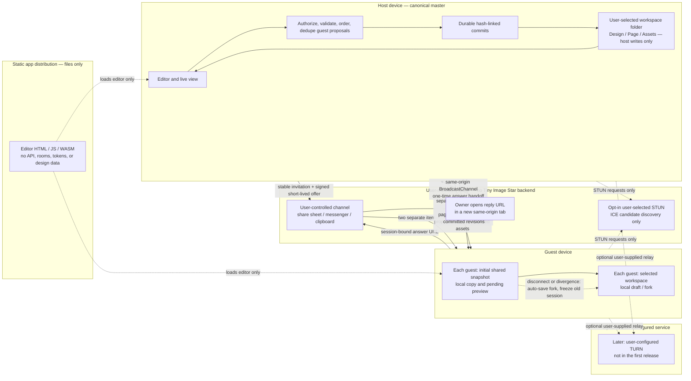

# Local workspace and live design sharing

**Status:** serverless collaboration protocol v2 is wired into the editor, but it is not production-ready. A host room supports up to four independent guest WebRTC sessions, one shared durable revision sequencer, initial snapshots, guest proposals, revision fan-out, local fork recovery, and authenticated host-to-guest page/viewport following. Each channel has an isolated queue; aggregate room asset transfers are bounded. When two guests edit the same base revision, the first durable commit wins and the stale guest's work is preserved as a local fork. There is no automatic merge or rebase. The owner can navigate a connected design in a guarded view-only editor while guests follow the current page, zoom, and canvas center; view messages are ephemeral and never write the workspace. Layer insertion/deletion, reordering/reparenting, allowlisted layer properties, and text replacement now compile to ordered typed operations whose intermediate ACK snapshots are checked against the host reducer. Document-level and unsupported composite changes retain a validated full-snapshot fallback. Presence now relays bounded cursors and remote layer selections; conflict transforms are not implemented. Current-revision browser smoke and independent-device network checks remain open; unit tests and static checks do not prove real WebRTC reachability or production readiness.

**Current state:** the editor can use a user-selected folder workspace, migrate existing IndexedDB designs, keep design/page snapshots and verified image/font assets in that folder, and start or join out-of-band WebRTC sessions. The owner remains the only canonical writer. Up to four guests can connect independently to one host room; the host serializes accepted revisions, sends each committed snapshot to other guests, and isolates a stale or stalled peer without closing its siblings. Guests checkpoint an independent local copy before proposing changes and preserve it as a local fork on disconnect or divergence. Existing IndexedDB data remains available as a library/recovery copy. The app provides direct ICE by default and an explicit opt-in to Google STUN; it has no rendezvous service or TURN relay. The invite still carries a fresh offer for each guest. A guest can now send a self-contained reply URL; when the owner opens it in the same browser profile while the sharing tab remains open, same-origin `BroadcastChannel` hands the signed answer to that tab and connects automatically. A manual reply-code fallback remains available. Guests receive the current snapshot at join and follow subsequent host page/viewport updates until they turn following off or interact with their own view. Browser smoke and independent-device reachability are still unverified, so this remains not production-ready.

**Implementation checkpoint:** workspace storage has validated manifests, per-design hash-linked commits, verified image/font stores, IndexedDB migration, folder discovery, autosave fencing, and write preflight limits. The collaboration modules implement signed short-lived offer/answer capsules, one-time answer use, direct WebRTC DataChannels, a shared host operation sequencer, per-peer revision fan-out, durable ACKs, bounded aggregate image/font transfers, disconnect forks, bounded per-peer queues/replay state, and retryable fork saves. The host UI can create separate guest offers, show peer status, and disconnect one guest without revoking the room. Before sending a local snapshot, the guest controller plans supported layer and text changes with the same reducer used by the host, stages the ordered operations against consecutive revisions, and keeps each exact intermediate result for its ACK. Changes outside that typed subset use the existing full-snapshot operation. Stale revisions are rejected and forked rather than rebased. Separate ordered control and asset DataChannels use explicit readiness and persistence barriers so control remains responsive during large transfers and dependent snapshots or edits wait for asset durability. The File menu offers clipboard/native share-sheet signaling and explicit asset approval. Browser workflow harnesses exist, but browser smoke is deferred while feature work continues. Independent-profile and real-device WebRTC/folder behavior remain unverified.

## Goal

Tiny Image Star should open into a user-selected workspace folder, keep each design and its pages in that folder, and let its owner share one design through a stable capability link plus a fresh session capsule for each guest. People with the link can see the host's current page and propose edits. The host's device and folder remain the only authority for that shared design. If the host disconnects or a guest detects divergent history, that guest automatically saves its last committed replica and local pending work as a separate fork in its chosen workspace before continuing. Tiny Image Star must not silently merge divergent histories or write them over the host's work.

The sharing model is deliberately one-master. It gives collaborators a clear answer to “which edit won?” and fits the requested detached-head behavior better than a multi-master CRDT. Several guests may connect, but all proposals pass through one host-owned revision sequence. Collaboration is a sequence of validated edits committed by the host, rather than independent documents that later merge.

## End-to-end architecture



**No Tiny Image Star collaboration backend is part of this design.** The deployed app can remain static. A stable design URL identifies the design and carries its revocable capability; it is an invitation, never a live-session locator. For each live session the host creates a fresh WebRTC offer, waits for ICE gathering, signs the session capsule with the design's persistent identity key, and sends it through a user-controlled channel. The guest verifies the identity, creates an answer, and returns a session-bound answer URL through that same user-controlled channel. When the owner opens the URL, its fragment stays local to the browser; the new same-origin tab relays the answer capsule to the already-open host tab with `BroadcastChannel`. The host verifies the signature against the exact outstanding session and consumes the answer once. This out-of-band exchange is required without rendezvous infrastructure: a stable design URL alone cannot discover an open host or start a live session. The app does not run a room directory, signaling endpoint, document server, or TURN service.

**Confirmed constraint: no central Tiny Image Star server.** Static hosting serves only the editor files; the canonical design, folder handle, operation journal, and live edit authority stay on the owner's device. No app backend receives designs, stores room state, issues share tokens, or forwards collaboration messages. The offer and answer move directly between users through a channel they choose. The reply URL simplifies the second handoff but does not wake or locate the owner: the owner must be online with the original sharing tab open in the same browser profile and app origin. If that tab is unavailable, the user can retry after opening it or use the manual reply-code fallback. A permanent link cannot establish a live session by itself.

**No-server product contract:** the owner shares one per-guest URL, `https://<static-origin>/<app-path>#tisjoin1.<invite-payload>.<offer-payload>`. The design capability and signed offer are carried in the URL fragment, so static hosting receives neither the design capability nor the temporary WebRTC offer. The offer contains gathered SDP and expires after five minutes. Opening the link starts joining immediately when the guest already has a save location; otherwise the app keeps the link ready while the guest chooses where to save their local copy. The guest returns a reply URL containing the session ID and signed answer in its fragment. The owner can paste this URL in the visible sharing panel, or open it in a new tab in the same-origin browser to relay it over `BroadcastChannel` to the still-open host tab. The host verifies the signature against that exact outstanding peer session and consumes the answer once. Every invited guest has a different offer and reply URL, while the owner uses one shared edit sequence to commit accepted changes. Exceptionally large offers that exceed the 16 KiB URL budget use the visible full-invite message fallback rather than failing session setup. The host stores capability grants and revocation state in its own workspace. If the owner is offline, the guest cannot change the canonical design; disconnection automatically checkpoints the guest replica and pending edits as a local fork.

The product distinguishes current connectivity from a later relay option:

| Product level | Tiny Image Star service | External network service | Expected behavior |
| --- | --- | --- | --- |
| **LAN / direct** (first-release default) | None | None | Use directly reachable candidates only. No outside network service is contacted; this works on suitable local/public routes, but not every internet connection. |
| **Internet P2P** (user opt-in) | None | STUN server selected by the user | STUN discovers possible direct routes; signaling remains out of band. The selected provider sees connection metadata, and some NAT/firewall pairs still fail. No STUN endpoint is preselected or silently contacted. |
| **Reliable Internet** (later, optional) | None | TURN relay configured and operated by the user | A relay can connect more network pairs, but carries encrypted packets and connection metadata. Tiny Image Star neither supplies nor operates TURN. |

The current default has no Tiny Image Star backend and contacts no external STUN or TURN service. The UI lets each participant explicitly select Google's STUN provider for internet-direct attempts after seeing the metadata disclosure. If STUN remains disabled, connections are limited to routes the devices can already reach, so many internet connections will fail. TURN is deferred; if later added, it must be a user-configured external relay. JSEP deliberately leaves offer/answer signaling to the application. Tiny Image Star now exchanges the same signed capsules through clipboard, the native share sheet, or a local animated QR transfer; none uses a signaling server. ICE uses STUN/TURN separately to find or relay network routes. [RFC 8829 (JSEP)](https://www.rfc-editor.org/rfc/rfc8829.html) defines this separation; the [W3C WebRTC Recommendation](https://www.w3.org/TR/webrtc/) defines the peer-connection API. Google's `stun.l.google.com:19302` is a user-selected third-party option, not a Tiny Image Star service. [TURN guidance](https://webrtc.org/getting-started/turn-server) describes TURN as a traffic relay, which is why support is deferred and must remain optional.

Google's documented `stun.l.google.com:19302` endpoint is only one user-selectable third-party STUN option. It does not carry SDP signaling or relay design traffic, and its provider can observe connection metadata such as the request's source address. With no selected STUN and no TURN relay, some carrier, office, and symmetric-NAT networks will fail to connect. The app must report that clearly and let users retry on another network. TURN is not part of the first release; a later user-configured relay must disclose that it sees connection metadata and encrypted packets. [WebRTC peer connections and signaling](https://webrtc.org/getting-started/peer-connections), [TURN server guidance](https://webrtc.org/getting-started/turn-server)

Each guest has separate v2 ordered control and asset DataChannels. Control carries the initial snapshot, edits, ACKs, ephemeral view state, and transfer coordination; bounded binary asset frames travel on the independent asset stream. `ASSET_READY` confirms that the guest has authenticated the host and prepared its receiver. After sending an asset batch, the sender issues an asset-channel barrier; the receiver acknowledges it over control only after every preceding asset has been validated and saved. The initial snapshot and later room revisions wait for that barrier, and a guest's `sendAsset` waits for it before allowing an edit to reference the new asset. This avoids application-level head-of-line blocking from ordered asset frames while preserving explicit durability ordering. Both streams still share the peer connection's underlying SCTP association and network capacity. The v2 control channel carries sequenced ephemeral presence in addition to edits and viewport hints. One host room coordinator sequences edits across all channels. After the host durably commits a proposal, it sends an authenticated `ROOM_REVISION` snapshot to every other ready guest. A peer with no pending edits adopts that revision; a peer with pending edits saves its work as a local fork and disconnects. The current cap is four guest sessions, and aggregate transfer accounting bounds bytes and asset count across the room. A per-peer send queue prevents one slow connection from holding the other peers' revision fan-out. `VIEW_STATE` is host-to-guest only and carries a monotonic room sequence, a page ID, zoom, and the canvas center in design coordinates. It is size/range bounded, ignored if its page is not in the authenticated snapshot, and never enters the commit journal. The host applies its active page to the shared document before accepting the next guest snapshot, so a guest cannot change which page the master is sharing. Each guest can pause following and inspect its own view. WebRTC data-channel transport uses SCTP over DTLS, but encryption alone does not establish the intended design identity or authorize edits. The app verifies the owner's signature over each gathered SDP offer against the public key in the stable invitation, verifies each guest's answer proof against the capability key, then validates each message and persists accepted changes at the host. [RFC 8831: WebRTC Data Channels](https://www.rfc-editor.org/rfc/rfc8831.html), [RFC 8827: WebRTC Security Architecture](https://www.rfc-editor.org/rfc/rfc8827.html)

`PRESENCE` carries only an actor ID, sequence, page ID, optional world-space cursor, and at most 128 selected layer IDs. The host accepts it only from the authenticated member's own actor ID, rate-limits updates, and relays it to ready peers. Receivers ignore stale sequences and references to pages they have not adopted yet. Remote cursors and selection outlines are presentation-only; presence never enters the design snapshot, autosave, or operation journal. Protocol v2 is a wire compatibility boundary: v1 clients fail during join instead of encountering an unknown presence message after editing starts.

**Current v2 join and edit for one guest session, with no app signaling service:**

```mermaid
sequenceDiagram
  autonumber
  actor Owner
  actor Guest
  participant App as Host Tiny Image Star
  participant Folder as Host workspace folder
  participant Channel as User's existing share channel
  participant GuestApp as Guest Tiny Image Star
  participant GuestFolder as Guest workspace folder

  Owner->>App: Choose workspace folder
  App->>Folder: Create workspace or verify existing workspace
  App->>Folder: Migrate existing IndexedDB design and verify assets
  Owner->>App: Create design and page
  App->>Folder: Journal page and design changes
  Owner->>App: Share Live
  App->>App: Create fresh offer; gather ICE; sign SDP in short-lived offer capsule
  App-->>Owner: Show stable invitation and offer as separate items
  Owner->>Channel: Send both items through a channel they choose
  Guest->>GuestApp: Choose or open guest workspace folder
  GuestApp->>GuestFolder: Create workspace or verify existing workspace
  Guest->>Channel: Receive invite
  Guest->>GuestApp: Enter invitation and offer; verify design identity, scope, and expiry
  GuestApp->>GuestApp: Create SDP answer; gather ICE; bind proof to session nonce
  GuestApp-->>Guest: Copy/share signed answer capsule
  Guest->>Channel: Return answer capsule to host
  Owner->>App: Paste guest answer capsule
  App->>App: Verify session, capability proof, and answer; complete ICE handshake
  Guest->>App: HELLO with design/session identity and last revision
  App->>Folder: Read and verify canonical head
  App-->>GuestApp: WELCOME and current snapshot
  Guest->>GuestApp: Make local edit; show pending preview
  GuestApp->>App: Ordered typed OPERATIONs (or validated snapshot fallback)
  App->>App: Check session, deduplicate, validate document

  alt Proposal valid and folder commit succeeds
    App->>Folder: Write full snapshot as hash-linked commit; publish new head
    Folder-->>App: Durable commit confirmed
    App-->>GuestApp: ACK with committed revision and hash
    GuestApp->>GuestFolder: Persist accepted replica state
  else Folder write fails
    Folder-->>App: Write or permission error
    App-->>GuestApp: No ACK; shared writes paused
    GuestApp->>GuestFolder: Automatically persist replica and pending edits as a new-lineage fork
  else Base is detached or operation conflicts
    App-->>GuestApp: REJECT stale revision; freeze the session
    GuestApp->>GuestFolder: Automatically persist a fork; freeze writes to the old master
    Guest->>GuestApp: Explicitly start a new live master when ready
  end
```

The ACK is the save boundary: the guest labels a proposal pending until the host has durably committed it. A disconnected host never hands authority to the last guest. On connection loss or a stale-revision rejection, the guest automatically writes its last acknowledged replica plus pending local work into a guest-owned local fork; the old session is frozen and no fork operation is sent to the original host. The guest can continue editing the local fork and may explicitly start a new live master after the fork is safely stored. A stable design URL cannot locate an active host or reconnect a peer by itself; each session needs a fresh offer and answer. The current UI uses clipboard or the native share sheet; QR scanning/generation is a possible later transport for those same text capsules. The selected messenger can read the stable capability link and gathered SDP, including ICE candidate network details, so users should share only through a channel they trust.

## Revision ordering and conflict rules

### Implemented v1 behavior

For supported layer-tree and property edits, the guest diffs its last proposed state against the next local checkpoint and emits `InsertNode`, `DeleteNode`, `MoveNode`, `SetProperty`, or `ReplaceText` operations. One local edit may produce several ordered operations; the guest stages them against consecutive base revisions before sending and records the exact expected snapshot after each operation. The host checks the session, design identity, operation ID, and exact `baseRevision`, applies one operation, validates the resulting document, writes it to the selected workspace, and returns `ACK` with the committed revision and hash only after the durable commit succeeds. Document-level changes and edits outside the typed allowlist still use `ReplaceSnapshot`. Reusing an operation ID with a different payload or submitting a stale revision is rejected. After each durable commit, the host sends the new full snapshot and head hash to every other connected guest. An idle guest adopts the revision; a guest with pending edits saves that work as a local fork. This makes concurrent same-base edits safe but does not merge them: the first operation in the host sequencer commits, and the stale proposal is forked. One host room accepts up to four independent guest sessions. Revoking the stable invite closes every session; an individual disconnect removes only that peer. Asset transfer count and bytes are bounded in aggregate for the whole room, and each peer has an independent bounded queue. There is no automatic rebase or merge.

The rest of this section describes a future target for typed, concurrent editing; it is not a claim about the current editor behavior.

The future typed-operation design should use one host sequencer and one ordered operation stream per design. It remains master-authoritative, not a multi-master CRDT. The current persistence format stores a full validated snapshot in each immutable hash-linked commit; it is not an append-only semantic operation log. The host processes one proposal at a time under a per-design writer lock; only that host can write the canonical folder. A local-tab coordinator and fencing token must prevent a second app tab from acting as writer for the same workspace. If the host detects an external folder change or a commit chain it cannot verify, it pauses writes and enters recovery instead of overwriting the unexpected state.

The target proposal includes a protocol version, design/session/page IDs, lineage ID, `opId`, base revision and head hash, typed operation, stable target IDs, and expected versions for the fields it changes. The initial operation allowlist is `SetProperty`, `InsertNode`, `DeleteNode`, `MoveNode`, `ReplaceText`, and `AddAsset`; unrecognized operation types fail closed. Every message is size-bounded and authenticated to its session. The host applies these rules in order:

1. Check the share capability, room, design/page scope, protocol version, message size, operation allowlist, and document invariants. Guest messages contain document operations only—never local paths, directory handles, filenames, or filesystem instructions.
2. Deduplicate by `(actorId, opId)`. The same ID and payload returns its original result; reusing an ID with a different payload is rejected and recorded as a protocol violation.
3. Verify that the proposal's base commit belongs to the current hash-linked lineage. If it is an ancestor of the current head, run only a registered deterministic transform for the operation type against intervening commits. Disjoint edits to stable IDs/field paths may rebase; overlapping edits to the same field or an operation without a tested transform are rejected with the current head and a conflict reason. The host never guesses.
4. Validate the resulting document, persist it in a full-snapshot hash-linked commit, update the recoverable head, then ACK and broadcast the accepted operation/commit. If the folder write fails, do not ACK and pause canonical writes until recovery succeeds. Commit signatures and broadcasting are future protocol work; v1 ACKs include the durable revision and commit hash.

This is the minimum safe base for concurrent editing. In the first release, overlapping edits to the same text range are rejected or held behind a short text-edit lease. Google Docs-like concurrent typing requires a separately designed and tested OT or stable-position transform before it is enabled. Other edit families need explicit transforms too; unsupported overlap is a visible conflict. A truly detached guest history—different lineage, base not in host ancestry, or failed transform—cannot be fast-forwarded. Preserve it automatically as a local fork, stop sending writes to the old master, and let the guest start a new master only after the fork save succeeds. Copying work back is an explicit manual action in the original design.

**Required editor refactor:** the current editor mutates document fields across UI handlers, gestures, and model helpers; snapshot undo/redo does not describe operations that can be validated or rebased. The existing IndexedDB revision compare-and-swap ([`storage.js`](../src/storage.js)) is useful for local recovery, but it is not a shared operation log; [`history.js`](../src/history.js) stores whole-document snapshots, and editor changes are spread through [`main.js`](../src/main.js) and [`model.js`](../src/model.js). Add a shared action/reducer boundary so local and remote edits apply the same typed operation at the existing gesture/input commit points. Derived layout/component changes must be deterministic and included in the accepted operation. Undo becomes a new validated inverse operation. The current image/font assets also live outside the document JSON, so asset references and verified transfer must be part of that boundary.

## User flow

1. **Choose a workspace.** On first use, ask the user to select a folder and grant read/write permission. Create the Tiny Image Star workspace metadata there. On later launches, reopen the saved directory handle and re-check permission; ask again if access was revoked. Show visible states such as “Saving,” “Saved to folder,” “Folder access needed,” and “Disk full.” A failed or pending write must never be presented as saved.
2. **Create a design and pages.** Designs are folders inside the workspace. Pages are folders inside their design. New pages and assets are written through the same journaled save path as edits.
3. **Share the invite.** The owner chooses **Invite someone**, creates an invite, and taps **Share invite** to send one complete message. They can show an invite QR code instead. The invite lasts about five minutes. The owner stays online and can follow along while the guest edits, but cannot edit at the same time. To add another guest, create and send a fresh invite. Under the hood, the message bundles a stable design invitation with a short-lived connection code; the stable link by itself cannot locate a live owner.
4. **Join and connect.** The guest pastes the full invite message or scans its QR code, selects a writable folder, and taps **Join design**. The guest sees a prompt to share a reply URL “to complete the shared context.” The owner opens that URL in the same browser profile and app origin where the sharing tab is still open; the app verifies and consumes the answer, then establishes WebRTC automatically. If no host tab responds or cross-tab messaging is unavailable, the link page presents the manual reply code. The guest verifies the signed invite and receives the current snapshot. Required image/font data travels over bounded encrypted DataChannel frames; the folder handle never leaves the host browser. Once connected, the owner gets a guarded view-only canvas and a mobile-sized view bar for page selection; guests follow its page, zoom, and canvas center by default, with a control to pause following and inspect locally.
5. **Edit collaboratively.** Each guest editor writes its local copy before sending a full-snapshot proposal. This includes anchored comment threads and their replies, resolution state, and deletion. The owner validates and commits each proposal through one shared revision sequencer, then returns an ACK with the exact new sequence and commit hash; only then does the proposing guest treat the change as canonical. Other idle guests receive the committed snapshot. A stale proposal or a room revision arriving while that guest has pending edits is preserved in a separate local fork; it is never merged over the owner's work. The owner displays accepted comments from committed snapshots. Without an active peer session, comments stay local to each design copy. The editor blocks further interaction in a guest while that guest's proposal is pending.
6. **Recover a disconnected or detached guest.** On transport loss, stale-head rejection, or divergence, freeze the old session and save the guest's folder-backed copy as a separate local fork. Retry remains available if storage fails. Copying work back to the original design remains a manual owner action; there is no automatic merge or leader election.

## Folder layout and persistence

The chosen directory is the workspace root. This is the current v1 layout; IDs are generated locally and remote paths are never accepted.

```text
Tiny Image Star Workspace/
  designs/<design-id>/
    CREATE.json
    .tiny-image-star/
      design.json
      HEAD.json
      PENDING.json
      commits/<commit-hash>.json
    assets/
      metadata/<asset-id>.json
      blobs/<content-hash>
    fonts/
      metadata/<font-id>.json
      blobs/<content-hash>
    pages/<page-id>/
      revisions/<commit-hash>.json
```

An automatic guest fork is a separate design under the guest's selected workspace, with a new design ID and lineage. Its first checkpoint records the source design ID, source lineage, last acknowledged revision/head hash, and the pending local operation IDs it preserved; it never contains the host's folder handle or path. Create or advance the fork through the same atomic journal path as ordinary local edits. The invite/join flow requires an available guest workspace before enabling edit proposals, so disconnect recovery does not depend on a later permission prompt.

`.tiny-image-star/design.json` holds stable design identity and format version. Each page's `revisions/<commit-hash>.json` is a materialized page snapshot. Image and font metadata refer to content-addressed blobs shared by the design. Each immutable commit stores the complete validated design snapshot plus sequence, previous hash, page ID, and its own hash; v1 does not persist a semantic operation log or compact snapshots at intervals. `HEAD.json` points to the latest verified commit, and `PENDING.json` supports interrupted-write recovery. The folder hierarchy is the canonical project layout, not a mirror that guests may write directly.

Saving validates the candidate against the current verified head and referenced assets, checks history limits, writes and reopens `PENDING.json`, writes the immutable full-snapshot commit, reopens and validates that commit and its page revisions, then writes and verifies `HEAD.json`. Only after the verified head advances does the host ACK the proposal. It then removes `PENDING.json`; if that cleanup fails, the advanced head remains authoritative and the next open reconciles the marker against the commit chain. Startup recovery checks the pending marker and verified chain and either resolves the marker when the head is unambiguous or reports an error without discarding the last valid commit. Folder permission errors, quota/disk errors, and corrupt documents pause canonical writes and remain visible to all connected guests. The browser stores the directory handle locally and rechecks permission on each launch; the handle never crosses to a guest. Existing IndexedDB documents and their assets are copied into a staging workspace, verified by IDs and hashes, and left intact until the new folder's manifest and first commit have been reopened successfully. Tiny Image Star writes each acknowledged edit into the selected local folder; if that folder is also watched by a cloud-sync utility, remote sync timing and conflict-copy behavior belong to that utility. On a changed or conflicting folder state, Tiny Image Star verifies the commit chain and pauses on uncertainty rather than replacing files it cannot prove are current.

The browser File System Access API requires a secure context and a user gesture for the directory picker, and support is not universal. OPFS is private browser storage rather than a visible user-selected folder, and it remains subject to browser storage quotas. Because selecting a visible folder is a product requirement, do not silently substitute OPFS and call it the selected folder. Use the directory picker where supported; for platforms without a writable folder picker, a native document-provider adapter is required for full workspace support. Until that adapter exists, clearly label the platform as unable to host a canonical folder workspace and retain `.flocal` import/export for portability. [MDN: `showDirectoryPicker()`](https://developer.mozilla.org/en-US/docs/Web/API/Window/showDirectoryPicker), [MDN: File System API](https://developer.mozilla.org/en-US/docs/Web/API/File_System_API), [MDN: Origin Private File System](https://developer.mozilla.org/en-US/docs/Web/API/File_System_API/Origin_private_file_system), [Storage quota and eviction](https://developer.mozilla.org/en-US/docs/Web/API/Storage_API/Storage_quotas_and_eviction_criteria)

## Edit protocol and authority rules

The target protocol uses a random `designId`, a `lineageId`, a monotonically increasing `sequence`, and a hash-linked committed head. V1 has a hash-linked workspace head and strict revision fence, but no persisted lineage or reconnect protocol. A future reconnecting guest would supply its last accepted `(lineageId, sequence, headHash)` and any pending operation IDs.

The host and guest authenticate before exchanging design data. The ordered reliable control channel carries versioned, size-limited messages such as:

| Message | Direction | Meaning |
| --- | --- | --- |
| `HELLO` / `WELCOME` | guest ↔ host | Current v2 session identity and revision/head |
| `SNAPSHOT` | host → guest | Current committed design snapshot after `HELLO` |
| `ROOM_REVISION` | host → guest | Later durable snapshot committed by another guest; applied only when this guest has no pending edits |
| `VIEW_STATE` | host → guest | Ephemeral ordered page, zoom, and canvas-center update; never a design commit |
| `PRESENCE` | peer → host → ready peers | Sequenced ephemeral cursor and selected-layer state; never a design commit |
| `OPERATION` | guest → host | Ordered typed layer/text edits, with a validated `ReplaceSnapshot` fallback for changes outside the current typed subset |
| `ACK` | host → guest | Durable revision and commit hash; duplicate exact operation IDs return the original result |
| `REJECT` | host → guest | Invalid or stale proposal; stale revision freezes the current v2 session |
| `ASSET_READY` | guest → host | Guest confirms the separate asset receiver is ready after authenticating `WELCOME` |
| `ASSET_BEGIN/CHUNK/END` | either direction | Consent-gated, hashed, bounded frames on the independent ordered asset DataChannel |
| `ASSET_BARRIER/ACK` | either direction | Confirms that all earlier asset frames on that sender's stream were persisted before dependent control messages continue |
| `FORK_NOTICE` | guest → host | Guest reports that it saved a local recovery fork |

In protocol v2 the host rejects replayed IDs with a different payload, unknown or invalid operations, stale base revisions, oversized payloads, invalid documents, and unauthorized design IDs. It commits the candidate before sending `ACK`. Guests never send file paths, arbitrary file names, or direct filesystem commands. Assets are written only under generated IDs after size, type, and hash checks. Presence uses world-space coordinates and at most 128 selected IDs, is throttled at the host, and is discarded if it refers to a page the guest has not received yet. A v1 peer is rejected by the versioned v2 handshake; clients must use the same collaboration protocol version.

**Detached state machine:**

The automatic local-fork path is implemented and unit-tested. Reconnect, ancestry checks, and lineage-aware fast-forward shown below are future behavior, not part of v1.

```mermaid
stateDiagram-v2
  [*] --> Connected
  Connected --> CatchingUp: reconnect, host head is descendant
  CatchingUp --> Connected: verified tail applied
  Connected --> ForkPersisting: host disconnected / detached / conflicting edit
  ForkPersisting --> LocalForkSaved: atomic local save succeeds
  ForkPersisting --> SaveBlocked: guest workspace write fails
  SaveBlocked --> ForkPersisting: storage access restored
  LocalForkSaved --> LocalEditing: continue on the fork
  LocalForkSaved --> CatchingUp: fresh capsule; fork has no local-only edits
  Connected --> Frozen: host storage error / revocation
  Frozen --> CatchingUp: same lineage, safe fast-forward
  Frozen --> ForkPersisting: local recovery checkpoint required
  LocalForkSaved --> NewMaster: user starts a new share
  LocalForkSaved --> ManualCopyBack: user manually copies into old master
```

No guest becomes master by timeout or by being the last connected peer. The app automatically creates a local design fork when the host disconnects or history detaches, then freezes writes to the old session. If the guest has not made fork-only edits, a fresh signed capsule can reconnect it after the host proves the same lineage; the saved recovery fork remains available. Once the guest edits the fork, that branch stays local and cannot be sent to the old master automatically. The guest may explicitly start a new live master from it. This avoids split-brain; offline availability is provided by a durable local fork, not by pretending a stale guest copy is still canonical. If the guest workspace cannot be written, pause guest edits and keep pending work recoverable in memory until the folder save succeeds.

## Stable design capability and one-time session capsules

Each design gets one stable edit-capability URL by default. Its versioned fragment contains a random public `shareId`, a high-entropy capability private key, and the design's pinned public identity key. This invitation and the fresh session offer are separate items; both are needed to join. The capability key grants edit access to that design and all of its pages; it is not the design ID, the folder name, or a key to the user's device. A new `shareId`/capability is generated when the owner rotates or revokes the link. Anyone with both invitation and offer can join the current session and propose edits, but cannot write the host's folder directly. In a no-backend setup, the stable URL is authorization only: it cannot locate an active host or establish a peer connection. To join live, **Share Live** creates the fresh signed offer capsule; the guest returns a one-time answer capsule out of band.

The offer capsule is a bounded, canonical payload containing design/share IDs, session ID, one-time nonce, issue/expiry times, and the complete ICE-gathered SDP offer, signed by the design identity private key. It does not embed the stable invitation or capability private key. The stable invitation separately carries the pinned identity public key and capability keypair material in its URL fragment. The answer capsule contains the session-bound SDP answer and is signed by the capability private key. The host checks expiry, scope, signature, and one-time use before sending document data. Both offer and answer include SDP network candidates, so the user's chosen messaging channel can observe those details. The codec enforces encoded-size bounds before parsing or allocating large buffers. Clipboard and native share-sheet transport remain available; QR handoff bundles the invitation with its one-time offer and the answer travels as a separate transfer. Large capsules split into small QR frames with a transfer identifier and SHA-256 checksum; the receiver exposes nothing until every frame arrives and the checksum matches. QR generation and decoding run locally. The QR carries the stable edit capability, so anyone who captures the complete handoff can attempt to join until the short-lived offer expires. Camera permission is requested only after the user presses **Start camera**; scanning saved QR images and the original paste flow remain alternatives. The app removes the invitation fragment from the address bar after capture.

Use Web Crypto P-256 signing keys rather than a hand-rolled token protocol. The capability private key stays in the invitation fragment and signs the session-bound answer; the host stores its corresponding public key in the local share registry and checks it before accepting the answer. The host's persistent design identity private key stays in the owner's local key store and signs the gathered offer SDP; the guest verifies that signature against the identity public key in the stable invitation. Because the signed SDP includes the DTLS fingerprint, these signatures bind the peer connection's DTLS identity to the design invitation and guest capability. V1 WELCOME, snapshot, and ACK messages are not separately signed; they travel over the negotiated DTLS-protected DataChannel and carry design/session/actor checks. Neither key grants access to the local folder. If the workspace moves to another device or browser profile without its local identity key, the owner creates a new invite and revokes the old one.

Read the fragment only in first-party app code, remove it from the visible address bar after capture, and exclude it from app analytics, requests, logs, crash reports, and error URLs. A fragment is not secret from the person who receives or copies the full link and can still leak through browser history, screenshots, clipboard, the user's chosen messaging provider, or malicious same-origin scripts. Tell users that the provider carrying the invite can see the link and its edit capability. Serve the editor with HTTPS, strict CSP, no untrusted third-party scripts, explicit share/revoke controls, challenge expiry and replay protection, and local failed-join limits. The app runs no signaling service and receives no signaling logs. WebRTC encrypts data channels in transit; the host and any authorized guest can still read, copy, and export the design. Minimize candidate/IP exposure in the UI and document that network-address privacy depends on browser policy and ICE configuration. A user-configured TURN relay sees connection metadata and encrypted packets, not document plaintext. [W3C Web Crypto API](https://www.w3.org/TR/WebCryptoAPI/), [RFC 6750: bearer token threats](https://www.rfc-editor.org/rfc/rfc6750.html), [RFC 3986: URI fragment](https://www.rfc-editor.org/rfc/rfc3986.html), [RFC 8828: WebRTC IP address privacy](https://www.rfc-editor.org/rfc/rfc8828.html)

Folder access is separate from link access. The host's directory handle stays in the host browser; guests receive validated design operations and approved assets, never the host's directory handle or paths. Only the host writes the canonical design folder. A user must confirm incoming asset transfers and should see size/progress before accepting large batches.

## Batch processing and GPU use

The app vendors Pillow-RS package version `12.2.0-alpha.5` from upstream `main` at source commit [`1f67a3f`](https://github.com/appunni-m/pillow-rs/commit/1f67a3f48324bcbf5e0048810914922d1c677980), the latest upstream revision checked on 2026-10-04; the build manifest and script pin that commit for reproducibility. Its browser build uses the JS crate's `wasm-core` codec/font feature set and the app's recorded JPEG/WebP quality patch. The current upstream core has a grouped GPU batch API for a narrow set of compatible operations, but the browser package does not enable the GPU feature or bind `BatchExecutor`; editor batches therefore run in the bounded WASM CPU worker pool, and no GPU speedup is claimed. A future GPU path needs an upstream-compatible browser WASM build and JavaScript bindings, then app-side adapter/device-loss handling, exact output parity, end-to-end benchmarks, and CPU fallback. Keep the current bounded Pillow-RS CPU scheduler as the fallback; WebGPU requires a secure context and an adapter may not be available, so it cannot be a platform requirement. Compare decode, upload, kernel, readback, and encode time on supported phones and desktops, and enable a GPU operation only when measured end-to-end throughput improves. Sharing and folder persistence must not depend on GPU access. [Pinned Pillow-RS WASM feature set](https://github.com/appunni-m/pillow-rs/blob/1f67a3f48324bcbf5e0048810914922d1c677980/pillow-rs-js/Cargo.toml), [W3C WebGPU](https://www.w3.org/TR/webgpu/), [MDN: WebGPU API](https://developer.mozilla.org/en-US/docs/Web/API/WebGPU_API)

## Mobile and browser support

The editor currently exposes **Share live…** and **Join live session…** from its main menu. The responsive collaboration dialog provides touch-sized actions, invitation/offer/answer fields, QR display and camera/image scanning, optional STUN disclosure, connection and asset-transfer status, stop-sharing controls, and a retry action if saving a guest fork fails. A connected owner gets a floating page/view dock; a connected guest can follow or pause the owner's view. While the owner is connected, canvas input is restricted to navigation and edits remain disabled, preventing unsynchronized master changes. The mobile UI is implemented, but its full workflow has not yet been validated on real Android/iOS devices. Context menus are not required for sharing. Remaining mobile work is platform validation and a native document-provider adapter where browsers cannot grant a writable folder.

Folder selection remains the main browser compatibility constraint. `showDirectoryPicker()` has limited availability; OPFS can provide private local persistence on more browsers, but it is not the user's visible directory. Until a native document-provider adapter exists, do not claim mobile browsers without a writable directory picker can host a canonical workspace. Keep `.flocal` export as an explicit portable save, and block live collaboration when the required writable workspace or DataChannel support is unavailable.

## Remaining release work

1. Run two independent browser profiles on desktop and real Android/iOS devices through offer/answer, required image/font transfer, local folder persistence, owner revoke, host failure, guest fork, retry after denied/quota-limited storage, and reload recovery. Unit/browser mocks do not establish real WebRTC reachability or mobile picker readiness.
2. Add deterministic cross-browser collaboration coverage for duplicate/reordered frames, two sessions racing on one design, external folder changes, large-but-bounded assets, malformed peers, and unload during an in-flight local checkpoint.
3. Make the full editor emit semantic operations instead of snapshot replacement. The current four-guest snapshot protocol rejects and forks conflicting same-base edits; tested typed-operation transforms could later preserve disjoint concurrent edits. Presence and cursor sharing remain future work.
4. Verify CSP, production headers, fragment-secret handling, browser history cleanup, dependency supply chain, and privacy disclosures against the deployed build. Pen-test before general availability.
5. Load-test realistic phone memory/CPU and storage, then set production caps for snapshot size, history, asset count/bytes, and session lifetime. No server-side telemetry or TURN service is introduced.

## Acceptance criteria

- The first-run workspace is selected by the user; a design and each page have their own folder beneath it; every acknowledged host edit survives reload and a forced tab termination.
- A guest receives the host's committed design and follows the host's page/viewport changes until following is paused; page/viewport packets never become document commits.
- A guest proposal is never marked saved before the host has durably recorded it. Duplicate proposals commit once. Invalid/stale operations are rejected without partial writes.
- Reconnecting same-lineage guests fast-forward only when the operation chain proves ancestry. Disconnect or divergence automatically writes a guest-owned fork with a fresh lineage and preserves pending edits; no automatic merge, hidden leader election, or canonical write from a guest occurs.
- A revoked or rotated link can no longer join; capability material is absent from app HTTP requests, app logs, and telemetry; the chosen external messenger is clearly identified as able to see a shared capsule; the pinned host identity verifies canonical commits; asset frames and room totals are bounded. A slow peer cannot block revision fan-out to sibling peers. Control and asset messages use separate ordered streams, and transfer barriers preserve save ordering; measure control latency under realistic large transfers before claiming a no-starvation guarantee.
- Direct-only WebRTC works on tested reachable pairs without any external service. STUN is contacted only after user selection and an explicit metadata disclosure. TURN is out of scope for the first release; if added later, the user configures it and sees the relay disclosure.
- Unsupported folder-picker browsers receive truthful fallback behavior, with platform coverage documented before release.

## Accepted defaults

1. Each design has one revocable edit link covering every page. Possession grants edit access; the folder path and host device remain private.
2. The selected folder is the only canonical save location. Use a native document-provider adapter where the mobile browser cannot provide writable folder access; do not silently substitute OPFS.
3. The host is the only sequencer and canonical writer. Current same-base conflicts are rejected and preserved as local forks. If tested typed-operation transforms are added later, only explicitly supported disjoint edits may rebase; there is no automatic branch merge or host election.
4. The link opens into follow-host page/viewport mode. Presence is temporary and separate from document edits; the host can stop sharing or rotate the link at any time.
5. LAN/direct with no external service is the default. Internet-direct STUN is opt-in and selected by the user after a metadata disclosure. TURN is deferred; a later relay must be configured and operated by the user. Direct connection is not guaranteed across all networks.
6. GPU processing remains optional. Use WebGPU only for supported operations with exactness checks and measured end-to-end speedups; Pillow-RS WASM remains the fallback.

The current code caps a room at four guest sessions and defaults to an aggregate 512 MiB and 256 asset transfers across the room. These are implementation bounds, not load-tested production limits; load-test realistic hosts and devices before increasing or presenting them as supported scale. Also verify offer/answer capsule sizes and expiry across common share channels, and decide whether guests may browse other pages while paused from following the host. Snapshot concurrency currently forks a peer on any stale base; future same-text collaboration requires typed operations plus a tested OT transform or edit lease. The no-backend requirement means there is no automatic single-link discovery, offline host queue, or relay guarantee.
