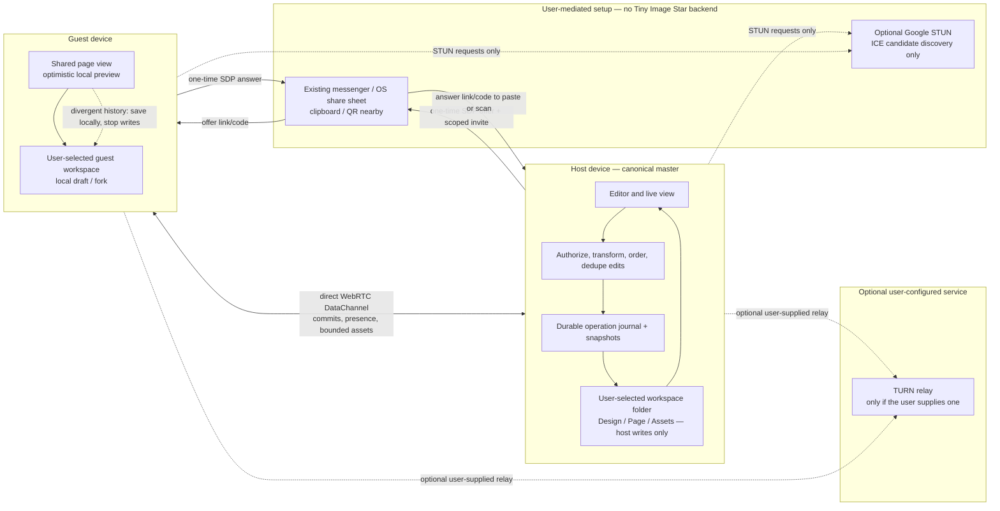
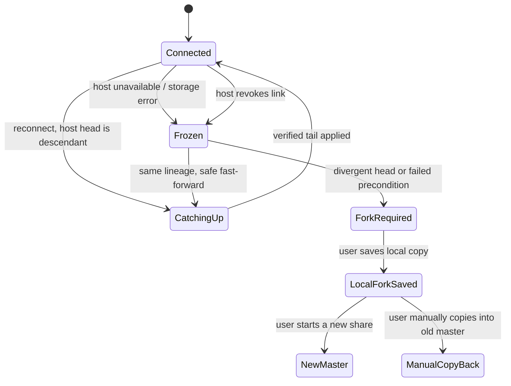

# Local workspace and live design sharing

**Status:** design proposal for review; this document does not implement folder persistence or WebRTC sharing. Updated 2026-10-01.

**Current state:** Tiny Image Star presently saves designs and image assets in IndexedDB and supports portable `.flocal` export/import. It does not yet use a user-selected workspace folder, a per-page folder tree, or live WebRTC collaboration. The architecture below is a proposed migration from that local-first base. Existing IndexedDB designs must remain recoverable until a verified folder migration succeeds.

## Goal

Tiny Image Star should open into a user-selected workspace folder, keep each design and its pages in that folder, and let its owner share one design through a link. People with the link can see the host's current page and propose edits. The host's device and folder remain the only authority for that shared design. A guest who edits a stale or disconnected copy must save it as a local fork before continuing; Tiny Image Star must not silently merge divergent histories or write them over the host's work.

The sharing model is deliberately one-master. It gives collaborators a clear answer to “which edit won?” and fits the requested detached-head behavior better than a multi-master CRDT. Collaboration is a sequence of validated edits committed by the host, rather than independent documents that later merge.

## End-to-end architecture



**No Tiny Image Star collaboration backend is part of this design.** The deployed app can remain static. WebRTC still needs signaling data, so the host creates a one-time SDP offer and sends it in the invite URL/code; the guest creates an SDP answer and returns it to the host through the same user-selected messaging app, share sheet, clipboard, or nearby QR scan. The host pastes or scans the answer to finish ICE negotiation. This manual exchange is required without a rendezvous service: a stable design URL alone cannot discover an open host or start a live session. The app does not run a room directory, signaling endpoint, document server, or TURN service.

Google's documented `stun.l.google.com:19302` endpoint is an optional third-party STUN service for discovering a possible direct route; it is not a Tiny Image Star server, and it neither carries SDP signaling nor relays design traffic. A STUN provider can observe connection metadata such as the request's source address. If the user disables STUN too, connections are limited to routes already reachable between the devices, such as a suitable local network or public address. With no TURN relay, some carrier, office, and symmetric-NAT networks will fail to connect. The app must report that clearly and let users retry on another network. A user may configure a TURN relay they operate or trust, but that is an external relay service and is not enabled or provided by Tiny Image Star. [WebRTC peer connections and signaling](https://webrtc.org/getting-started/peer-connections), [TURN server guidance](https://webrtc.org/getting-started/turn-server)

WebRTC DataChannels fit ordered edit messages and presence. They use SCTP over DTLS, but transport encryption does not replace application authorization or authenticate the intended host through an untrusted out-of-band channel. Each message still needs design scope, capability checks, validation, and host-side persistence. Large asset transfer should use bounded chunks with backpressure so it cannot block edit traffic. [RFC 8831: WebRTC Data Channels](https://www.rfc-editor.org/rfc/rfc8831.html), [RFC 8827: WebRTC Security Architecture](https://www.rfc-editor.org/rfc/rfc8827.html)

**One edit from phone to durable folder commit, with no app signaling service:**

```mermaid
sequenceDiagram
  autonumber
  actor Owner
  actor Guest
  participant App as Host Tiny Image Star
  participant Folder as Host workspace folder
  participant Channel as User's existing share channel
  participant GuestApp as Guest Tiny Image Star
  participant GuestFolder as Guest workspace folder

  Owner->>App: Choose workspace folder
  App->>Folder: Create workspace or verify existing workspace
  App->>Folder: Migrate existing IndexedDB design and verify assets
  Owner->>App: Create design and page
  App->>Folder: Journal page and design changes
  Owner->>App: Share design
  App->>App: Generate one-time offer; wait for ICE gathering; sign invite
  App-->>Owner: Copy/share offer URL or code
  Owner->>Channel: Send invite through a channel they choose
  Guest->>GuestApp: Choose or open guest workspace folder
  GuestApp->>GuestFolder: Create workspace or verify existing workspace
  Guest->>Channel: Receive invite
  Guest->>GuestApp: Open invite and verify host identity
  GuestApp->>GuestApp: Create SDP answer; wait for ICE gathering to finish
  GuestApp-->>Guest: Copy/share one-time answer code
  Guest->>Channel: Return answer code to host
  Owner->>App: Paste or scan guest answer code
  App->>App: Verify capability proof and complete SDP/ICE handshake
  Guest->>App: HELLO with last accepted lineage, sequence, and hash
  App->>Folder: Read and verify canonical head
  App-->>GuestApp: Signed snapshot or verified missing commit tail
  Guest->>GuestApp: Make local edit; show pending preview
  GuestApp->>App: PROPOSE with op ID, base head, operation, field preconditions
  App->>App: Authenticate, deduplicate, transform if supported, validate

  alt Proposal valid and folder commit succeeds
    App->>Folder: Append operation and hash-linked commit; publish new head
    Folder-->>App: Durable commit confirmed
    App-->>GuestApp: COMMIT/ACK with sequence and hash
    GuestApp->>GuestFolder: Persist accepted replica state
  else Folder write fails
    Folder-->>App: Write or permission error
    App-->>GuestApp: No ACK; shared writes paused
    GuestApp->>GuestFolder: Preserve pending work as a local fork
  else Base is detached or operation conflicts
    App-->>GuestApp: DETACHED; freeze proposals to the old master
    GuestApp->>GuestFolder: Save local copy, then start an independent master
  end
```

The ACK is the save boundary: local previews may appear optimistically, but the UI must label them pending until the host has durably appended the commit. A disconnected host never hands authority to the last guest. The design-scoped capability URL can be stable, but it cannot locate an active host or reconnect a peer by itself; each guest needs a fresh offer/answer exchange. Sharing the invite and answer through a third-party messenger exposes those temporary codes to that provider, so the UI must warn users to use a channel they trust. For QR pairing, both devices must be physically available to scan in both directions.

## Revision ordering and conflict rules

The first collaboration version uses one host sequencer and one append-only log per design. It is master-authoritative, not a multi-master CRDT. This gives each accepted edit one stable order and lets the folder remain the source of truth. The host processes one proposal at a time under a per-design writer lock; only that host can write the canonical folder. A local-tab coordinator and fencing token must prevent a second app tab from acting as writer for the same workspace. If the host detects an external folder change or a commit chain it cannot verify, it pauses writes and enters recovery instead of overwriting the unexpected state.

Every proposal includes a protocol version, design/page IDs, lineage ID, `opId`, base sequence and head hash, operation type, stable target IDs, and expected versions for the fields it changes. The host applies these rules in order:

1. Check the share capability, room, design/page scope, protocol version, message size, operation allowlist, and document invariants. Guest messages contain document operations only—never local paths, directory handles, filenames, or filesystem instructions.
2. Deduplicate by `(actorId, opId)`. The same ID and payload returns its original result; reusing an ID with a different payload is rejected and recorded as a protocol violation.
3. Verify that the proposal's base commit belongs to the current hash-linked lineage. If it is an ancestor of the current head, run only a registered deterministic transform for the operation type against intervening commits. Disjoint edits to stable IDs/field paths may rebase; overlapping edits to the same field or an operation without a tested transform are rejected with the current head and a conflict reason. The host never guesses.
4. Validate the resulting document, append the operation and hash-linked commit, update the recoverable head, then ACK and broadcast the signed commit. If the folder write fails, do not ACK and pause canonical writes until recovery succeeds.

This is the minimum safe base for concurrent editing. In the first release, overlapping edits to the same text range are rejected or held behind a short text-edit lease. Google Docs-like concurrent typing requires a separately designed and tested OT or stable-position transform before it is enabled. Other edit families need explicit transforms too; unsupported overlap is a visible conflict. A truly detached guest history—different lineage, base not in host ancestry, or failed transform—cannot be fast-forwarded. Preserve it as a local fork, stop sending writes to the old master, and let the guest start a new master only after saving. Copying work back is an explicit manual action in the original design.

**Required editor refactor:** the current editor mutates document fields across UI handlers, gestures, and model helpers; snapshot undo/redo does not describe operations that can be validated or rebased. The existing IndexedDB revision compare-and-swap ([`storage.js`](../src/storage.js)) is useful for local recovery, but it is not a shared operation log; [`history.js`](../src/history.js) stores whole-document snapshots, and editor changes are spread through [`main.js`](../src/main.js) and [`model.js`](../src/model.js). Collaboration cannot safely be added as a WebRTC wrapper around the current save queue. Add a shared action/reducer boundary so local and remote edits apply the same typed operation at the existing gesture/input commit points. Derived layout/component changes must be deterministic and included in the accepted operation. Undo becomes a new validated inverse operation; guests may not submit replacement document snapshots. The current image/font assets also live outside the document JSON, so asset references and verified transfer must be part of that boundary.

## User flow

1. **Choose a workspace.** On first use, ask the user to select a folder and grant read/write permission. Create the Tiny Image Star workspace metadata there. On later launches, reopen the saved directory handle and re-check permission; ask again if access was revoked. Show visible states such as “Saving,” “Saved to folder,” “Folder access needed,” and “Disk full.” A failed or pending write must never be presented as saved.
2. **Create a design and pages.** Designs are folders inside the workspace. Pages are folders inside their design. New pages and assets are written through the same journaled save path as edits.
3. **Start sharing.** The owner selects **Share design**, sees what will be shared, and creates a one-time invitation containing a fresh host offer and the design's revocable capability. The owner sends it through a channel they choose and stays online. The stable capability URL alone cannot establish a session. The shared view follows the host's selected page and viewport; collaborator cursors, selection, and presence are ephemeral and do not change the document.
4. **Join and synchronize.** The guest chooses a local workspace, opens the one-time invitation, verifies the pinned host identity, creates an SDP answer, and returns it to the owner through the same channel. Once the host completes negotiation, the guest proves possession of the design capability and receives the current committed snapshot plus operation-log tail. The host displays a participant and connection indicator and can revoke access or stop sharing at any time.
5. **Edit collaboratively.** The guest preview updates immediately, but the UI marks it pending. A semantic edit proposal goes to the host. The host checks capability, session, lineage, base head, operation ID, registered transform, entity/field preconditions, document invariants, and resource limits. The host writes the operation and resulting new head to its selected folder before broadcasting the committed sequence number and acknowledging the guest. Only then is the guest edit shown as saved.
6. **Recover a detached guest.** If the guest reconnects and its base is a verified ancestor of the host head, it fetches the missing committed operations and continues; pending proposals rebase only through registered transforms whose preconditions still hold. If the host advanced over a conflicting field, identity or preconditions do not match, or the history cannot be fast-forwarded, freeze guest writes. Offer **Save local copy and continue as host**. After the fork is saved, the guest can host that copy and manually copy/paste work into the original design if desired. There is no automatic detached-history merge and no leader election.

## Folder layout and persistence

The chosen directory is the workspace root. The exact serialization format should be versioned and migration-friendly; IDs are generated locally and remote paths are never accepted.

```text
Tiny Image Star Workspace/
  .tiny-image-star/
    workspace.json
    transactions/<transaction-id>/
  designs/<design-id>/
    design.json
    HEAD
    commits/<sequence>-<hash>.json
    operations/<sequence>-<operation-id>.json
    assets/<content-hash>.<extension>
    pages/<page-id>/
      page.json
```

`design.json` holds stable design identity and format version. Each `page.json` holds that page's editable scene graph and page settings. Assets are content-addressed and shared by pages in the design. A commit records the sequence number, previous commit hash, new hash, operation ID, and resulting document revision. The host durably appends every acknowledged operation; full page/design snapshots are written at bounded intervals to limit replay time, while the immutable operation history remains the recovery trail. The folder hierarchy is the canonical project layout, not a mirror that guests may write directly.

Saving uses a journaled transaction: validate and serialize first; stage new content under a transaction ID; close/write staged files; publish an immutable commit record; then update `HEAD` as a recoverable index and mark cleanup complete. The closed, hash-linked commit record is the durable commit point; `HEAD` can be rebuilt from valid commits after a crash. Startup recovery checks the commit chain and pending journal entries, ignores uncommitted staged data, and repairs or reports incomplete work without discarding the last valid commit. A successful local write is required before the host sends an ACK. Folder permission errors, quota/disk errors, and corrupt documents pause canonical writes and remain visible to all connected guests. The browser stores the directory handle locally and rechecks permission on each launch; the handle never crosses to a guest. Existing IndexedDB documents and their assets are copied into a staging workspace, verified by IDs and hashes, and left intact until the new folder's manifest and first commit have been reopened successfully. Tiny Image Star writes each acknowledged edit into the selected local folder; if that folder is also watched by a cloud-sync utility, remote sync timing and conflict-copy behavior belong to that utility. On a changed or conflicting folder state, Tiny Image Star verifies the commit chain and pauses on uncertainty rather than replacing files it cannot prove are current.

The browser File System Access API requires a secure context and a user gesture for the directory picker, and support is not universal. OPFS is private browser storage rather than a visible user-selected folder, and it remains subject to browser storage quotas. Because selecting a visible folder is a product requirement, do not silently substitute OPFS and call it the selected folder. Use the directory picker where supported; for platforms without a writable folder picker, a native document-provider adapter is required for full workspace support. Until that adapter exists, clearly label the platform as unable to host a canonical folder workspace and retain `.flocal` import/export for portability. [MDN: `showDirectoryPicker()`](https://developer.mozilla.org/en-US/docs/Web/API/Window/showDirectoryPicker), [MDN: File System API](https://developer.mozilla.org/en-US/docs/Web/API/File_System_API), [MDN: Origin Private File System](https://developer.mozilla.org/en-US/docs/Web/API/File_System_API/Origin_private_file_system), [Storage quota and eviction](https://developer.mozilla.org/en-US/docs/Web/API/Storage_API/Storage_quotas_and_eviction_criteria)

## Edit protocol and authority rules

Every shared design has a random `designId`, a `lineageId`, a monotonically increasing `sequence`, and a hash-linked committed head. The host owns the only writer lease for a live share. A reconnecting guest supplies its last accepted `(lineageId, sequence, headHash)` and any pending operation IDs.

The reliable, ordered control channel carries versioned, size-limited messages such as:

| Message | Direction | Meaning |
| --- | --- | --- |
| `HELLO` / `WELCOME` | guest ↔ host | Capability proof, identity, head, role, and protocol version |
| `SNAPSHOT` / `TAIL` | host → guest | Current committed state or missing accepted operations |
| `PROPOSE` | guest → host | One semantic edit with `opId`, base head, and preconditions |
| `COMMIT` / `ACK` | host → guests | Persisted sequence and resulting hash; duplicate IDs return the original result |
| `REJECT` / `DETACHED` | host → guest | Stale precondition, permission, lineage, or storage reason; freeze writes as required |
| `PRESENCE` | either direction | Ephemeral cursor, selection, viewport, and participant status |
| `ASSET_BEGIN/CHUNK/END` | either direction | Consent-gated, hashed, bounded asset transfer on a separate backpressured channel |

The host rejects replayed IDs with a different payload, unknown operations, stale entity versions, edits to deleted/locked entities, oversized payloads, invalid references, and unauthorized design/page IDs. It validates resulting document invariants before commit. Guests never send file paths, arbitrary file names, or direct filesystem commands. Assets are written only under generated IDs after size, type, and hash checks. The operation protocol needs deterministic normalization so every participant renders the same committed state.

**Detached state machine:**



No guest may become master by timeout or by being the last connected peer. A guest starts a new master only from a saved local fork with a new lineage and share capability. This avoids split-brain; offline availability is provided by local save/fork, not by pretending a stale guest copy is still canonical.

## Stable design capability and one-time session invite

Each design gets one stable edit-capability URL by default. It contains a random public `shareId`, a high-entropy per-design capability key in the URL fragment, and the host's public identity key. The capability key grants edit access to that design and all of its pages; it is not the design ID, the folder name, or a key to the user's device. A new `shareId`/capability is generated when the owner rotates or revokes the link. The UI states plainly that anyone with the URL can edit and copy the shared design. In a no-backend setup, that stable URL is authorization only: it cannot locate an active host or establish a peer connection. To join live, the Share flow packages the same capability with a fresh host SDP offer into a one-time invitation URL/code; the guest returns a one-time SDP answer out of band.

Use Web Crypto P-256 signing keys rather than a hand-rolled token protocol. The invite capability's private key stays in the fragment and proves possession by signing a one-time challenge bound to the `shareId`, protocol version, and connection nonce. The corresponding public key is stored in the host's local share registry; the host verifies the proof before sending any design data or accepting edits. Separately, the host's identity private key stays in the owner's local key store; its public key is pinned in the invite, and it signs WELCOME/snapshot/commit hashes so guests can verify the canonical host without trusting the messaging channel used to exchange SDP. Neither key grants access to the local folder. If the workspace moves to another device or browser profile without its local identity key, the owner creates a new invite and revokes the old one.

Read the fragment only in first-party app code, remove it from the visible address bar after capture, and exclude it from app analytics, requests, logs, crash reports, and error URLs. A fragment is not secret from the person who receives or copies the full link and can still leak through browser history, screenshots, clipboard, the user's chosen messaging provider, or malicious same-origin scripts. Tell users that the provider carrying the invite can see the link and its edit capability. Serve the editor with HTTPS, strict CSP, no untrusted third-party scripts, explicit share/revoke controls, challenge expiry and replay protection, and local failed-join limits. The app runs no signaling service and receives no signaling logs. WebRTC encrypts data channels in transit; the host and any authorized guest can still read, copy, and export the design. Minimize candidate/IP exposure in the UI and document that network-address privacy depends on browser policy and ICE configuration. A user-configured TURN relay sees connection metadata and encrypted packets, not document plaintext. [W3C Web Crypto API](https://www.w3.org/TR/WebCryptoAPI/), [RFC 6750: bearer token threats](https://www.rfc-editor.org/rfc/rfc6750.html), [RFC 3986: URI fragment](https://www.rfc-editor.org/rfc/rfc3986.html), [RFC 8828: WebRTC IP address privacy](https://www.rfc-editor.org/rfc/rfc8828.html)

Folder access is separate from link access. The host's directory handle stays in the host browser; guests receive validated design operations and approved assets, never the host's directory handle or paths. Only the host writes the canonical design folder. A user must confirm incoming asset transfers and should see size/progress before accepting large batches.

## Batch processing and GPU use

The app's pinned Pillow-RS `12.2.0-alpha.5` browser build uses its `wasm-all` codec/font feature set, which omits Pillow-RS's native GPU feature; today's batch path therefore runs in the WASM CPU worker pool. Alpha.5 is the latest published prerelease, while upstream `main` has newer untagged commits; moving to those commits is a separate parity-reviewed runtime change, not part of this sharing design. A detected browser GPU does not change the current WASM CPU path. Batch GPU acceleration is a separate, optional engineering track: it needs a browser-WASM GPU backend or app-owned kernels, runtime adapter/device-loss handling, exact output parity, and full-pipeline benchmarks. Keep the current bounded Pillow-RS CPU scheduler as the fallback; WebGPU requires a secure context and an adapter may not be available, so it cannot be a platform requirement. Compare decode, upload, kernel, readback, and encode time on supported phones and desktops, and enable a GPU operation only when measured end-to-end throughput improves. Sharing and folder persistence must not depend on GPU access. [Pinned Pillow-RS WASM feature set](https://github.com/appunni-m/pillow-rs/blob/v12.2.0-alpha.5/pillow-rs-js/Cargo.toml), [newer upstream main commit](https://github.com/appunni-m/pillow-rs/commit/e7fe1fb2c842bb868af9a8ced60cfb841484eb9f), [W3C WebGPU](https://www.w3.org/TR/webgpu/), [MDN: WebGPU API](https://developer.mozilla.org/en-US/docs/Web/API/WebGPU_API)

## Mobile and browser support

The editor and collaboration controls need phone-sized participant, connection, and save-status UI; touch-friendly edit/accept/reject controls; and a clear read-only or fork screen when disconnected. Live editing must never depend on right-click/context menus. Users need a persistent way to open **Share**, inspect pending edits, save a local fork, and stop sharing.

Folder selection is the main browser compatibility constraint. `showDirectoryPicker()` has limited availability; OPFS can provide private local persistence on more browsers, but it is not the user's visible directory. To honor visible-folder source of truth and mobile support together, use a native document-provider adapter on mobile browsers that cannot grant a writable directory. Until that adapter ships, do not claim the mobile browser has a canonical workspace; allow it to join/view only where its local save requirement is met, and keep `.flocal` export as an explicit portable save. Keep peer-to-peer sharing behind a capability check and show a supported fallback message when DataChannels or the needed storage path is unavailable.

## Delivery plan

1. **Approve product/security choices.** Keep the selected visible folder as canonical; use a native document-provider adapter where a browser cannot provide one. Decide maximum guests, design/asset sizes, link expiry, and whether guests may inspect pages without following the host. No signaling service is planned; users exchange SDP offer/answer codes using channels they choose.
2. **Workspace foundation.** Implement folder selection, permission persistence/re-check, versioned folder format, save journal/recovery, quota handling, IndexedDB migration, and explicit export/import fallback. Test crash recovery and external folder changes before network sharing.
3. **Editor operation layer.** Convert local mutations into typed deterministic semantic operations at gesture/input commit points; provide apply/validate/reduce for local and remote edits. Turn undo into inverse operations and add per-tab writer fencing.
4. **Local operation log.** Add sequence/hash, idempotency, only-tested rebases, checkpoints, recovery and stale-revision tests. Test every operation family for deterministic replay; same-text-range concurrency stays rejected or leased until OT is proven.
5. **Manual handshake and transport.** Add one-time SDP offer/answer generation, clipboard/share-sheet/QR exchange, scoped capability proofs, optional STUN discovery, connection-state UX, reliable edit/control channels, and a separately backpressured asset channel. Do not introduce a room directory or signaling backend. If users later request TURN support, make it an explicit user-configured external relay with clear privacy and bandwidth terms.
6. **Host-authoritative collaboration.** Add host validation, write-before-ACK sequencing, signed snapshot/tail sync, revocation, guest pending preview, and the explicit detached/fork workflow. Add two-browser fault-injection tests for duplicate/reordered messages, tab crash, host disk failure, stale base, network partition, reconnect, and revoke.
7. **Security and scale gate.** Threat-model capability leakage through external messaging, malicious peers, XSS, path traversal, oversized assets, user-configured TURN, and host-device compromise. Pen-test before general availability. Load-test host CPU, memory, disk writes, and peer connections on realistic phone hardware; without a central service, diagnostics are opt-in exports from the host and are not sent automatically.
8. **Limited rollout.** Ship behind an opt-in flag to a small cohort. Review opt-in local diagnostics and user-reported join/write/recovery failures, then widen only after recovery and revocation targets are met. No collaboration telemetry is collected centrally.

## Acceptance criteria

- The first-run workspace is selected by the user; a design and each page have their own folder beneath it; every acknowledged host edit survives reload and a forced tab termination.
- A guest sees the host's committed page and follows the host's page/viewport changes; presence is visibly separate from saved content.
- A guest proposal is never marked saved before the host has durably recorded it. Duplicate proposals commit once. Invalid/stale operations are rejected without partial writes.
- Reconnecting same-lineage guests fast-forward only when the operation chain proves ancestry. Divergence freezes shared writes and offers a local fork; no automatic merge, hidden leader election, or canonical write from a guest occurs.
- A revoked or rotated link can no longer join; the invite private key is absent from app HTTP requests, app logs, and telemetry; the chosen external messenger is clearly identified as able to see a shared invite; the pinned host identity verifies canonical commits; large asset messages are bounded and cannot starve edit messages.
- Direct WebRTC sessions pass on supported network pairs. If ICE cannot find a direct route, the app explains that this no-backend setup cannot relay the session and preserves local work. An optional user-configured TURN path is separately tested if implemented.
- Unsupported folder-picker browsers receive truthful fallback behavior, with platform coverage documented before release.

## Proposed defaults for review

1. Each design has one revocable edit link covering every page. Possession grants edit access; the folder path and host device remain private.
2. The selected folder is the only canonical save location. Use a native document-provider adapter where the mobile browser cannot provide writable folder access; do not silently substitute OPFS.
3. The host is the only sequencer and canonical writer. Connected, non-conflicting edits may rebase through tested transforms; detached or conflicting work is saved locally before a guest can host it separately. There is no automatic branch merge or host election.
4. The link opens into follow-host page/viewport mode. Presence is temporary and separate from document edits; the host can stop sharing or rotate the link at any time.
5. Google's public STUN example may be used for route discovery. Tiny Image Star runs no TURN service; direct connection is not guaranteed across all networks. Users may configure a TURN relay they operate or trust if they need a relay path.
6. GPU processing remains optional. Use WebGPU only for supported operations with exactness checks and measured end-to-end speedups; Pillow-RS WASM remains the fallback.

Before production, set the maximum connected-guest count and asset/design limits from host-side load tests, set the maximum invite/answer code size for common messaging apps, and decide whether guests may browse other pages while paused from following the host. Same-text concurrent editing also needs an explicit OT or edit-lease decision and passing convergence tests. The no-backend requirement means there is no automatic single-link discovery, offline host queue, or relay guarantee.
